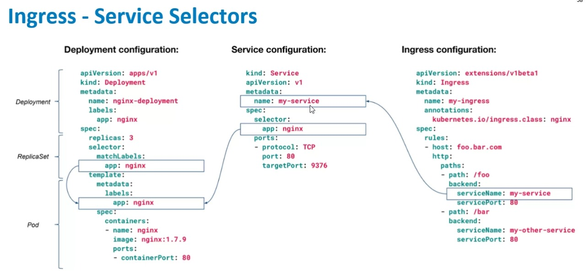
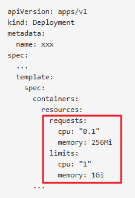
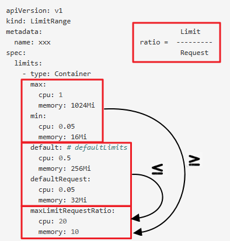
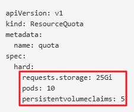

#  IMAGENES

* [Ingress / Service / Deployment](#id1)
* [Resource Management](#id5)
  * [Limits / Requests](#id6)
  * [LimitRange](#id7)
  * [ResourceQuota](#id8)

# Ingress / Service / Deployment 

# Resource Management 

## Limits / Requests 

## LimitRange 

## ResourceQuota  

