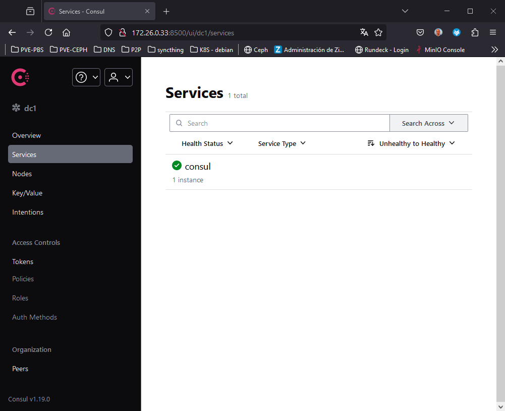
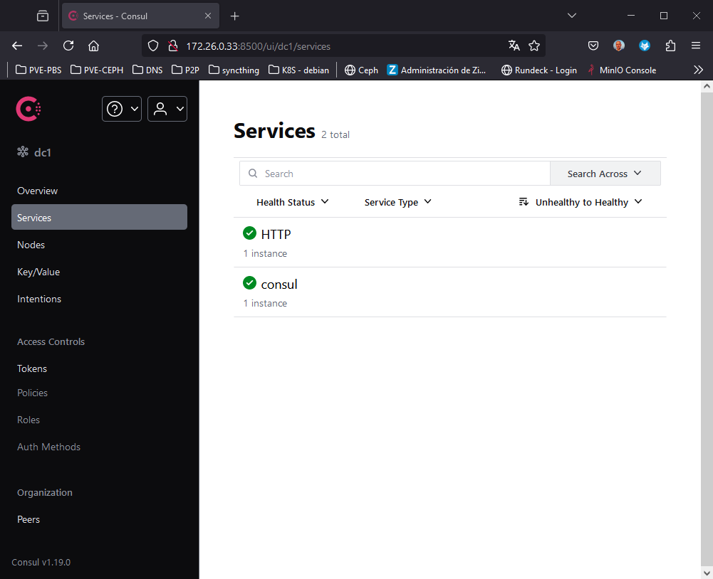
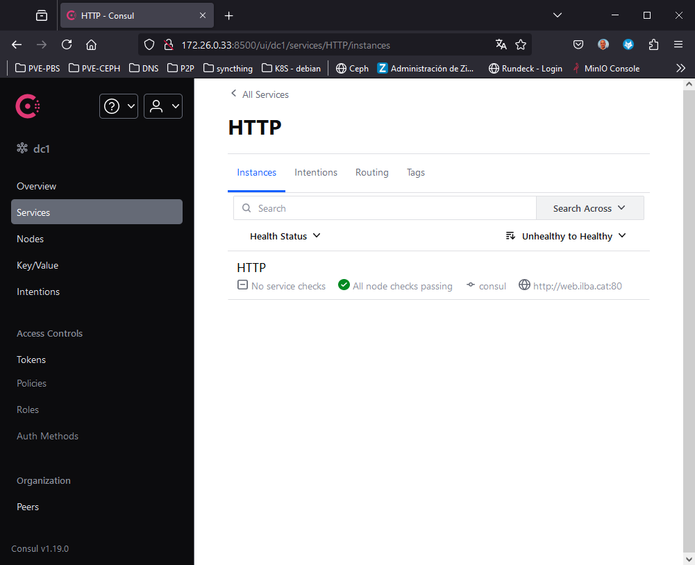
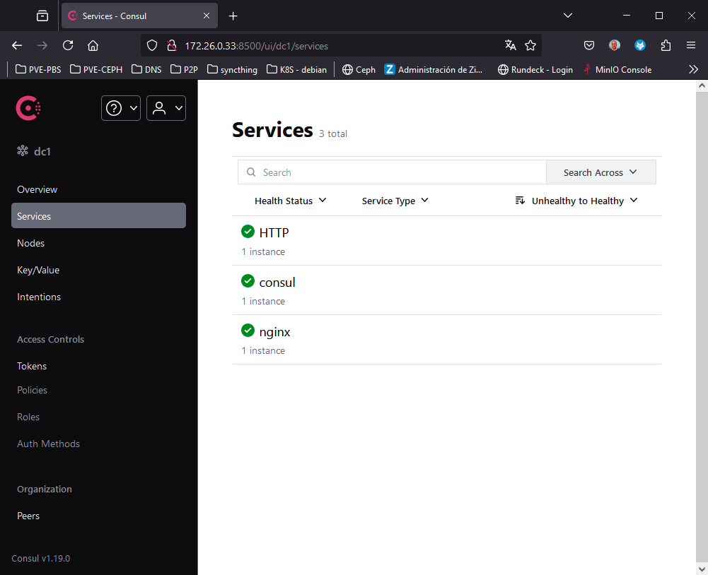
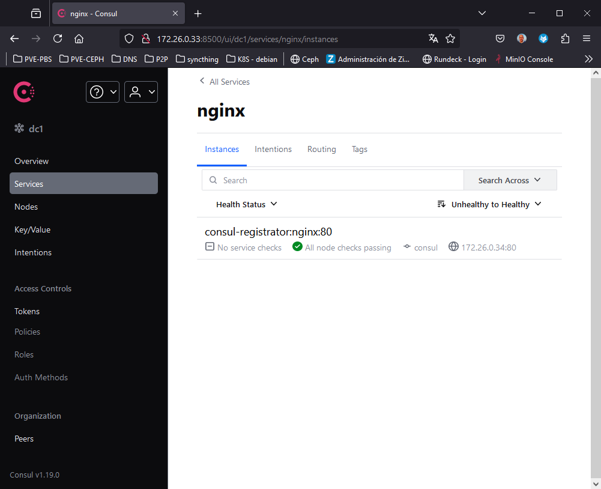

# Pruebas de Consul

* [Getting Started](#id0)
* [Desplegar consul](#id1)
* [Registro servicios con docker-compose](#id2)
* [Consulta de servicios](#id3)


## Getting Started <div id='id1' />

Instalación base:

* docker-compose

Notas:

* No hay persistencia de datos

Esquema:

```
     +---+                    +---+          
     |   |                    |   |          
     |   |                    |   |          
     |   |                    |   |          
     +---+                    +---+          
Hostname: consul      Hostnane: consul-client
IP: 172.26.0.33       IP: 172.26.0.34         
```

## Desplegar consul <div id='id1' />


```
root@consul:~# cat /etc/docker-compose/docker-compose.yaml
services:

  consul:
    container_name: consul
    hostname: consul
    image: hashicorp/consul:1.19
    ports:
      - "8400:8400"
      - "8500:8500" # this is the GUI/API
      - "8600:8600"
    dns:
     - "172.26.0.11"
    volumes:
     - /etc/localtime:/etc/localtime:ro
    networks:
      default:
        ipv4_address: 10.11.12.10

networks:
  default:
    driver: bridge
    ipam:
      config:
        - subnet: 10.11.12.0/24

root@consul:~# docker compose -f /etc/docker-compose/docker-compose.yaml up -d
```



Registramos de forma manual algún servicio:

```
root@consul:~# docker exec -it consul consul services register -name=HTTP -address=http://web.ilba.cat -port=80
Registered service: HTTP
```

Verificamos que se haya registrado en Consul:





## Registro servicios con docker-compose <div id='id2' />

Registramos los servicios con docker-compose

```
root@consul-client:~# cat /etc/docker-compose/docker-compose.yaml
services:

  consul-registrator:
    container_name: consul-registrator
    hostname: consul-registrator
    image: gliderlabs/registrator:master
    volumes:
     - /var/run/docker.sock:/tmp/docker.sock
    command: "-ip=172.26.0.34 consul://172.26.0.33:8500"

  nginx:
    container_name: nginx
    hostname: nginx
    image: nginx:1.27-bookworm
    ports:
      - "80:80"
    volumes:
     - /etc/localtime:/etc/localtime:ro
    depends_on:
      - consul-registrator

root@consul-client:~# docker compose -f /etc/docker-compose/docker-compose.yaml up -d
```

Verificamos que se haya registrado en Consul:





## Consulta de servicios <div id='id3' />


```
root@consul:~# docker exec -it consul consul catalog services
HTTP
consul
nginx
```

```
root@consul-client:~# apt update && apt -y install jq

root@consul-client:~# curl -s http://172.26.0.33:8500/v1/agent/service/HTTP
{
    "ID": "HTTP",
    "Service": "HTTP",
    "Tags": [],
    "Meta": {},
    "Port": 80,
    "Address": "http://web.ilba.cat",
    "Weights": {
        "Passing": 1,
        "Warning": 1
    },
    "EnableTagOverride": false,
    "ContentHash": "b3279d556030b491",
    "Datacenter": "dc1"
}

root@consul-client:~# curl -s http://172.26.0.33:8500/v1/agent/service/HTTP | jq -r '.Address'
http://web.ilba.cat
```