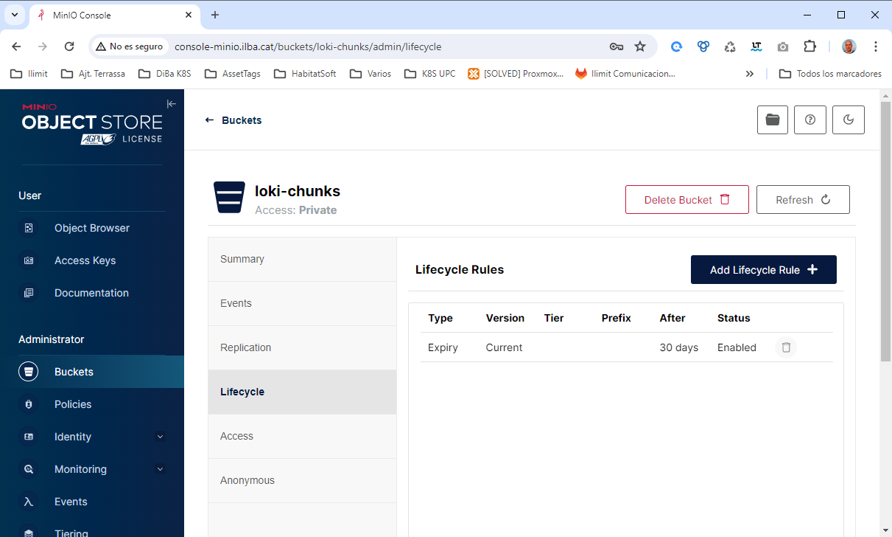

# Instalación de Loki

* [MinIO](#id10)
* [Loki](#id20)
* [Promtail](#id30)
* [Config Grafana con Loki](#id40)

## MinIO <div id='id10' />

### Errores minio

Para desplegar minio el equipo ha de tener la siguiente flag:

```
root@diba-master:~# kubectl -n minio logs -f minio-post-job-bsl9n minio-make-policy
Fatal glibc error: CPU does not support x86-64-v2
```

**SOLVED** switched to [x86-64-v2-AES CPU type](https://github.com/makeplane/plane/issues/3527#issuecomment-1925070815)

Necesitamos un cluster de 3 nodos::

```
root@diba-master:~# kubectl get nodes
NAME            STATUS   ROLES           AGE   VERSION
diba-master     Ready    control-plane   45d   v1.28.6
diba-master-1   Ready    <none>          45d   v1.28.6
diba-master-2   Ready    <none>          45d   v1.28.6
diba-master-3   Ready    <none>          45d   v1.28.6
```

### Instalación minio

Crear el directorio en los workers, ya que en este caso no usaremos un storage compartido, se usará el storage local de cada worker de K8S:

```
mkdir /disk-local-minio-data
```

```
$ cat values-minio.yaml

mode: distributed

persistence:
  enabled: false

extraVolumes:
  - name: minio-data
    hostPath:
      path: /disk-local-minio-data
      type: Directory
extraVolumeMounts:
  - name: minio-data
    mountPath: /export

drivesPerNode: 1
replicas: 3
pools: 1

ingress:
  enabled: true
  ingressClassName: "nginx"
  labels: {}
  annotations: {}
  path: /
  hosts:
    - api-minio.ilba.cat
  tls: []

consoleIngress:
  enabled: true
  ingressClassName: "nginx"
  labels: {}
  annotations: {}
  path: /
  hosts:
    - console-minio.ilba.cat
  tls: []

resources:
  requests:
    memory: 1Gi

users:
  - accessKey: admin
    secretKey: admin-password
    policy: consoleAdmin
  - accessKey: loki
    secretKey: loki-password
    policy: loki-policy

policies:
- name: loki-policy
  statements:
    - resources:
        - 'arn:aws:s3:::loki-*/*'
      actions:
        - "s3:AbortMultipartUpload"
        - "s3:GetObject"
        - "s3:DeleteObject"
        - "s3:PutObject"
        - "s3:ListMultipartUploadParts"
    - resources:
        - 'arn:aws:s3:::loki-*'
      actions:
        - "s3:CreateBucket"
        - "s3:DeleteBucket"
        - "s3:GetBucketLocation"
        - "s3:ListBucket"
        - "s3:ListBucketMultipartUploads"

buckets:
  - name: loki-chunks
    policy: none
    purge: false

nodeAffinity:
  required:
    nodeSelectorTerms:
    - matchExpressions:
      - key: kubernetes.io/hostname
        operator: In
        values:
        - diba-master-1
        - diba-master-2
        - diba-master-3
```


```
helm repo add minio https://charts.min.io/ && helm repo update
```

```
helm upgrade --install \
minio minio/minio \
--create-namespace \
--namespace minio \
--version=5.0.15 \
-f values-minio.yaml
```

### Verificaciones de MinIO

```
root@diba-master:~# helm ls -n minio
NAME    NAMESPACE       REVISION        UPDATED                                         STATUS          CHART           APP VERSION
minio   minio           1               2024-05-17 10:31:58.495053209 +0200 CEST        deployed        minio-5.0.15    RELEASE.2024-01-11T07-46-16Z
```

```
root@diba-master:~# kubectl -n minio get pods -o wide
NAME      READY   STATUS    RESTARTS   AGE     IP            NODE            NOMINATED NODE   READINESS GATES
minio-0   1/1     Running   0          2m54s   10.38.28.19   diba-master-2   <none>           <none>
minio-1   1/1     Running   0          2m54s   10.38.25.14   diba-master-1   <none>           <none>
minio-2   1/1     Running   0          2m54s   10.38.26.12   diba-master-3   <none>           <none>
```

```
root@diba-master:~# kubectl get ingress -A
NAMESPACE      NAME                CLASS    HOSTS                    ADDRESS        PORTS   AGE
minio          minio               nginx    api-minio.ilba.cat       172.26.0.101   80      68s
minio          minio-console       nginx    console-minio.ilba.cat   172.26.0.101   80      68s
```

Verificar que en los workes se ha creado la estructura de directorios

```
$ ls -la /disk-local-minio-data/
total 16
drwxr-xr-x  4 root root 4096 May 17 10:32 .
drwxr-xr-x 19 root root 4096 May 17 10:13 ..
drwxr-xr-x  2 root root 4096 May 17 10:32 loki-chunks
drwxr-xr-x  6 root root 4096 May 17 10:32 .minio.sys
```

Verificamos que se pueda acceder via web:
* URL: [console-minio.ilba.cat](http://console-minio.ilba.cat)
* Username: admin
* Password: admin-password

### Cosas a hacer en MinIO

Hay que crear a mano el "Lifecycle Rules":



## Loki <div id='id20' />

### Instalación de Loki

```
helm repo add grafana https://grafana.github.io/helm-charts && helm repo update
```

**NOTA:** No modificar las replicas del fichero _values-loki.yaml_, ya que son las mínimas que para que pueda funcionar.  
Por ejemplo: si bajamos las réplicas del _backend_ a 1, después cuando configuremos Grafana, no funcionará y saldrá el siguiente error: 
[Status: 500. Message: index gateway get ring: too many unhealthy instances in the ring](https://github.com/grafana/loki/issues/10537#issuecomment-1717322802)


```
$ cat values-loki.yaml
global:
  dnsService: "coredns"

loki:
  auth_enabled: false
  compactor:
    retention_enabled: true
  storage:
    bucketNames:
      chunks: loki-chunks
      ruler: loki-chunks
      admin: loki-chunks
    type: s3
    s3:
      endpoint: http://minio.minio.svc.cluster.local:9000
      accessKeyId: loki
      secretAccessKey: loki-password
      s3ForcePathStyle: true
      insecure: false
      http_config:
        insecure_skip_verify: true

write:
  replicas: 2
  persistence:
    volumeClaimsEnabled: false

read:
  replicas: 2
  persistence:
    volumeClaimsEnabled: false

gateway:
  replicas: 2
  ingress:
    enabled: true
    ingressClassName: nginx
    hosts:
      - host: gateway-loki.ilba.cat
        paths:
          - path: /
            pathType: Prefix
    tls: []

  basicAuth:
    enabled: true
    username: loki-gateway
    password: loki-gateway-password

backend:
  replicas: 3
  persistence:
    volumeClaimsEnabled: false
```

```
helm upgrade --install \
loki grafana/loki \
--create-namespace \
--namespace loki \
--version=5.47.2 \
-f values-loki.yaml
```

### Verificaciones de Loki

```
root@diba-master:~# helm ls -n loki
NAME    NAMESPACE       REVISION        UPDATED                                         STATUS          CHART           APP VERSION
loki    loki            1               2024-05-17 13:15:47.659556826 +0200 CEST        deployed        loki-5.47.2     2.9.6
```

```
root@diba-master:~# kubectl -n loki get pods
NAME                                           READY   STATUS    RESTARTS   AGE
loki-backend-0                                 1/2     Running   0          3m57s
loki-canary-cmn7p                              1/1     Running   0          3m58s
loki-canary-krngx                              1/1     Running   0          3m58s
loki-canary-zmztt                              1/1     Running   0          3m58s
loki-gateway-5ccdb57c44-spmhl                  1/1     Running   0          38s
loki-grafana-agent-operator-59556555b8-hrlh9   1/1     Running   0          3m58s
loki-logs-62ltq                                2/2     Running   0          3m35s
loki-logs-l79sd                                2/2     Running   0          3m35s
loki-logs-wkszz                                2/2     Running   0          3m35s
loki-read-6d9b895c4-v6bf6                      1/1     Running   0          3m58s
loki-write-0                                   1/1     Running   0          3m57s
```

```
root@diba-master:~# kubectl get ingress -A
NAMESPACE      NAME                CLASS    HOSTS                    ADDRESS        PORTS   AGE
loki           loki-gateway        nginx    gateway-loki.ilba.cat    172.26.0.101   80      7m4s
```

## Promtail <div id='id30' />

### Instalación de Promtail

```
$ cat values-promtail.yaml
config:
   clients:
    - url: http://loki-gateway.loki.svc.cluster.local/loki/api/v1/push
      basic_auth:
         username: loki-gateway
         password: loki-gateway-password
```

```
helm upgrade --install \
promtail grafana/promtail \
--create-namespace \
--namespace promtail \
--version=6.15.5 \
-f values-promtail.yaml
```

### Verificaciones de Promtail

```
root@diba-master:~# helm -n promtail ls
NAME            NAMESPACE       REVISION        UPDATED                                         STATUS          CHART           APP VERSION
promtail        promtail        1               2024-05-17 19:16:05.444210472 +0200 CEST        deployed        promtail-6.15.5 2.9.3
```

Verificamos que estén todos los pods.  
Ha de haber tantos pods como "control plane" + "workers" hayan.  
En este ejemplo hay 1 "control plane" + 3 "workers", en total 4 pods

```
root@diba-master:~# kubectl -n promtail get pods
NAME             READY   STATUS    RESTARTS   AGE
promtail-9bs8m   1/1     Running   0          4m55s
promtail-gr8kf   1/1     Running   0          4m55s
promtail-mftxx   1/1     Running   0          4m55s
promtail-pczlh   1/1     Running   0          4m55s
```

Verificamos los logs de algún contenedor de promtail, para que no salga ningún error:

```
root@diba-master:~# kubectl -n promtail logs -f promtail-gr8kf
```

## Send logs to Loki

```
root@diba-master:~# kubectl get ingress -A
NAMESPACE      NAME                CLASS    HOSTS                    ADDRESS        PORTS   AGE
test-metallb   mi-primer-ingress   <none>   www.dominio.cat          172.26.0.101   80      3d
```

### Accediendo por Consola

```
$ while curl -sI -o /dev/null -w "%{http_code}\n" -H "Host: www.dominio.cat" "http://172.26.0.101/"; do sleep 1; done;
```

### Accediendo por URL

Acceso a la [web de testing](http://www.dominio.cat/)


## Config Grafana con Loki <div id='id40' />

Verificamos que en el MinIO se haya guardado algo de datos:

* URL: [console-minio.ilba.cat](http://console-minio.ilba.cat)
* Username: admin
* Password: admin-password


Accedemos a [Grafana](http://172.26.0.32:3000) (está ubicado fuera del cluster de K8S)

Configuramos el Data Source:

* Name: Loki-K8S
* URL: http://gateway-loki.ilba.cat
* User: loki-gateway
* Password: loki-gateway-password

Importar Dashboard: [15141](https://grafana.com/grafana/dashboards/15141-kubernetes-service-logs/)

