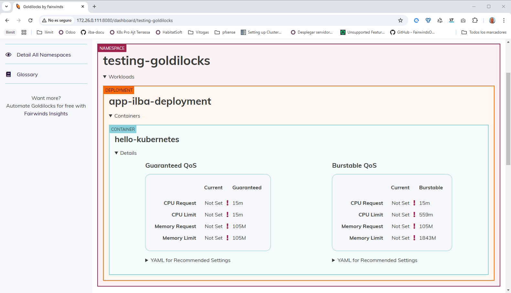

# Index:

* [Requirements](#id10)
* [Instalamos metrics server](#id20)
* [Instalamos VPA](#id30)
* [Instalamos goldilocks](#id40)
* [Creamos un NS de testing](#id50)

# Requirements <div id='id10' />

Requirements de [goldilocks](https://github.com/FairwindsOps/goldilocks) :
* helm
* metrics-server
* vertical-pod-autoscaler (VPA)
* goldilocks

# Instalamos metrics server <div id='id20' />

```
root@cilium-01-cp:~# helm repo add metrics-server https://kubernetes-sigs.github.io/metrics-server/
root@cilium-01-cp:~# helm repo update

helm upgrade --install \
metrics-server metrics-server/metrics-server \
--namespace kube-system \
--set args="{--kubelet-insecure-tls}"

root@cilium-01-cp:~# helm -n kube-system ls
NAME            NAMESPACE       REVISION        UPDATED                                 STATUS          CHART                   APP VERSION
metrics-server  kube-system     1               2024-12-19 07:36:31.670586606 +0100 CET deployed        metrics-server-3.12.2   0.7.2

root@cilium-01-cp:~# k -n kube-system get pods | grep metrics-server
metrics-server-869cd9f57-pcxf4         1/1     Running   0             48s
```
```
root@cilium-01-cp:~# k top nodes
NAME           CPU(cores)   CPU%   MEMORY(bytes)   MEMORY%
cilium-01-cp   191m         10%    982Mi           29%
cilium-01-wk   59m          3%     446Mi           12%
```

# Instalamos VPA <div id='id30' />

```
root@cilium-01-cp:~# helm repo add fairwinds-stable https://charts.fairwinds.com/stable
root@cilium-01-cp:~# helm repo update

helm upgrade --install \
vpa fairwinds-stable/vpa \
--create-namespace \
--namespace vpa

root@cilium-01-cp:~# helm -n vpa ls
NAME    NAMESPACE       REVISION        UPDATED                                 STATUS          CHART           APP VERSION
vpa     vpa             1               2024-12-19 07:40:54.472703355 +0100 CET deployed        vpa-4.7.1       1.0.0

root@cilium-01-cp:~# k -n vpa get pods
NAME                                        READY   STATUS    RESTARTS   AGE
vpa-admission-controller-8678b87646-gdchx   1/1     Running   0          68s
vpa-recommender-585b9f8c54-hcmgf            1/1     Running   0          68s
vpa-updater-5775fbb787-lvqdz                1/1     Running   0          68s
```
# Instalamos goldilocks <div id='id40' />

```
helm upgrade --install \
goldilocks fairwinds-stable/goldilocks \
--create-namespace \
--namespace goldilocks

root@cilium-01-cp:~# helm -n goldilocks ls
NAME            NAMESPACE       REVISION        UPDATED                                 STATUS          CHART                   APP VERSION
goldilocks      goldilocks      1               2024-12-19 07:44:25.547370391 +0100 CET deployed        goldilocks-9.0.1        v4.13.0

root@cilium-01-cp:~# k -n goldilocks get pods
NAME                                     READY   STATUS    RESTARTS   AGE
goldilocks-controller-7d86fdccd7-trxzg   1/1     Running   0          37s
goldilocks-dashboard-6c5688877-5hxmq     1/1     Running   0          37s
goldilocks-dashboard-6c5688877-jx8m9     1/1     Running   0          37s
```

# Creamos un NS de testing <div id='id50' />

```
root@cilium-01-cp:~# vim testing-goldilocks.yaml
apiVersion: v1
kind: Namespace
metadata:
  name: testing-goldilocks
---
apiVersion: apps/v1
kind: Deployment
metadata:
  name: app-ilba-deployment
  namespace: testing-goldilocks
  labels:
    app.kubernetes.io/name: app-ilba
spec:
  replicas: 3
  selector:
    matchLabels:
      app.kubernetes.io/name: app-ilba
  template:
    metadata:
      labels:
        app.kubernetes.io/name: app-ilba
    spec:
      containers:
        - name: hello-kubernetes
          image: paulbouwer/hello-kubernetes:1.9
          imagePullPolicy: Always
          ports:
            - name: http
              containerPort: 8080
              protocol: TCP
---
apiVersion: v1
kind: Service
metadata:
  name: app-ilba-service
  namespace: testing-goldilocks
spec:
  selector:
    app.kubernetes.io/name: app-ilba
  ports:
    - protocol: TCP
      port: 8080
      targetPort: http
```

```
root@cilium-01-cp:~# k apply -f testing-goldilocks.yaml
root@cilium-01-cp:~# k label ns testing-goldilocks goldilocks.fairwinds.com/enabled=true
```

```
root@cilium-01-cp:~# k -n testing-goldilocks scale deployment app-ilba-deployment --replicas=5
```

Accedemos a su GUI: http://172.26.0.111:8080/dashboard/testing-goldilocks

```
root@cilium-01-cp:~# k -n goldilocks port-forward --address 0.0.0.0 svc/goldilocks-dashboard 8080:80
```

