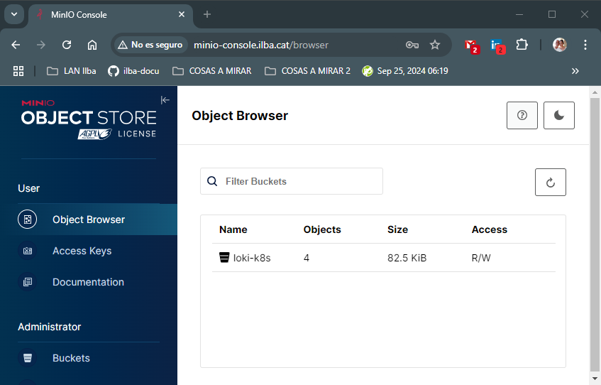
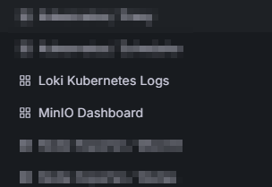
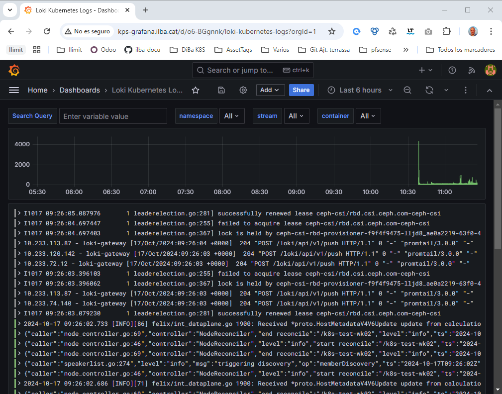
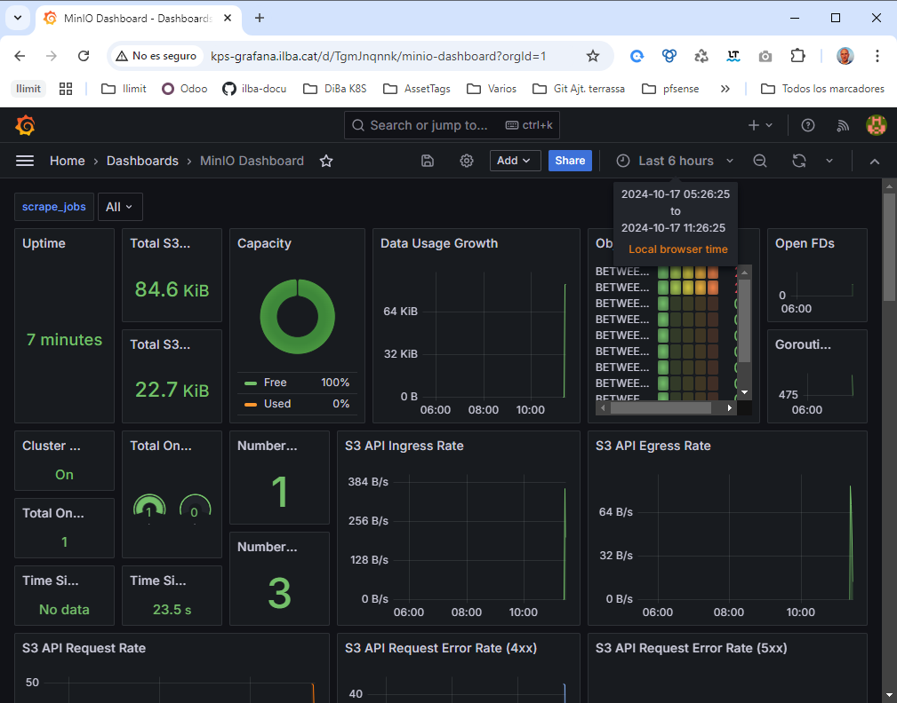
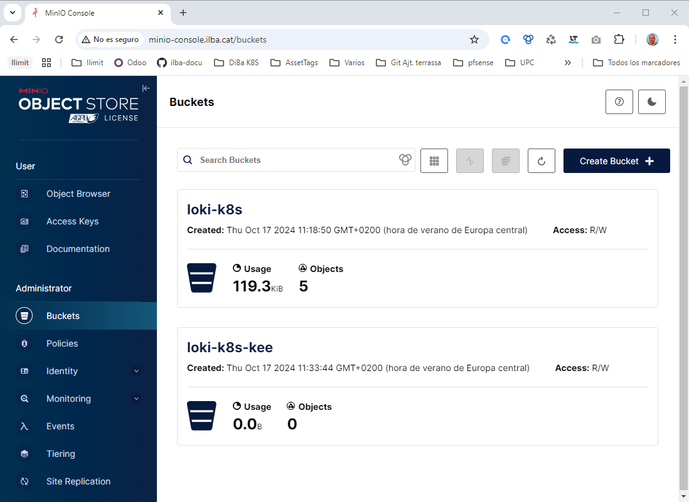
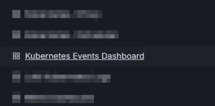
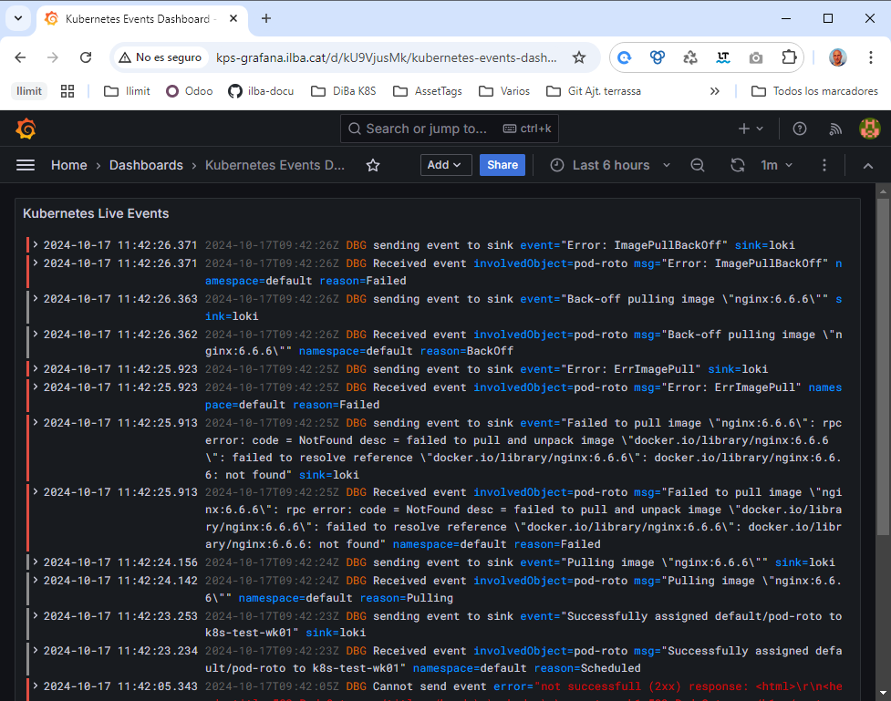

# Instalación de KPS / Loki / MinIO

* [Requisitos previos](#id10)
* [Kube Prometheus Stack (KPS)](#id20)
* [Loki](#id30)
* [Kubernetes Event Exporter (KEE)](#id40)

## Requisitos previos <div id='id10' />

**Este montaje está pensado para testing, sólo se ha desplegado un pod de cada componente y nunca se ha pensado en la H.A.**

Antes de empezar necesitamos:

* Un cluster de K8S desplegado

```
root@k8s-test-cp:~# kubectl get nodes
NAME            STATUS   ROLES           AGE    VERSION
k8s-test-cp     Ready    control-plane   5d4h   v1.30.4
k8s-test-wk01   Ready    <none>          5d4h   v1.30.4
k8s-test-wk02   Ready    <none>          5d4h   v1.30.4
k8s-test-wk03   Ready    <none>          5d4h   v1.30.4
```

* Un sistema de CSI (en nuestro caso Ceph)

```
root@k8s-test-cp:~# kubectl get sc
NAME                   PROVISIONER        RECLAIMPOLICY   VOLUMEBINDINGMODE   ALLOWVOLUMEEXPANSION   AGE
csi-rbd-sc (default)   rbd.csi.ceph.com   Delete          Immediate           true                   10m
```

* Añadir los siguientes repositorios al Helm:

```
helm repo add minio https://charts.min.io/
helm repo add prometheus-community https://prometheus-community.github.io/helm-charts
helm repo add grafana https://grafana.github.io/helm-charts
helm repo update
```

Copiamos los ficheros yaml:

```
scp yaml/* k8s-test-cp:
```

## Kube Prometheus Stack (KPS) <div id='id20' />

Instalamos KPS:

```
kubectl create ns kube-prometheus-stack

kubectl -n kube-prometheus-stack create secret generic etcd-client-cert \
--from-file=/etc/ssl/etcd/ssl/ca.pem \
--from-file=/etc/ssl/etcd/ssl/node-k8s-test-cp.pem \
--from-file=/etc/ssl/etcd/ssl/node-k8s-test-cp-key.pem

helm upgrade --install \
kube-prometheus-stack prometheus-community/kube-prometheus-stack  \
--create-namespace \
--namespace kube-prometheus-stack \
--version=63.1.0 \
-f values-kps.yaml
```

```
root@k8s-test-cp:~# kubectl get ingress -A
NAMESPACE               NAME                                 CLASS   HOSTS                      ADDRESS        PORTS   AGE
kube-prometheus-stack   kube-prometheus-stack-alertmanager   nginx   kps-alermanager.ilba.cat   172.26.0.101   80      109s
kube-prometheus-stack   kube-prometheus-stack-grafana        nginx   kps-grafana.ilba.cat       172.26.0.101   80      109s
kube-prometheus-stack   kube-prometheus-stack-prometheus     nginx   kps-prometheus.ilba.cat    172.26.0.101   80      109s
```

Verificamos que se pueda acceder via web:
* URL: [kps-grafana.ilba.cat](http://kps-grafana.ilba.cat)
* Username: admin
* Password: 2SchingyeodbekcosBup

## Loki <div id='id30' />

Instalamos Loki:

```
helm upgrade --install \
minio minio/minio \
--create-namespace \
--namespace minio \
--version=5.2.0 \
-f values-minio.yaml
```

```
root@k8s-test-cp:~# kubectl -n minio get pods
NAME                     READY   STATUS    RESTARTS   AGE
minio-75d45cc59f-8pdpp   1/1     Running   0          36s
```

Verificamos que se pueda acceder via web:
* URL: [minio-console.ilba.cat](http://minio-console.ilba.cat)
* Username: admin
* Password: Er2Ophgundeat2



```
helm upgrade --install \
loki grafana/loki \
--create-namespace \
--namespace loki \
--version=6.16.0 \
-f values-loki.yaml
```

```
root@k8s-test-cp:~# kubectl -n loki get pods
NAME                            READY   STATUS    RESTARTS   AGE
loki-backend-0                  2/2     Running   0          81s
loki-chunks-cache-0             2/2     Running   0          81s
loki-gateway-68f8dd49fd-98b2p   1/1     Running   0          82s
loki-read-6f8d5b7b9b-8wgjq      1/1     Running   0          82s
loki-results-cache-0            2/2     Running   0          81s
loki-write-0                    1/1     Running   0          81s
```

```
helm upgrade --install \
promtail grafana/promtail \
--create-namespace \
--namespace promtail \
--version=6.16.6 \
-f values-promtail.yaml
```

```
root@k8s-test-cp:~# kubectl -n promtail get pods
NAME             READY   STATUS    RESTARTS   AGE
promtail-26zvg   1/1     Running   0          56s
promtail-gx42v   1/1     Running   0          56s
promtail-nq8jb   1/1     Running   0          56s
promtail-xtjqp   1/1     Running   0          56s
```

```
kubectl apply -f dashboard-loki.yaml
kubectl apply -f dashboard-minio.yaml
```

Podremos ver que hemos creado dos dashboards nuevos:







## Kubernetes Event Exporter (KEE) <div id='id40' />

Necesitamos un sistema de almancenamiento de "eventos", ya que K8s por defecto sólo guarda los eventos 1h:

```
root@k8s-test-cp:~# cat /etc/kubernetes/manifests/kube-apiserver.yaml | grep event-ttl
    - --event-ttl=1h0m0s
```

Creamos un bucket con el nombre: loki-k8s-kee

Verificamos que se pueda acceder via web:
* URL: [minio-console.ilba.cat](http://minio-console.ilba.cat)
* Username: admin
* Password: Er2Ophgundeat2



```
helm upgrade --install \
kubernetes-event-exporter-loki grafana/loki \
--create-namespace \
--namespace kubernetes-event-exporter-loki \
--version=6.16.0 \
-f values-kubernetes-event-exporter-loki.yaml
```

```
kubectl -n kubernetes-event-exporter-loki get pods
```

```
helm upgrade --install \
kubernetes-event-exporter oci://registry-1.docker.io/bitnamicharts/kubernetes-event-exporter \
--create-namespace \
--namespace kubernetes-event-exporter \
--version=3.2.14 \
-f values-kubernetes-event-exporter.yaml
```

```
kubectl apply -f dashboard-kubernetes-event-exporter.yaml
kubectl apply -f pod_roto.yaml
```

Verificamos los dashboards:
* URL: [kps-grafana.ilba.cat](http://kps-grafana.ilba.cat)
* Username: admin
* Password: 2SchingyeodbekcosBup





