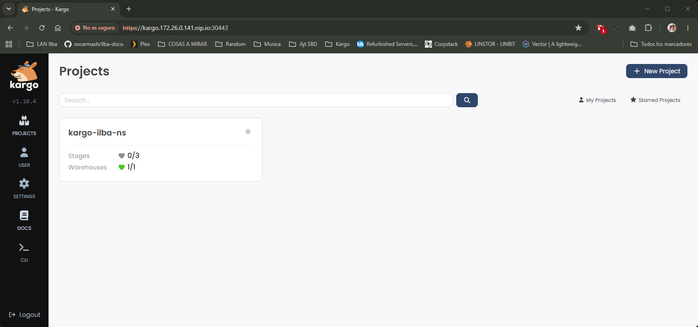
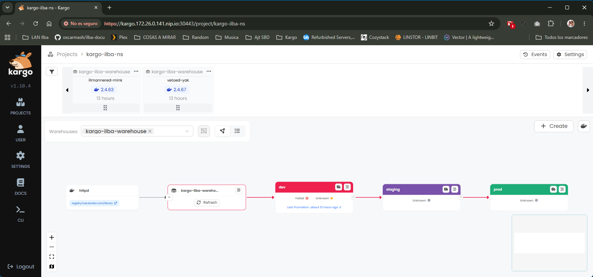
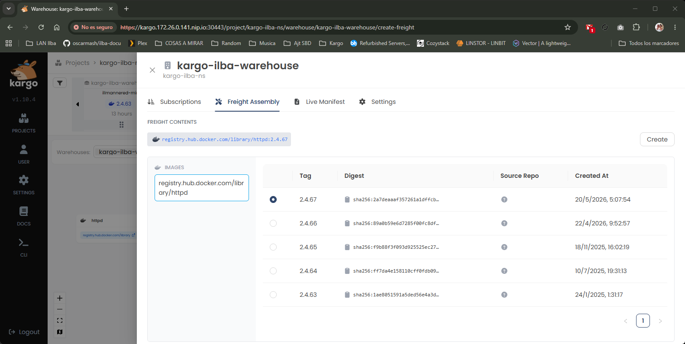

# Kargo

* [Instalación de ArgoCD](#id10)
* [Instalación de Cert-Manager](#id20)
* [Instalación de Kargo](#id30)
  * [Trabajando con Kargo](#id31)

# Instalación de ArgoCD <div id='id10' />

```
helm repo add argo https://argoproj.github.io/argo-helm && helm repo update
```

```
cat >> values-argocd.yaml<< EOF
global:
  domain: argocd.172.26.0.101.nip.io
configs:  
  params:  
    server.insecure: true
server:
  ingress:
    enabled: true
    ingressClassName: "cilium"
EOF
```

```
helm upgrade --install \
argocd argo/argo-cd \
--create-namespace \
--namespace argocd \
--version=9.5.17 \
-f values-argocd.yaml
```
```
kubectl -n argocd \
get secret argocd-initial-admin-secret \
-o jsonpath="{.data.password}" | base64 -d; echo
```

URL -> http://argocd.172.26.0.101.nip.io/

# Instalación de Cert-Manager <div id='id20' />

Es obligatorio instalarlo, aunque vayamos a usarlo en local.

```
helm upgrade --install \
cert-manager cert-manager \
--repo https://charts.jetstack.io \
--version v1.20.2 \
--namespace cert-manager \
--create-namespace \
--set crds.enabled=true
```

```
root@k8s-cilium-01-cp:~# cat kargo-issuer.yaml 
apiVersion: cert-manager.io/v1
kind: ClusterIssuer
metadata:
  name: kargo-selfsigned-issuer
spec:
  selfSigned: {}
```

```
root@k8s-cilium-01-cp:~# k apply -f kargo-issuer.yaml
```

# Instalación de Kargo <div id='id30' />

```
helm upgrade --install kargo \
oci://ghcr.io/akuity/kargo-charts/kargo \
--namespace kargo \
--create-namespace \
--version 1.10.4 \
--values values-kargo.yaml
```

URL -> https://kargo.172.26.0.141.nip.io:30443/
Password: admin

## Trabajando con Kargo <div id='id31' />

```
root@k8s-cilium-01-cp:~# k apply -f https://raw.githubusercontent.com/oscarmash/test-argocd/refs/heads/main/00-bootstrap.yaml
```

URL -> http://argocd.172.26.0.101.nip.io/

El NS *kargo-ilba-ns*, lo crea Kargo de manera automática y ha de ser así,porque añade unos "labels" especiales

```
root@k8s-cilium-01-cp:~# git clone https://github.com/oscarmash/test-argocd.git
root@k8s-cilium-01-cp:~# k apply -k ./test-argocd/kargo/
```







```
[ Warehouse ]
      │
      ▼
  [ dev ] ──► [ staging ] ──► [ prod ]
```

```
root@k8s-cilium-01-cp:~# k get project -A
NAME            READY   STATUS                                AGE
kargo-ilba-ns   True    Project is synced and ready for use   117m

root@k8s-cilium-01-cp:~# k get warehouse -A
NAMESPACE       NAME                   SHARD   AGE
kargo-ilba-ns   kargo-ilba-warehouse           118m

root@k8s-cilium-01-cp:~# k get promotiontask -A
NAMESPACE       NAME                    AGE
kargo-ilba-ns   kargo-ilba-promo-task   119m

root@k8s-cilium-01-cp:~# k get stages -A
NAMESPACE       NAME      SHARD   CURRENT FREIGHT   HEALTH   READY   STATUS   AGE
kargo-ilba-ns   dev                                                           114m
kargo-ilba-ns   prod                                                          114m
kargo-ilba-ns   staging                                                       114m

$ kubectl get freights -A
```

Revisión de logs:

```
root@k8s-cilium-01-cp:~# kubectl logs -n kargo deployment/kargo-controller --tail=50 -f
```
