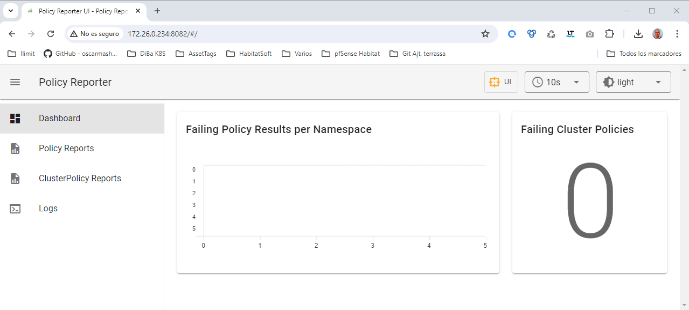
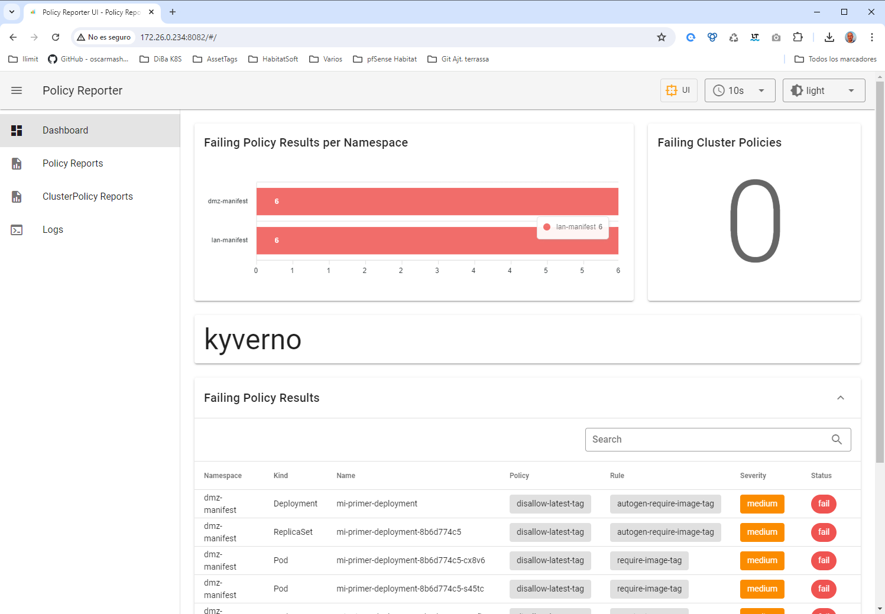

# Index:

* [Kyverno](#id10)
* [policy-reporter](#id20)
* [Testing](#id30)

# Kyverno <div id='id10' />

```
root@kubespray-aio:~# helm repo add kyverno https://kyverno.github.io/kyverno/
root@kubespray-aio:~# helm repo update

root@kubespray-aio:~# helm search repo kyverno -l | head -5
NAME                            CHART VERSION   APP VERSION     DESCRIPTION
kyverno/kyverno                 3.2.6           v1.12.5         Kubernetes Native Policy Management
kyverno/kyverno                 3.2.5           v1.12.4         Kubernetes Native Policy Management
kyverno/kyverno                 3.2.4           v1.12.3         Kubernetes Native Policy Management
kyverno/kyverno                 3.2.3           v1.12.2         Kubernetes Native Policy Management


root@kubespray-aio:~# vim lan-values-kyverno.yaml
global:
  nodeSelector:
    workload: lan

helm upgrade --install lan-kyverno kyverno/kyverno \
--create-namespace \
--namespace lan-kyverno \
--version=3.2.6 \
-f lan-values-kyverno.yaml

root@kubespray-aio:~# helm -n lan-kyverno ls
NAME            NAMESPACE       REVISION        UPDATED                                 STATUS          CHART           APP VERSION
lan-kyverno     lan-kyverno     1               2024-07-28 09:18:56.10238778 +0200 CEST deployed        kyverno-3.2.6   v1.12.5

root@kubespray-aio:~# kubectl -n lan-kyverno get pods -o wide
NAME                                                       READY   STATUS      RESTARTS   AGE   IP              NODE               NOMINATED NODE   READINESS GATES
kyverno-admission-controller-55c8b95c4d-kp4x8              1/1     Running     0          85s   10.233.109.41   kubespray-aio-w1   <none>           <none>
kyverno-background-controller-868dc74c7d-58xr7             1/1     Running     0          85s   10.233.109.43   kubespray-aio-w1   <none>           <none>
kyverno-cleanup-admission-reports-28702520-pbh7z           0/1     Completed   0          30s   10.233.109.49   kubespray-aio-w1   <none>           <none>
kyverno-cleanup-cluster-admission-reports-28702520-lnwhv   0/1     Completed   0          30s   10.233.109.47   kubespray-aio-w1   <none>           <none>
kyverno-cleanup-cluster-ephemeral-reports-28702520-wdmjx   0/1     Completed   0          30s   10.233.109.45   kubespray-aio-w1   <none>           <none>
kyverno-cleanup-controller-668fc794c5-fghkx                1/1     Running     0          85s   10.233.109.42   kubespray-aio-w1   <none>           <none>
kyverno-cleanup-ephemeral-reports-28702520-kcx5b           0/1     Completed   0          30s   10.233.109.48   kubespray-aio-w1   <none>           <none>
kyverno-cleanup-update-requests-28702520-dh6ft             0/1     Completed   0          30s   10.233.109.46   kubespray-aio-w1   <none>           <none>
kyverno-reports-controller-5db9f47b57-k8bx2                1/1     Running     0          85s   10.233.109.44   kubespray-aio-w1   <none>           <none>
```

# policy-reporter <div id='id20' />

```
root@kubespray-aio:~# helm repo add policy-reporter https://kyverno.github.io/policy-reporter
root@kubespray-aio:~# helm repo update

root@kubespray-aio:~# helm search repo policy-reporter -l | head -5
NAME                            CHART VERSION   APP VERSION     DESCRIPTION
policy-reporter/policy-reporter 2.24.1          2.20.1          Policy Reporter watches for PolicyReport Resour...
policy-reporter/policy-reporter 2.24.0          2.20.0          Policy Reporter watches for PolicyReport Resour...
policy-reporter/policy-reporter 2.23.1          2.19.0          Policy Reporter watches for PolicyReport Resour...
policy-reporter/policy-reporter 2.23.0          2.19.0          Policy Reporter watches for PolicyReport Resour...


root@kubespray-aio:~# vim lan-values-policy-reporter.yaml
rest:
  enabled: true
metrics:
  enabled: true
kyvernoPlugin:
  enabled: true
ui:
  enabled: true
kyvernoPlugin:
  enabled: true
resources: {}

helm upgrade --install lan-policy-reporter policy-reporter/policy-reporter \
--create-namespace \
--namespace lan-policy-reporter \
--version=2.24.1 \
-f lan-values-policy-reporter.yaml

root@kubespray-aio:~# helm -n lan-policy-reporter ls
NAME                    NAMESPACE               REVISION        UPDATED                                         STATUS          CHART                   APP VERSION
lan-policy-reporter     lan-policy-reporter     1               2024-07-28 09:29:26.621257616 +0200 CEST        deployed        policy-reporter-2.24.1  2.20.1

root@kubespray-aio:~# kubectl -n lan-policy-reporter get pods
NAME                                                  READY   STATUS    RESTARTS   AGE
lan-policy-reporter-684bc7d8c5-b9cfl                  1/1     Running   0          71s
lan-policy-reporter-kyverno-plugin-5f644d68b9-js72h   1/1     Running   0          71s
lan-policy-reporter-ui-555bb5979-9nrzr                1/1     Running   0          71s

```

Verificamos que podemos acceder a la GUI:

```
root@kubespray-aio:~# kubectl port-forward service/lan-policy-reporter-ui 8082:8080 -n lan-policy-reporter --address 0.0.0.0
```



# Testing <div id='id30' />

```
root@kubespray-aio:~# vim disallow-latest-tag.yaml
apiVersion: kyverno.io/v1
kind: ClusterPolicy
metadata:
  name: disallow-latest-tag
  annotations:
    policies.kyverno.io/title: Disallow Latest Tag
    policies.kyverno.io/category: Best Practices
    policies.kyverno.io/minversion: 1.6.0
    policies.kyverno.io/severity: medium
    policies.kyverno.io/subject: Pod
    policies.kyverno.io/description: >-
      The ':latest' tag is mutable and can lead to unexpected errors if the
      image changes. A best practice is to use an immutable tag that maps to
      a specific version of an application Pod. This policy validates that the image
      specifies a tag and that it is not called `latest`.      
spec:
  validationFailureAction: audit
  background: true
  rules:
  - name: require-image-tag
    match:
      any:
      - resources:
          kinds:
          - Pod
    validate:
      message: "An image tag is required."
      pattern:
        spec:
          containers:
          - image: "*:*"
  - name: validate-image-tag
    match:
      any:
      - resources:
          kinds:
          - Pod
    validate:
      message: "Using a mutable image tag e.g. 'latest' is not allowed."
      pattern:
        spec:
          containers:
          - image: "!*:latest"
```

```
root@kubespray-aio:~# kubectl apply -f disallow-latest-tag.yaml

root@kubespray-aio:~# kubectl get clusterpolicy
NAME                  ADMISSION   BACKGROUND   VALIDATE ACTION   READY   AGE     MESSAGE
disallow-latest-tag   true        true         audit             True    2m23s   Ready
```

