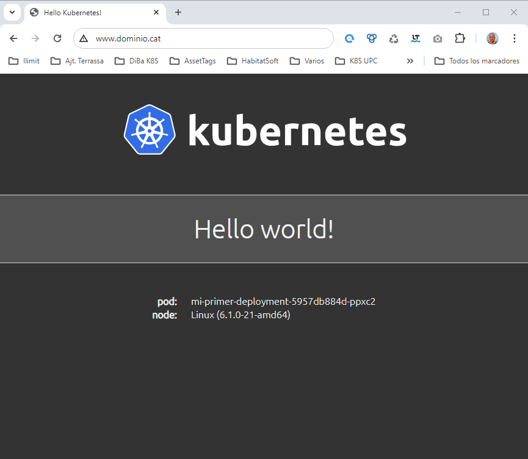

# Instalación de Promtail / Loki / MinIO

* [Grafana](#id5) en este caso es externo, el equipo se llama **monitoring**
* [MinIO](#id10) 
  * [No host path](#id11)
  * [Error minio CPU](#id12)
  * [Instalación minio](#id13)
  * [Verificaciones de MinIO](#id14)
  * [Configuración de Lifecycle](#id15)
  * [Monitorización con Prometheus](#id16)
  * [Comando "mc" ](#id17)
* [Loki](#id20)
  * [Notas del montaje de Loki](#id21)
  * [Instalación de Loki](#id22)
  * [Verificaciones de Loki](#id23)
* [Promtail](#id30)
* [Config Grafana con Loki](#id40)
* [Cosas de Loki](#id50)
  * [Cambio logs ingress-nginx](#id60)
  * [Que es la pppppppppp...](#id70)

Esquema:

```
     +---+                    +---+               
     |   |                    |   |               
     |   |                    |   | Cluster de K8S
     |   |                    |   |               
     +---+                    +---+               
Hostname: monitoring                              
IP: 172.26.0.32                                   
```

## Grafana <div id='id5' />

El grafana lo hemos puesto fuera del cluster de K8S, en un equipo llamado: **monitoring**

Dejo el fichero del contenedor de grafana

```
root@monitoring:~# cat /etc/docker-compose/docker-compose.yml
version: '3.7'

volumes:
  grafana_data: {}

services:

  grafana:
    container_name: grafana
    hostname: grafana
    image: grafana/grafana:10.4.2    
    volumes:
      - /etc/localtime:/etc/localtime:ro
      - grafana_data:/var/lib/grafana
      - ./grafana/provisioning:/etc/grafana/provisioning
    environment:
      - GF_SECURITY_ADMIN_USER=admin
      - GF_SECURITY_ADMIN_PASSWORD=sorisat
      - GF_SMTP_ENABLED=true
      - GF_SMTP_HOST=172.26.0.32:25
      - GF_SMTP_FROM_ADDRESS=grafana_alerts@ilba.cat
      - GF_SMTP_SKIP_VERIFY=true
    ports:
      - "3000:3000"
    restart: unless-stopped
```

## MinIO <div id='id10' />

Necesitamos un cluster de 3 nodos:

```
root@diba-master:~# kubectl get nodes
NAME            STATUS   ROLES           AGE   VERSION
diba-master     Ready    control-plane   45d   v1.28.6
diba-master-1   Ready    <none>          45d   v1.28.6
diba-master-2   Ready    <none>          45d   v1.28.6
diba-master-3   Ready    <none>          45d   v1.28.6
```

### No host path <div id='id11' />

Para el storage de MinIO no usar [host path](https://github.com/minio/minio/discussions/18598#discussioncomment-7766467)

### Error minio CPU <div id='id12' />

Para desplegar minio el equipo ha de tener la siguiente flag:

```
root@diba-master:~# kubectl -n minio logs -f minio-post-job-bsl9n minio-make-policy
Fatal glibc error: CPU does not support x86-64-v2
```

**SOLVED** switched to [x86-64-v2-AES CPU type](https://github.com/makeplane/plane/issues/3527#issuecomment-1925070815)


### Instalación minio <div id='id13' />

En este caso, hemos desplegado MinIO con **1 sólo pod**:


```
root@diba-master:~# vim values-minio.yaml
mode: standalone

persistence:
  enabled: true
  storageClass: "csi-rbd-sc"
  size: 20Gi

drivesPerNode: 1
replicas: 1
pools: 1

ingress:
  enabled: true
  ingressClassName: "nginx"
  labels: {}
  annotations: {}
  path: /
  hosts:
    - minio-api.ilba.cat
  tls: []

consoleIngress:
  enabled: true
  ingressClassName: "nginx"
  labels: {}
  annotations: {}
  path: /
  hosts:
    - minio-console.ilba.cat
  tls: []

resources:
  requests:
    memory: 2Gi

users:
  - accessKey: admin
    secretKey: Er2Ophgundeat2
    policy: consoleAdmin
  - accessKey: loki
    secretKey: We2spertaudO12
    policy: loki-policy

policies:
- name: loki-policy
  statements:
    - resources:
        - 'arn:aws:s3:::loki-*/*'
      actions:
        - "s3:AbortMultipartUpload"
        - "s3:GetObject"
        - "s3:DeleteObject"
        - "s3:PutObject"
        - "s3:ListMultipartUploadParts"
    - resources:
        - 'arn:aws:s3:::loki-*'
      actions:
        - "s3:CreateBucket"
        - "s3:DeleteBucket"
        - "s3:GetBucketLocation"
        - "s3:ListBucket"
        - "s3:ListBucketMultipartUploads"

buckets:
  - name: loki-k8s
    policy: none
    purge: false
```


```
root@diba-master:~# helm repo add minio https://charts.min.io/ && helm repo update
```

```
root@diba-master:~# helm upgrade --install \
minio minio/minio \
--create-namespace \
--namespace minio \
--version=5.2.0 \
-f values-minio.yaml
```

### Verificaciones de MinIO <div id='id14' />

```
root@diba-master:~# helm -n minio ls
NAME    NAMESPACE       REVISION        UPDATED                                         STATUS          CHART           APP VERSION
minio   minio           2               2024-09-29 07:56:01.582158116 +0200 CEST        deployed        minio-5.2.0     RELEASE.2024-04-18T19-09-19Z
```

```
root@diba-master:~# root@k8s-test-cp:~# kubectl -n minio get pods
NAME                     READY   STATUS              RESTARTS   AGE
minio-f8bb597d7-n6kn9    1/1     Running             0          88m
```

```
root@diba-master:~# kubectl get ingress -A
NAMESPACE         NAME               CLASS   HOSTS                      ADDRESS        PORTS   AGE
minio             minio              nginx   minio-api.ilba.cat         172.26.0.101   80      74m
minio             minio-console      nginx   minio-console.ilba.cat     172.26.0.101   80      89m
```


Verificamos que se pueda acceder via web:
* URL: [minio-console.ilba.cat](http://minio-console.ilba.cat)
* Username: admin
* Password: Er2Ophgundeat2

### Configuración de Lifecycle <div id='id15' />

Si optamos por usar este sistema de *Lifecycle*, el valor de *days* que pogamos en el MinIO, ha de ser mayor que el indicado en el Loki *compactor*, dicho de otra manera:
* If you have a lifecycle policy configured on the object store, please ensure that it is longer than the retention period.

Hay que crear a mano el "Lifecycle Rules":


### Monitorización con Prometheus <div id='id16' />


Instalamos el "mc", para que nos de la configuración de prometheus

```
root@kubespray-aio:~# wget https://dl.min.io/client/mc/release/linux-amd64/mc
root@kubespray-aio:~# chmod 755 mc

root@kubespray-aio:~# kubectl -n minio get svc
NAME            TYPE        CLUSTER-IP     EXTERNAL-IP   PORT(S)    AGE
minio           ClusterIP   10.233.62.98   <none>        9000/TCP   23m
minio-console   ClusterIP   10.233.5.8     <none>        9001/TCP   23m
minio-svc       ClusterIP   None           <none>        9000/TCP   23m

root@kubespray-aio:~# ./mc alias set myminio http://10.233.62.98:9000 admin admin-password

root@kubespray-aio:~# ./mc admin prometheus generate myminio
scrape_configs:
- job_name: minio-job
  bearer_token: TOKEN
  metrics_path: /minio/v2/metrics/cluster
  scheme: http
  static_configs:
  - targets: ['10.233.62.98:9000']

root@kubespray-aio:~# kubectl -n minio get ingress
NAME            CLASS   HOSTS                    ADDRESS        PORTS   AGE
minio           nginx   minio-api.ilba.cat       172.26.0.101   80      76m
minio-console   nginx   minio-console.ilba.cat   172.26.0.101   80      90m
```

Añadimos la configuración a nuestro prometheus:

```
root@monitoring:~# vim /etc/prometheus/prometheus.yml
    - job_name: minio-job
    bearer_token: TOKEN
    metrics_path: /minio/v2/metrics/cluster
    scheme: http
    static_configs:
    - targets: ['minio-api.ilba.cat']

root@monitoring:~# curl -X POST localhost:9090/-/reload
```


```
root@monitoring:~# cat /etc/prometheus/prometheus.yml
rule_files:
  - /etc/prometheus/rules/*.yml

root@monitoring:~# vim /etc/prometheus/rules/05-minio.yml
groups:

- name: 'MinIO -> K8s kubespray-aio'
  rules:

  - alert: MinioClusterDiskOffline
    expr: minio_cluster_drive_offline_total > 0
    for: 0m
    labels:
      severity: critical
    annotations:
      summary: Minio cluster disk offline (instance {{ $labels.instance }})
      description: "Minio cluster disk is offline\n  VALUE = {{ $value }}\n  LABELS = {{ $labels }}"

  - alert: MinioNodeDiskOffline
    expr: minio_cluster_nodes_offline_total > 0
    for: 0m
    labels:
      severity: critical
    annotations:
      summary: Minio node disk offline (instance {{ $labels.instance }})
      description: "Minio cluster node disk is offline\n  VALUE = {{ $value }}\n  LABELS = {{ $labels }}"

  - alert: MinioDiskSpaceUsage
    expr: disk_storage_available / disk_storage_total * 100 < 10
    for: 0m
    labels:
      severity: warning
    annotations:
      summary: Minio disk space usage (instance {{ $labels.instance }})
      description: "Minio available free space is low (< 10%)\n  VALUE = {{ $value }}\n  LABELS = {{ $labels }}"

root@monitoring:~# curl -X POST localhost:9090/-/reload
```


### Comando "mc"  <div id='id17' />

```
root@kubespray-aio:~# wget https://dl.min.io/client/mc/release/linux-amd64/mc
root@kubespray-aio:~# chmod 755 mc
```

```
root@kubespray-aio:~# kubectl -n minio get svc
NAME            TYPE        CLUSTER-IP     EXTERNAL-IP   PORT(S)    AGE
minio           ClusterIP   10.233.62.98   <none>        9000/TCP   4m33s
minio-console   ClusterIP   10.233.5.8     <none>        9001/TCP   4m33s
minio-svc       ClusterIP   None           <none>        9000/TCP   4m33s

root@kubespray-aio:~# ./mc alias set myminio http://10.233.62.98:9000 admin Er2Ophgundeat2
Added `myminio` successfully.

root@kubespray-aio:~# ./mc alias ls
...
myminio
  URL       : http://10.233.62.98:9000
  AccessKey : admin
  SecretKey : admin-password
  API       : s3v4
  Path      : auto
...
```

```
root@kubespray-aio:~# ./mc alias ls myminio
myminio
  URL       : http://10.233.62.98:9000
  AccessKey : admin
  SecretKey : admin-password
  API       : s3v4
  Path      : auto

root@kubespray-aio:~# ./mc admin info myminio
●  10.233.9.56:9000
   Uptime: 1 hour
   Version: 2024-04-18T19:09:19Z
   Network: 1/1 OK
   Drives: 1/1 OK
   Pool: 1

┌──────┬──────────────────────┬─────────────────────┬──────────────┐
│ Pool │ Drives Usage         │ Erasure stripe size │ Erasure sets │
│ 1st  │ 0.0% (total: 20 GiB) │ 1                   │ 1            │
└──────┴──────────────────────┴─────────────────────┴──────────────┘

288 KiB Used, 1 Bucket, 10 Objects, 10 Versions
1 drive online, 0 drives offline, EC:0
```

Compresión de MinIO, ver [documentación](https://min.io/docs/minio/linux/administration/object-management/data-compression.html#tutorials)

```
ilimit-k8s-pre-master01:~# ./mc admin config get myminio compression
compression enable=off allow_encryption=off extensions=.txt,.log,.csv,.json,.tar,.xml,.bin mime_types=text/*,application/json,application/xml,binary/octet-stream
```

## Loki <div id='id20' />

### Notas del montaje de Loki <div id='id21' />

**NOTA:** Hemos creado la mínima infraestructura para que funcione, no está pensado para montaje en HA

Datos importantes del values.yaml de Loki:
* By default the *compactor.retention-enabled* flag is not set, so the logs sent to Loki live forever.
* [URL de configuración del compactor](https://grafana.com/docs/loki/latest/operations/storage/retention/#retention-configuration)
* Si seteamos el valor: *compactor.working_directory*, hemos de configurar: 
*backend.extraVolumeMounts* y *backend.extraVolumes*, sinó nos dará el siguiente error:

```
root@k8s-test-cp:~# kubectl -n loki logs -f loki-backend-0 -c loki
level=error ts=2024-09-29T06:40:02.44940159Z caller=log.go:216 msg="error running loki" err="init compactor: mkdir /data: read-only file system\nerror initialising module: compactor\ngithub.com/grafana/dskit/modules.(*Manager).initModule\n\t/src/loki/vendor/github.com/grafana/dskit/modules/modules.go:138\ngithub.com/grafana/dskit/modules.(*Manager).InitModuleServices\n\t/src/loki/vendor/github.com/grafana/dskit/modules/modules.go:108\ngithub.com/grafana/loki/v3/pkg/loki.(*Loki).Run\n\t/src/loki/pkg/loki/loki.go:458\nmain.main\n\t/src/loki/cmd/loki/main.go:129\nruntime.main\n\t/usr/local/go/src/runtime/proc.go:271\nruntime.goexit\n\t/usr/local/go/src/runtime/asm_amd64.s:1695"
```

### Instalación de Loki <div id='id22' />

```
helm repo add grafana https://grafana.github.io/helm-charts && helm repo update
```

```
root@diba-master:~# vim values-loki.yaml
global:
  dnsService: "coredns"

chunksCache:
  allocatedMemory: 100

loki:
  commonConfig:
    replication_factor: 1
  storage:
    bucketNames:
      chunks: loki-k8s
      ruler: loki-k8s
      admin: loki-k8s
    type: s3
    s3:
      endpoint: http://minio.minio.svc.cluster.local:9000
      accessKeyId: loki
      secretAccessKey: We2spertaudO12
      s3ForcePathStyle: true
      insecure: false
      http_config:
        insecure_skip_verify: true
  auth_enabled: false
  schemaConfig:
    configs:
      - from: 2024-09-28
        store: tsdb
        object_store: s3
        schema: v13
        index:
          prefix: loki_index_
          period: 24h
  compactor:
    working_directory: /data/retention
    compaction_interval: 5m
    retention_enabled: true
    retention_delete_delay: 10m
    retention_delete_worker_count: 150
    delete_request_store: s3
  limits_config:
    retention_period: 15m

write:
  replicas: 1
  persistence:
    volumeClaimsEnabled: false

read:
  replicas: 1
  persistence:
    volumeClaimsEnabled: false

gateway:
  replicas: 1
  ingress:
    enabled: true
    ingressClassName: nginx
    hosts:
      - host: loki-gateway.ilba.cat
        paths:
          - path: /
            pathType: Prefix
    tls: []

  basicAuth:
    enabled: true
    username: loki-gateway
    password: loki-gateway-password

backend:
  replicas: 1
  extraVolumeMounts:
  - name: compactor-data
    mountPath: /data/retention
  extraVolumes:
    - name: compactor-data
      emptyDir: {}
```

```
helm upgrade --install \
loki grafana/loki \
--create-namespace \
--namespace loki \
--version=6.15.0 \
-f values-loki.yaml
```

### Verificaciones de Loki <div id='id23' />

```
root@diba-master:~# helm ls -n loki
NAME    NAMESPACE       REVISION        UPDATED                                         STATUS          CHART           APP VERSION
loki    loki            1               2024-09-29 08:46:43.921348391 +0200 CEST        deployed        loki-6.15.0     3.1.1
```

```
root@diba-master:~# kubectl -n loki get pods
NAME                           READY   STATUS    RESTARTS   AGE
loki-backend-0                 2/2     Running   0          29m
loki-canary-6kqlq              1/1     Running   0          29m
loki-canary-b748c              1/1     Running   0          29m
loki-canary-n4lds              1/1     Running   0          29m
loki-chunks-cache-0            2/2     Running   0          29m
loki-gateway-9ccb49f86-q2xlk   1/1     Running   0          29m
loki-read-5cdfb66d66-hh6t4     1/1     Running   0          29m
loki-results-cache-0           2/2     Running   0          29m
loki-write-0                   1/1     Running   0          29m
```

```
root@diba-master:~# kubectl get ingress -A
NAMESPACE         NAME               CLASS   HOSTS                      ADDRESS        PORTS   AGE
loki              loki-gateway       nginx   loki-gateway.ilba.cat      172.26.0.101   80      30m
minio             minio              nginx   minio-api.ilba.cat         172.26.0.101   80      80m
minio             minio-console      nginx   minio-console.ilba.cat     172.26.0.101   80      95m
```

## Promtail <div id='id30' />

### Instalación de Promtail

```
root@diba-master:~# vim values-promtail.yaml
config:
   clients:
    - url: http://loki-gateway.loki.svc.cluster.local/loki/api/v1/push
      basic_auth:
         username: loki-gateway
         password: loki-gateway-password
```

```
helm upgrade --install \
promtail grafana/promtail \
--create-namespace \
--namespace promtail \
--version=6.16.6 \
-f values-promtail.yaml
```

### Verificaciones de Promtail

```
root@diba-master:~# helm -n promtail ls
NAME            NAMESPACE       REVISION        UPDATED                                         STATUS          CHART           APP VERSION
promtail        promtail        1               2024-09-29 08:49:56.541490009 +0200 CEST        deployed        promtail-6.16.6 3.0.0
```

Verificamos que estén todos los pods.  
Ha de haber tantos pods como "control plane" + "workers" hayan.  
En este ejemplo hay 1 "control plane" + 3 "workers", en total 4 pods

```
root@diba-master:~# kubectl -n promtail get pods
NAME             READY   STATUS    RESTARTS   AGE
promtail-9bs8m   1/1     Running   0          4m55s
promtail-gr8kf   1/1     Running   0          4m55s
promtail-mftxx   1/1     Running   0          4m55s
promtail-pczlh   1/1     Running   0          4m55s
```

Verificamos los logs de algún contenedor de promtail, para que no salga ningún error:

```
root@diba-master:~# kubectl -n promtail logs -f promtail-gr8kf
```

## Send logs to Loki

```
root@diba-master:~# cat testing.yaml
apiVersion: v1
kind: Namespace
metadata:
  name: test-metallb
---
apiVersion: apps/v1
kind: Deployment
metadata:
  name: mi-primer-deployment
  namespace: test-metallb
spec:
  selector:
    matchLabels:
      app: mi-primer-deployment
  replicas: 2
  template:
    metadata:
       labels:
          app: mi-primer-deployment
    spec:
      containers:
      - name: mi-primer-deployment
        image: paulbouwer/hello-kubernetes:1.9
        ports:
        - containerPort: 8080
---
apiVersion: v1
kind: Service
metadata:
  name: mi-primer-service
  namespace: test-metallb
  labels:
     app: mi-primer-service
spec:
  type: ClusterIP
  selector:
    app: mi-primer-deployment
  ports:
    - port: 80
      targetPort: 8080
---
apiVersion: networking.k8s.io/v1
kind: Ingress
metadata:
  name: mi-primer-ingress
  namespace: test-metallb
  annotations:
    kubernetes.io/ingress.class: "nginx"
spec:
  rules:
    - host: www.dominio.cat
      http:
        paths:
          - path: /
            pathType: Prefix
            backend:
               service:
                  name: mi-primer-service
                  port:
                     number: 80
```

```
root@diba-master:~# kubectl get ingress -A
NAMESPACE      NAME                CLASS    HOSTS                    ADDRESS        PORTS   AGE
...
test-metallb   mi-primer-ingress   <none>   www.dominio.cat          172.26.0.101   80      3d
```

### Accediendo por Consola

```
$ while curl -sI -o /dev/null -w "%{http_code}\n" -H "Host: www.dominio.cat" "http://172.26.0.101/"; do sleep 1; date; done;
```

### Accediendo por URL

Acceso a la [web de testing](http://www.dominio.cat/)



## Config Grafana con Loki <div id='id40' />

Verificamos que en el MinIO se haya guardado algo de datos:

* URL: [minio-console.ilba.cat](http://minio-console.ilba.cat)
* Username: admin
* Password: Er2Ophgundeat2


Accedemos a [Grafana](http://172.26.0.32:3000) (está ubicado fuera del cluster de K8S)

Configuramos el Data Source:

* Name: Loki-K8S
* URL: http://loki-gateway.ilba.cat
* User: loki-gateway
* Password: loki-gateway-password

Importar Dashboard: [15141](https://grafana.com/grafana/dashboards/15141-kubernetes-service-logs/)


## Cosas de Loki <div id='id50' />

### Cambio logs ingress-nginx <div id='id60' />

Los logs por defecto que pone el ingress-nginx, sería como el siguiente:

```
172.26.0.204 - - [06/Jul/2024:10:49:28 +0000] "GET /images/kubernetes.png HTTP/1.1" 304 0 "http://www.dominio.cat/" "Mozilla/5.0 (Windows NT 10.0; Win64; x64) AppleWebKit/537.36 (KHTML, like Gecko) Chrome/126.0.0.0 Safari/537.36" 498 0.005 [test-metallb-mi-primer-service-80] [] 10.38.25.68:8080 0 0.005 304 08940f37d2170d2b790a3a02cb29f080
```

Lo que queremos es que salga más información tipo:

```
{"timestamp": "2024-07-06T10:56:39+00:00", "requestID": "070e446fb0d703a424693ce792228f1d", "proxyUpstreamName": "test-metallb-mi-primer-service-80", "proxyAlternativeUpstreamName": "","upstreamStatus": "304", "upstreamAddr": "10.38.25.68:8080","httpRequest":{"requestMethod": "GET", "requestUrl": "www.dominio.cat/images/kubernetes.png", "status": 304,"requestSize": "498", "responseSize": "0", "userAgent": "Mozilla/5.0 (Windows NT 10.0; Win64; x64) AppleWebKit/537.36 (KHTML, like Gecko) Chrome/126.0.0.0 Safari/537.36", "remoteIp": "172.26.0.204", "referer": "http://www.dominio.cat/", "latency": "0.005 s", "protocol":"HTTP/1.1"}}
```

Para ello, modificaremos el **log-format** del ingress-nginx:

```
root@diba-master:~# vim values-nginx.yaml
controller:
  service:
    type: LoadBalancer
    externalTrafficPolicy: "Local"
  publishService:
    enabled: true
  kind: DaemonSet
  config:
    log-format-upstream: '{"timestamp": "$time_iso8601", "requestID": "$req_id", "proxyUpstreamName":
    "$proxy_upstream_name", "proxyAlternativeUpstreamName": "$proxy_alternative_upstream_name","upstreamStatus":
    "$upstream_status", "upstreamAddr": "$upstream_addr","httpRequest":{"requestMethod":
    "$request_method", "requestUrl": "$host$request_uri", "status": $status,"requestSize":
    "$request_length", "responseSize": "$upstream_response_length", "userAgent": "$http_user_agent",
    "remoteIp": "$remote_addr", "referer": "$http_referer", "latency": "$upstream_response_time s",
    "protocol":"$server_protocol"}}'
```

Y aplicaremos los cambios:

```
helm upgrade --install \
ingress-nginx ingress-nginx/ingress-nginx \
--create-namespace \
--namespace ingress-nginx \
--version=4.7.1 \
-f values-nginx.yaml
```

Verificaremos el correcto despliegue:

```
root@diba-master:~# helm -n ingress-nginx ls
NAME            NAMESPACE       REVISION        UPDATED                                         STATUS          CHART                   APP VERSION
ingress-nginx   ingress-nginx   2               2024-07-06 12:55:40.468292411 +0200 CEST        deployed        ingress-nginx-4.7.1     1.8.1
```

### Que es la pppppppppp... <div id='id70' />

En el dashboard de loki podemos ver el siguiente mensaje:


La respuesta es la siguiente:


