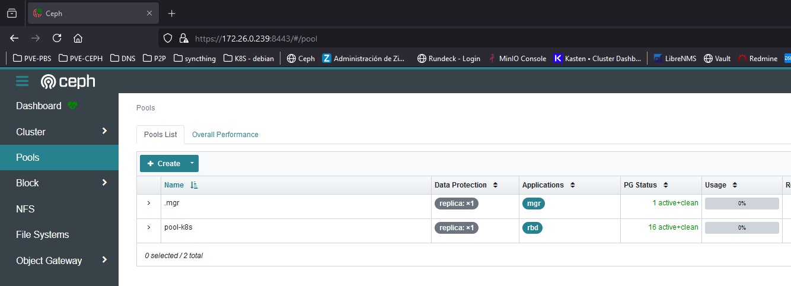
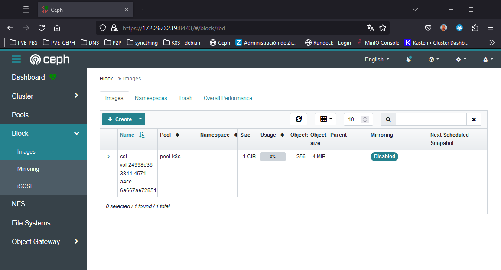

# Ceph Storage RBD

* [Getting Started](#id0)
* [Ceph](#id1)
* [Config Ceph](#id2)
* [Change SC to default](#id3)
* [Testing](#id4)
* [Errores](#id5)
  * [Enlace PV/PVC a Ceph](#id6)
  * [fsck de Ceph](#id7)


## Getting Started <div id='id0' />

Partimos de la siguiente base:

* El microprocesador de los equipos del cluster de K8s, han de tener el flag: **x86-64-v2**
* Tenemos un cluster de K8S desplegado
* Por experiencia propia: si no hay 3 wokers/nodes, no nos funcionará el sistema de storage de Ceph
* Tenemos un sistema de Ceph desplegado (en esta caso es un All-In-One)

Verificaremos que todo esté correcto

```
root@kubespray-aio:~# kubectl get nodes
NAME               STATUS   ROLES           AGE    VERSION
kubespray-aio      Ready    control-plane   162d   v1.27.5
kubespray-aio-w1   Ready    <none>          161d   v1.27.5
kubespray-aio-w2   Ready    <none>          161d   v1.27.5
kubespray-aio-w3   Ready    <none>          161d   v1.27.5
```

```
root@ceph-aio:~# cephadm shell
root@ceph-aio:~# ceph -s
  cluster:
    id:     7d2b3cca-f1eb-11ee-a886-593bc87d3824
    health: HEALTH_OK
            (muted: POOL_NO_REDUNDANCY)

  services:
    mon: 1 daemons, quorum ceph-aio (age 95s)
    mgr: ceph-aio.iaeehz(active, since 42s)
    osd: 3 osds: 3 up (since 52s), 3 in (since 2M)

  data:
    pools:   1 pools, 1 pgs
    objects: 2 objects, 449 KiB
    usage:   891 MiB used, 89 GiB / 90 GiB avail
    pgs:     1 active+clean
```

## Ceph <div id='id1' /> 


```
root@ceph-aio:~# ceph osd lspools
1 .mgr

root@ceph-aio:~# ceph mon dump | grep "fsid "
dumped monmap epoch 1
fsid 7d2b3cca-f1eb-11ee-a886-593bc87d3824

root@ceph-aio:~# ceph mon dump | grep 6789
dumped monmap epoch 1
0: [v2:172.26.0.239:3300/0,v1:172.26.0.239:6789/0] mon.ceph-aio
```

```
root@ceph-aio:~# ceph osd pool create pool-k8s 16
root@ceph-aio:~# ceph osd pool set pool-k8s size 1 --yes-i-really-mean-it
root@ceph-aio:~# rbd pool init pool-k8s
root@ceph-aio:~# ceph health mute POOL_NO_REDUNDANCY

root@ceph-aio:~# ceph osd lspools
1 .mgr
6 pool-k8s
```

Verificaremos via web que se ha creado el Pool correctamente:



Verificaremos que el Ceph este **HEALTH_OK**

```
root@ceph-aio:~# ceph -s
  cluster:
    id:     7d2b3cca-f1eb-11ee-a886-593bc87d3824
    health: HEALTH_OK
            (muted: POOL_NO_REDUNDANCY)

  services:
    mon: 1 daemons, quorum ceph-aio (age 4m)
    mgr: ceph-aio.iaeehz(active, since 3m)
    osd: 3 osds: 3 up (since 3m), 3 in (since 2M)

  data:
    pools:   2 pools, 17 pgs
    objects: 3 objects, 449 KiB
    usage:   891 MiB used, 89 GiB / 90 GiB avail
    pgs:     17 active+clean
```

```
root@ceph-aio:~# ceph auth add client.k8s mon 'allow r' osd 'allow rwx pool=pool-k8s'
root@ceph-aio:/# ceph auth get-key client.k8s && echo
AQDs9H9mvNoLIRAAosZeAMUDg7am2bGbVi7zoA==
```

Verificar "cosas" del usuario:

```
root@ceph-aio:/# ceph auth get-key client.k8s && echo
AQDs9H9mvNoLIRAAosZeAMUDg7am2bGbVi7zoA==

root@ceph-aio:~# ceph auth get client.k8s
[client.k8s]
        key = AQDs9H9mvNoLIRAAosZeAMUDg7am2bGbVi7zoA==
        caps mon = "allow r"
        caps osd = "allow rwx pool=pool-k8s"
```

## Config Ceph <div id='id2' /> 

```
root@diba-master:~# helm repo add ceph-csi https://ceph.github.io/csi-charts
root@diba-master:~# helm repo update

root@diba-master:~# helm search repo ceph-csi/ceph-csi-rbd
NAME                    CHART VERSION   APP VERSION     DESCRIPTION
ceph-csi/ceph-csi-rbd   3.11.0          3.11.0          Container Storage Interface (CSI) driver, provi...
```

```
root@diba-master:~# vim values-ceph-csi-rbd.yaml
csiConfig:
  - clusterID: "7d2b3cca-f1eb-11ee-a886-593bc87d3824"
    monitors:
      - "172.26.0.239:6789"

storageClass:
  create: true
  name: csi-rbd-sc
  clusterID: 7d2b3cca-f1eb-11ee-a886-593bc87d3824
  pool: pool-k8s
  annotations:
    storageclass.kubernetes.io/is-default-class: "true"

secret:
  create: true
  name: csi-rbd-secret
  userID: k8s
  userKey: AQDs9H9mvNoLIRAAosZeAMUDg7am2bGbVi7zoA==
```

:warning: El siguiente paso tarda unos 15 minutos :warning:

```
root@diba-master:~# helm upgrade --install ceph-csi-rbd \
--create-namespace \
--namespace ceph-csi \
-f values-ceph-csi-rbd.yaml \
--version=3.11.0 \
ceph-csi/ceph-csi-rbd

root@kubespray-aio:~# helm -n ceph-csi ls
NAME            NAMESPACE       REVISION        UPDATED                                 STATUS          CHART                   APP VERSION
ceph-csi-rbd    ceph-csi        1               2024-06-29 13:12:31.60139992 +0200 CEST deployed        ceph-csi-rbd-3.11.0     3.11.0
```

```
root@diba-master:~# kubectl -n ceph-csi get pods
NAME                                        READY   STATUS    RESTARTS   AGE
ceph-csi-rbd-nodeplugin-6gvd2               3/3     Running   0          3m54s
ceph-csi-rbd-nodeplugin-gmr4c               3/3     Running   0          3m54s
ceph-csi-rbd-nodeplugin-t6nnp               3/3     Running   0          3m54s
ceph-csi-rbd-provisioner-66d99f8ffb-8bl2k   7/7     Running   0          3m54s
ceph-csi-rbd-provisioner-66d99f8ffb-jmrpq   7/7     Running   0          3m54s
ceph-csi-rbd-provisioner-66d99f8ffb-rm2fg   7/7     Running   0          3m54s

root@kubespray-aio:~# kubectl get sc
NAME                   PROVISIONER        RECLAIMPOLICY   VOLUMEBINDINGMODE   ALLOWVOLUMEEXPANSION   AGE
csi-rbd-sc (default)   rbd.csi.ceph.com   Delete          Immediate           true                   42s
```

## Change SC to default <div id='id3' />

```
root@kubespray-aio:~# kubectl get sc
NAME         PROVISIONER        RECLAIMPOLICY   VOLUMEBINDINGMODE   ALLOWVOLUMEEXPANSION   AGE
csi-rbd-sc   rbd.csi.ceph.com   Delete          Immediate           true                   4m48s

root@kubespray-aio:~# kubectl patch storageclass csi-rbd-sc -p '{"metadata": {"annotations":{"storageclass.kubernetes.io/is-default-class":"true"}}}'

root@kubespray-aio:~# kubectl get sc
NAME                   PROVISIONER        RECLAIMPOLICY   VOLUMEBINDINGMODE   ALLOWVOLUMEEXPANSION   AGE
csi-rbd-sc (default)   rbd.csi.ceph.com   Delete          Immediate           true                   4m59s
```

## Testing <div id='id4' />

```
root@kubespray-aio:~# kubectl create ns test-ceph
```

```
root@kubespray-aio:~# vim test-ceph.yaml
apiVersion: v1
kind: PersistentVolumeClaim
metadata:
  name: pvc-fs-apache
  namespace: test-ceph
spec:
  accessModes:
    - ReadWriteOnce
  volumeMode: Filesystem
  resources:
    requests:
      storage: 1Gi
  storageClassName: csi-rbd-sc
---
apiVersion: apps/v1
kind: Deployment
metadata:
  name: httpd-deployment
  namespace: test-ceph
spec:
  selector:
    matchLabels:
      app: httpd
  replicas: 1
  template:
    metadata:
      labels:
        app: httpd
    spec:
      containers:
      - name: httpd
        image: httpd
        ports:
        - containerPort: 80
        volumeMounts:
        - name: data
          mountPath: /mydata
      volumes:
      - name: data
        persistentVolumeClaim:
          claimName: pvc-fs-apache

root@kubespray-aio:~# kubectl apply -f test-ceph.yaml
```

```
root@diba-master:~# kubectl -n test-ceph get pods
NAME                                READY   STATUS    RESTARTS   AGE
httpd-deployment-6b74459564-bwhjw   1/1     Running   0          96s
```

```
root@diba-master:~# kubectl -n test-ceph get pvc
NAME            STATUS   VOLUME                                     CAPACITY   ACCESS MODES   STORAGECLASS   AGE
pvc-fs-apache   Bound    pvc-03992982-0896-4fcc-916f-c289bad96b6c   1Gi        RWO            csi-rbd-sc     110s
```

```
root@diba-master:~# NAME_POD=`kubectl -n test-ceph get pods | grep httpd-deployment | awk '{print $1}'`
root@diba-master:~# kubectl -n test-ceph exec -it $NAME_POD -- bash

root@httpd-deployment-6b74459564-bwhjw:/usr/local/apache2# df -h | grep mydata
/dev/rbd0       974M   24K  958M   1% /mydata
```

Si falla todo verificar:

```
root@kubespray-aio:~# kubectl -n ceph-csi logs -f ceph-csi-rbd-nodeplugin-m5nhf
```

```
root@kubespray-aio:~# kubectl -n ceph-csi exec -it ceph-csi-rbd-nodeplugin-m5nhf -- bash
```

```
[root@kubespray-aio /]# timeout 5 bash -c "</dev/tcp/172.26.0.239/6789" && echo $?
0

[root@kubespray-aio /]# timeout 5 bash -c "</dev/tcp/172.26.0.239/3300" && echo $?
0
```

```
[root@kubespray-aio /]# ping -c 2 172.26.0.239
PING 172.26.0.239 (172.26.0.239) 56(84) bytes of data.
64 bytes from 172.26.0.239: icmp_seq=1 ttl=64 time=3.52 ms
64 bytes from 172.26.0.239: icmp_seq=2 ttl=64 time=0.691 ms

--- 172.26.0.239 ping statistics ---
2 packets transmitted, 2 received, 0% packet loss, time 1001ms
rtt min/avg/max/mdev = 0.691/2.103/3.516/1.413 ms
```
## Errores <div id='id5' />

## Enlace PV/PVC a Ceph <div id='id6' />

Como saber el enlace que hay entre los diferentes nombres que usa K8S y Ceph

```
root@diba-master:~# kubectl -n test-ceph get pvc
NAME            STATUS   VOLUME                                     CAPACITY   ACCESS MODES   STORAGECLASS   AGE
pvc-fs-apache   Bound    pvc-03992982-0896-4fcc-916f-c289bad96b6c   1Gi        RWO            csi-rbd-sc     3m36s

root@diba-master:~# kubectl -n test-ceph describe pv pvc-03992982-0896-4fcc-916f-c289bad96b6c | grep VolumeHandle
    VolumeHandle:      0001-0024-7d2b3cca-f1eb-11ee-a886-593bc87d3824-0000000000000006-24998e36-3844-4571-a4ce-6a667ae72851
```

Verificaremos que el número: **24998e36-3844-4571-a4ce-6a667ae72851** coincide con el de Ceph en la siguiente imagen:




Con los comandos anteriores podemos observar que el storage de K8S que usa para enlazar con Ceph es: 

```
root@ceph-aio:~# rbd ls pool-k8s
csi-vol-24998e36-3844-4571-a4ce-6a667ae72851

root@ceph-aio:~# rbd info pool-k8s/csi-vol-24998e36-3844-4571-a4ce-6a667ae72851
rbd image 'csi-vol-24998e36-3844-4571-a4ce-6a667ae72851':
        size 1 GiB in 256 objects
        order 22 (4 MiB objects)
        snapshot_count: 0
        id: 1e4da98d50e09
        block_name_prefix: rbd_data.1e4da98d50e09
        format: 2
        features: layering
        op_features:
        flags:
        create_timestamp: Sun Jun 30 15:36:04 2024
        access_timestamp: Sun Jun 30 15:36:04 2024
        modify_timestamp: Sun Jun 30 15:36:04 2024
```

## fsck de Ceph <div id='id7' />

Mensaje de error:

```
$ k describe pod loki-write-0
Events:
  Type     Reason       Age                       From     Message
  ----     ------       ----                      ----     -------
  Warning  FailedMount  5m33s (x1997 over 2d21h)  kubelet  MountVolume.MountDevice failed for volume "pvc-117685da-76d0-4f22-87b5-e2f4833d1720" : rpc error: code = Internal desc = 'fsck' found errors on device /dev/rbd12 but could not correct them: fsck from util-linux 2.37.4
/dev/rbd12 contains a file system with errors, check forced.
/dev/rbd12: Unattached inode 393227
```

Instalación de Ceph:

```
root@ilimit-paas-k8s-provi-cp01:~# apt-get update
root@ilimit-paas-k8s-provi-cp01:~# apt-get install -y ceph-common
```

Recopilaciónde datos para posterior configuración del cliente de Ceph:

```
root@vrt-hv01:~# ceph auth get client.ilimit-paas-k8s-provi
[client.ilimit-paas-k8s-provi]
        key = AQAIPYVnYTcRExAALDQf1sZ12ym+v83kFF+U1g==
        caps mon = "allow r"
        caps osd = "allow rwx pool=ilimit-paas-k8s-provi"

root@vrt-hv01:~# ceph mon dump | grep 6789
dumped monmap epoch 75
0: [v2:10.61.2.209:3300/0,v1:10.61.2.209:6789/0] mon.vrt-hv09
1: [v2:10.61.2.203:3300/0,v1:10.61.2.203:6789/0] mon.vrt-hv03
2: [v2:10.61.2.201:3300/0,v1:10.61.2.201:6789/0] mon.vrt-hv01
3: [v2:10.61.2.208:3300/0,v1:10.61.2.208:6789/0] mon.vrt-hv08
4: [v2:10.61.2.211:3300/0,v1:10.61.2.211:6789/0] mon.vrt-hv11

root@vrt-hv01:~# ceph mon dump | grep "fsid "
dumped monmap epoch 75
fsid dbe78947-5443-4cb3-b14c-aced62e0920c

root@vrt-hv01:~# rbd ls ilimit-paas-k8s-provi
csi-vol-15bc543e-abed-4a43-b7ba-e607ee7f5e19
...
```

Configuración del cliente de Ceph

```
root@ilimit-paas-k8s-provi-cp01:~# vim /etc/ceph/ceph.conf
[global]
        fsid = dbe78947-5443-4cb3-b14c-aced62e0920c
        mon_host = 10.61.2.209 10.61.2.203 10.61.2.201 10.61.2.208 10.61.2.211

[client]
        keyring = /etc/ceph/ceph.client.ilimit-paas-k8s-provi.keyring

root@ilimit-paas-k8s-provi-cp01:~# vim /etc/ceph/ceph.client.ilimit-paas-k8s-provi.keyring
[client.ilimit-paas-k8s-provi]
        key = AQAIPYVnYTcRExAALDQf1sZ12ym+v83kFF+U1g==
```

Verificación del acceso:

```
root@ilimit-paas-k8s-provi-cp01:~# rbd ls ilimit-paas-k8s-provi -n client.ilimit-paas-k8s-provi
csi-vol-15bc543e-abed-4a43-b7ba-e607ee7f5e19
...
```

Enlazar PVC con RBD:

```
root@ilimit-paas-k8s-provi-cp01:~# kubectl -n core get pvc | grep loki-write-0 | awk '{print $3}'
pvc-117685da-76d0-4f22-87b5-e2f4833d1720

root@ilimit-paas-k8s-provi-cp01:~# kubectl -n core describe pv pvc-117685da-76d0-4f22-87b5-e2f4833d1720 | grep VolumeHandle
    VolumeHandle:      0001-0024-dbe78947-5443-4cb3-b14c-aced62e0920c-0000000000000019-1f5d604f-1207-4667-a649-1cbb41e982a8

root@ilimit-paas-k8s-provi-cp01:~# rbd ls ilimit-paas-k8s-provi -n client.ilimit-paas-k8s-provi | grep 1cbb41e982a8
csi-vol-1f5d604f-1207-4667-a649-1cbb41e982a8
```

Chequeamos el disco:

```
root@ilimit-paas-k8s-provi-cp01:/etc/ceph# rbd map csi-vol-1f5d604f-1207-4667-a649-1cbb41e982a8 --pool ilimit-paas-k8s-provi -n client.ilimit-paas-k8s-provi
/dev/rbd0

root@ilimit-paas-k8s-provi-cp01:/etc/ceph# rbd showmapped
id  pool                   namespace  image                                         snap  device
0   ilimit-paas-k8s-provi             csi-vol-1f5d604f-1207-4667-a649-1cbb41e982a8  -     /dev/rbd0

root@ilimit-paas-k8s-provi-cp01:/etc/ceph# fsck -fvy /dev/rbd0

root@ilimit-paas-k8s-provi-cp01:~# rbd unmap /dev/rbd0
```