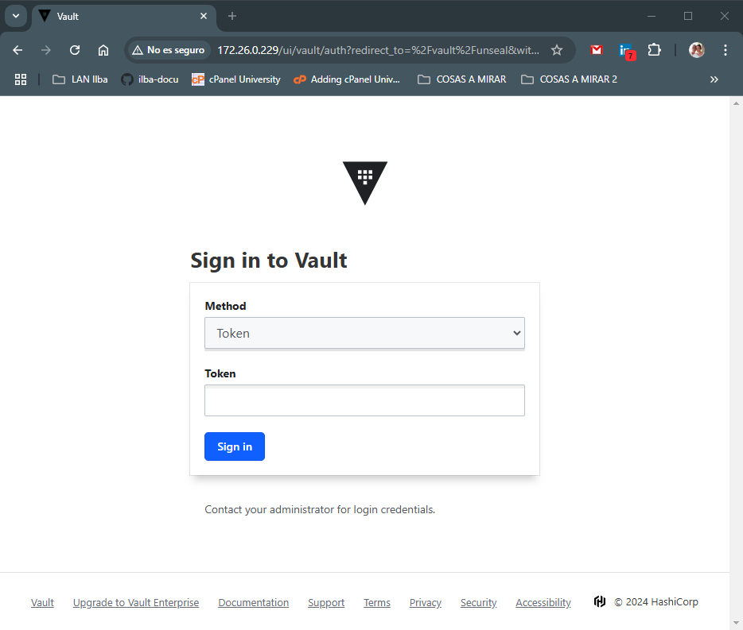

# Index:

* [Transit](#id10)
  * [Instalación vault en docker-compose](#id11)
  * [Unseal de Vault](#id12)
* [kubernetes](#id20)
  * [Token transit para K8s](#id21)
  * [Vault en K8s](#id22)

# Transit <div id='id10' />

Necesitamos un equipo con docker-compose, para poder desplegar el transit.

## Instalación vault en docker-compose <div id='id11' />

```
root@vault-transit:~# apt-get update && apt-get install -y jq
```

```
root@vault-transit:~# mkdir -p /etc/vault-server/{config,file}

root@vault-transit:~# cat <<EOF >> /etc/vault-server/config/vault.json
{
    "disable_mlock": true,
    "backend": {
      "file": {
        "path": "/vault/file"
      }
    },
    "listener": {
      "tcp":{
        "address": "0.0.0.0:8200",
        "tls_disable": 1
      }
    },
    "ui": true
}
EOF
```

```
root@vault-transit:~# mkdir -p /etc/nginx/conf.d/

root@vault-transit:~# vim /etc/nginx/conf.d/default.conf
upstream vault {
  server vault:8200 max_fails=3;
}
server {
  listen *:80;
  server_name _;
  location /healthz {
      stub_status;
  }
  location / {
    proxy_set_header Host $host;
    proxy_set_header X-Real-IP $remote_addr;
    proxy_set_header X-Forwarded-Host $host;
    proxy_set_header X-Forwarded-Server $host;
    proxy_set_header X-Forwarded-Port $server_port;
    proxy_set_header X-Forwarded-For $proxy_add_x_forwarded_for;
    proxy_set_header X-Forwarded-Proto $scheme;
    proxy_pass http://vault;
  }
}
```


```
root@vault-transit:~# cat <<EOF >> /etc/docker-compose/docker-compose.yaml
version: '3'
services:
  nginx:
    container_name: 'nginx'
    hostname: 'nginx'
    image: 'nginx:1.25.3-alpine'
    depends_on:
      - 'vault'
    ports:
      - '80:80'
    volumes:
      - '/etc/localtime:/etc/localtime:ro'
      - '/etc/nginx/conf.d/default.conf:/etc/nginx/conf.d/default.conf'
  vault:
    container_name: vault
    hostname: vault
    image: hashicorp/vault:1.17.5
    restart: always
    environment:
      VAULT_ADDR: http://localhost:8200
    ports:
      - "8200:8200"
    cap_add:
      - 'IPC_LOCK'
    volumes:
      - /etc/vault-server/config/vault.json:/etc/vault-server/config/vault.json
      - /etc/vault-server/file:/vault/file
      - /etc/localtime:/etc/localtime:ro
    command: "vault server -config=/etc/vault-server/config/vault.json"
EOF

root@vault-transit:~# docker-compose -f /etc/docker-compose/docker-compose.yaml up -d

root@vault-transit:~# docker ps -a
CONTAINER ID   IMAGE                    COMMAND                  CREATED         STATUS         PORTS                                       NAMES
d8581e800825   nginx:1.25.3-alpine      "/docker-entrypoint.…"   7 seconds ago   Up 6 seconds   0.0.0.0:80->80/tcp, :::80->80/tcp           nginx
fcc757fc5331   hashicorp/vault:1.17.5   "docker-entrypoint.s…"   8 seconds ago   Up 7 seconds   0.0.0.0:8200->8200/tcp, :::8200->8200/tcp   vault
```

## Unseal de Vault <div id='id12' />

```
root@vault-transit:~# docker exec -it vault vault operator init
Unseal Key 1: +Y8HDolAfpm/hwrZ72flgrAfj8aH1QwvlP2vf/2UyjaS
Unseal Key 2: 5id1ig/8u+bgN1HnPJQW8TQvyAT+o5vinTQ2/yUrvilA
Unseal Key 3: dAMRqHsU491x4bizhrIarYkmeEyqDy42uYGWHPBdlFyZ
Unseal Key 4: 0PI8LW7DzkUzxhoeOoYPEcSbbcSdTTufzt2iGMbF5Rdc
Unseal Key 5: i6PknfSwlOFukzmNMKKKoSGDjgLp70qhnBt3efJEh0Fs

Initial Root Token: hvs.xBV3t49lOCmaDrXrLQqN4AE6
```

```
root@vault-transit:~# vim /usr/local/sbin/unsealt_vault_script.sh
#!/bin/bash

VAULT_ADDR='172.26.0.235'

KEY=(
     '+Y8HDolAfpm/hwrZ72flgrAfj8aH1QwvlP2vf/2UyjaS'
     '5id1ig/8u+bgN1HnPJQW8TQvyAT+o5vinTQ2/yUrvilA'
     'dAMRqHsU491x4bizhrIarYkmeEyqDy42uYGWHPBdlFyZ'
    )

for i in "${KEY[@]}"; do
    echo "$i"
    curl -s --request PUT --data "{\"key\": \"$i\"}" $VAULT_ADDR/v1/sys/unseal
    sleep 5
done

SEALED=`curl -s $VAULT_ADDR/v1/sys/seal-status | jq '.sealed'`


if [[ $SEALED == "true" ]]
then
  echo "Vault is sealed: SHIT"
else
  echo "Vault is unsealed: OK"
fi


root@vault-transit:~# chmod +x /usr/local/sbin/unsealt_vault_script.sh
root@vault-transit:~# /usr/local/sbin/unsealt_vault_script.sh

root@vault-transit:~# docker exec -it vault vault status
Key             Value
---             -----
Seal Type       shamir
Initialized     true
Sealed          false
Total Shares    5
Threshold       3
Version         1.17.5
Build Date      2024-08-30T15:54:57Z
Storage Type    file
Cluster Name    vault-cluster-3ca45972
Cluster ID      dae6fc79-4abf-77eb-03a2-f20b240da24f
HA Enabled      false
```

```
root@vault-transit:~# cat <<EOF >> /etc/systemd/system/unsealt_vault_script.service
[Unit]
Description="Unseal Vault"
Wants=vault.service consul.service

[Service]
ExecStart=/usr/local/sbin/unsealt_vault_script.sh
ExecStartPre=/bin/sleep 30

[Install]
WantedBy=multi-user.target
EOF

root@vault-transit:~# systemctl daemon-reload && systemctl enable unsealt_vault_script.service && reboot
```

```
root@vault-transit:~# docker exec -it vault vault status
Key             Value
---             -----
Seal Type       shamir
Initialized     true
Sealed          false
Total Shares    5
Threshold       3
Version         1.17.5
Build Date      2024-08-30T15:54:57Z
Storage Type    file
Cluster Name    vault-cluster-3ca45972
Cluster ID      dae6fc79-4abf-77eb-03a2-f20b240da24f
HA Enabled      false
```

Verificamos el accceso via web:

* URL: http://172.26.0.235
* TOKEN: hvs.bbUzLpUPeshAAR6gCCrm5UjU



# kubernetes <div id='id20' />

## Token transit para K8s <div id='id21' />

```
root@vault-transit:~# docker exec -it vault sh

/ # vault status | grep Sealed
Sealed          false

/ # vault login hvs.xBV3t49lOCmaDrXrLQqN4AE6
/ # vault secrets enable transit
/ # vault write sys/auth/token/tune default_lease_ttl=87600h
/ # vault write sys/auth/token/tune max_lease_ttl=87600h
/ # vault write -f transit/keys/autounseal

/ # cat <<EOF >> autounseal-policy.hcl
path "transit/encrypt/autounseal" {
   capabilities = [ "update" ]
}
path "transit/decrypt/autounseal" {
   capabilities = [ "update" ]
}
EOF

/ # vault policy write autounseal-k8s autounseal-policy.hcl

/ # vault token create -policy="autounseal-k8s" -wrap-ttl=87600h
Key                              Value
---                              -----
wrapping_token:                  hvs.CAESILloitmOiPIC1a9Pq5atEvKt-T5sy4xD2XNgeiAk90JRGh4KHGh2cy5EV2FVRjN5MDRaVWVjc3FXUmxod2lDWWk
wrapping_accessor:               hVio5mIgXMfgnIeCXT3TUJvQ
wrapping_token_ttl:              87600h
wrapping_token_creation_time:    2024-11-17 09:49:20.560625851 +0100 CET
wrapping_token_creation_path:    auth/token/create
wrapped_accessor:                IufZlzoEZZUFDbW7jnyvTy0Q

/ # VAULT_TOKEN="hvs.CAESILloitmOiPIC1a9Pq5atEvKt-T5sy4xD2XNgeiAk90JRGh4KHGh2cy5EV2FVRjN5MDRaVWVjc3FXUmxod2lDWWk" vault unwrap
Key                  Value
---                  -----
token                hvs.CAESIOqhI0JeLQszCg3k7sOMbQmUqujaE6pn5bb0R-YdHRA_Gh4KHGh2cy5aTkhCZFZXeEhFSEw0b2FaNjRySGJtNXU
token_accessor       IufZlzoEZZUFDbW7jnyvTy0Q
token_duration       87600h
token_renewable      true
token_policies       ["autounseal-k8s" "default"]
identity_policies    []
policies             ["autounseal-k8s" "default"]
```

Este es el Token para el values del vault que desplegaremos en K8s: **hvs.CAESIOqhI0JeLQszCg3k7sOMbQmUqujaE6pn5bb0R-YdHRA_Gh4KHGh2cy5aTkhCZFZXeEhFSEw0b2FaNjRySGJtNXU**

## Vault en K8s <div id='id22' />

```
root@k8s-test-cp:~# kubectl get nodes
NAME            STATUS   ROLES           AGE   VERSION
k8s-test-cp     Ready    control-plane   27d   v1.30.4
k8s-test-wk01   Ready    <none>          27d   v1.30.4
k8s-test-wk02   Ready    <none>          27d   v1.30.4
k8s-test-wk03   Ready    <none>          27d   v1.30.4

root@k8s-test-cp:~# kubectl get sc
NAME                   PROVISIONER        RECLAIMPOLICY   VOLUMEBINDINGMODE   ALLOWVOLUMEEXPANSION   AGE
csi-rbd-sc (default)   rbd.csi.ceph.com   Delete          Immediate           true                   4m45s
```


/ $ vault operator raft list-peers