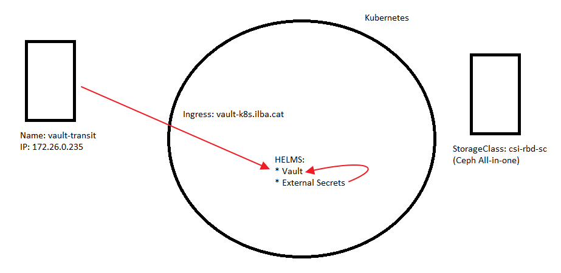
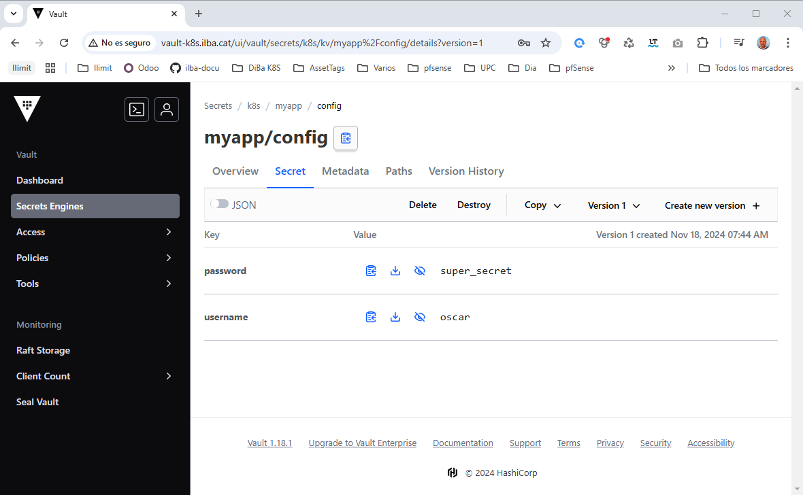

# Index:

* [Start](#id05)
* [Transit](#id10)
  * [Instalación vault en docker-compose](#id11)
  * [Unseal de Vault](#id12)
* [kubernetes](#id20)
  * [Token transit para K8s](#id21)
  * [Vault en K8s](#id22)
  * [External secrets](#id23)
* [Comandos útiles](#id30)
  * [Forzar sincronismo](#id31)

# Start <div id='id05' />



Necesitamos:
* Un equipo con docker-compose, para poder desplegar el transit.
* Un cluster de K8s con Storage persistente

# Transit <div id='id10' />

## Instalación vault en docker-compose <div id='id11' />

```
root@vault-transit:~# apt-get update && apt-get install -y jq
```

```
root@vault-transit:~# mkdir -p /etc/vault-server/{config,file}

root@vault-transit:~# cat <<EOF >> /etc/vault-server/config/vault.json
{
    "disable_mlock": true,
    "backend": {
      "file": {
        "path": "/vault/file"
      }
    },
    "listener": {
      "tcp":{
        "address": "0.0.0.0:8200",
        "tls_disable": 1
      }
    },
    "ui": true
}
EOF
```

```
root@vault-transit:~# mkdir -p /etc/nginx/conf.d/

root@vault-transit:~# vim /etc/nginx/conf.d/default.conf
upstream vault {
  server vault:8200 max_fails=3;
}
server {
  listen *:80;
  server_name _;
  location /healthz {
      stub_status;
  }
  location / {
    proxy_set_header Host $host;
    proxy_set_header X-Real-IP $remote_addr;
    proxy_set_header X-Forwarded-Host $host;
    proxy_set_header X-Forwarded-Server $host;
    proxy_set_header X-Forwarded-Port $server_port;
    proxy_set_header X-Forwarded-For $proxy_add_x_forwarded_for;
    proxy_set_header X-Forwarded-Proto $scheme;
    proxy_pass http://vault;
  }
}
```


```
root@vault-transit:~# cat <<EOF >> /etc/docker-compose/docker-compose.yaml
version: '3'
services:
  nginx:
    container_name: 'nginx'
    hostname: 'nginx'
    image: 'nginx:1.25.3-alpine'
    depends_on:
      - 'vault'
    ports:
      - '80:80'
    volumes:
      - '/etc/localtime:/etc/localtime:ro'
      - '/etc/nginx/conf.d/default.conf:/etc/nginx/conf.d/default.conf'
  vault:
    container_name: vault
    hostname: vault
    image: hashicorp/vault:1.17.5
    restart: always
    environment:
      VAULT_ADDR: http://localhost:8200
    ports:
      - "8200:8200"
    cap_add:
      - 'IPC_LOCK'
    volumes:
      - /etc/vault-server/config/vault.json:/etc/vault-server/config/vault.json
      - /etc/vault-server/file:/vault/file
      - /etc/localtime:/etc/localtime:ro
    command: "vault server -config=/etc/vault-server/config/vault.json"
EOF

root@vault-transit:~# docker-compose -f /etc/docker-compose/docker-compose.yaml up -d

root@vault-transit:~# docker ps -a
CONTAINER ID   IMAGE                    COMMAND                  CREATED         STATUS         PORTS                                       NAMES
d8581e800825   nginx:1.25.3-alpine      "/docker-entrypoint.…"   7 seconds ago   Up 6 seconds   0.0.0.0:80->80/tcp, :::80->80/tcp           nginx
fcc757fc5331   hashicorp/vault:1.17.5   "docker-entrypoint.s…"   8 seconds ago   Up 7 seconds   0.0.0.0:8200->8200/tcp, :::8200->8200/tcp   vault
```

## Unseal de Vault <div id='id12' />

```
root@vault-transit:~# docker exec -it vault vault operator init
Unseal Key 1: +Y8HDolAfpm/hwrZ72flgrAfj8aH1QwvlP2vf/2UyjaS
Unseal Key 2: 5id1ig/8u+bgN1HnPJQW8TQvyAT+o5vinTQ2/yUrvilA
Unseal Key 3: dAMRqHsU491x4bizhrIarYkmeEyqDy42uYGWHPBdlFyZ
Unseal Key 4: 0PI8LW7DzkUzxhoeOoYPEcSbbcSdTTufzt2iGMbF5Rdc
Unseal Key 5: i6PknfSwlOFukzmNMKKKoSGDjgLp70qhnBt3efJEh0Fs

Initial Root Token: hvs.xBV3t49lOCmaDrXrLQqN4AE6
```

```
root@vault-transit:~# vim /usr/local/sbin/unsealt_vault_script.sh
#!/bin/bash

VAULT_ADDR='172.26.0.235'

KEY=(
     '+Y8HDolAfpm/hwrZ72flgrAfj8aH1QwvlP2vf/2UyjaS'
     '5id1ig/8u+bgN1HnPJQW8TQvyAT+o5vinTQ2/yUrvilA'
     'dAMRqHsU491x4bizhrIarYkmeEyqDy42uYGWHPBdlFyZ'
    )

for i in "${KEY[@]}"; do
    echo "$i"
    curl -s --request PUT --data "{\"key\": \"$i\"}" $VAULT_ADDR/v1/sys/unseal
    sleep 5
done

SEALED=`curl -s $VAULT_ADDR/v1/sys/seal-status | jq '.sealed'`


if [[ $SEALED == "true" ]]
then
  echo "Vault is sealed: SHIT"
else
  echo "Vault is unsealed: OK"
fi


root@vault-transit:~# chmod +x /usr/local/sbin/unsealt_vault_script.sh
root@vault-transit:~# /usr/local/sbin/unsealt_vault_script.sh

root@vault-transit:~# docker exec -it vault vault status
Key             Value
---             -----
Seal Type       shamir
Initialized     true
Sealed          false
Total Shares    5
Threshold       3
Version         1.17.5
Build Date      2024-08-30T15:54:57Z
Storage Type    file
Cluster Name    vault-cluster-3ca45972
Cluster ID      dae6fc79-4abf-77eb-03a2-f20b240da24f
HA Enabled      false
```

```
root@vault-transit:~# cat <<EOF >> /etc/systemd/system/unsealt_vault_script.service
[Unit]
Description="Unseal Vault"
Wants=vault.service consul.service

[Service]
ExecStart=/usr/local/sbin/unsealt_vault_script.sh
ExecStartPre=/bin/sleep 30

[Install]
WantedBy=multi-user.target
EOF

root@vault-transit:~# systemctl daemon-reload && systemctl enable unsealt_vault_script.service && reboot
```

```
root@vault-transit:~# docker exec -it vault vault status
Key             Value
---             -----
Seal Type       shamir
Initialized     true
Sealed          false
Total Shares    5
Threshold       3
Version         1.17.5
Build Date      2024-08-30T15:54:57Z
Storage Type    file
Cluster Name    vault-cluster-3ca45972
Cluster ID      dae6fc79-4abf-77eb-03a2-f20b240da24f
HA Enabled      false
```

Verificamos el accceso via web:

* URL: http://172.26.0.235
* TOKEN: hvs.xBV3t49lOCmaDrXrLQqN4AE6


# kubernetes <div id='id20' />

## Token transit para K8s <div id='id21' />

```
root@vault-transit:~# docker exec -it vault sh

/ # vault status | grep Sealed
Sealed          false

/ # vault login hvs.xBV3t49lOCmaDrXrLQqN4AE6
/ # vault secrets enable transit
/ # vault write sys/auth/token/tune default_lease_ttl=87600h
/ # vault write sys/auth/token/tune max_lease_ttl=87600h
/ # vault write -f transit/keys/autounseal

/ # cat <<EOF >> autounseal-policy.hcl
path "transit/encrypt/autounseal" {
   capabilities = [ "update" ]
}
path "transit/decrypt/autounseal" {
   capabilities = [ "update" ]
}
EOF

/ # vault policy write autounseal-k8s autounseal-policy.hcl

/ # vault token create -policy="autounseal-k8s" -wrap-ttl=87600h
Key                              Value
---                              -----
wrapping_token:                  hvs.CAESILloitmOiPIC1a9Pq5atEvKt-T5sy4xD2XNgeiAk90JRGh4KHGh2cy5EV2FVRjN5MDRaVWVjc3FXUmxod2lDWWk
wrapping_accessor:               hVio5mIgXMfgnIeCXT3TUJvQ
wrapping_token_ttl:              87600h
wrapping_token_creation_time:    2024-11-17 09:49:20.560625851 +0100 CET
wrapping_token_creation_path:    auth/token/create
wrapped_accessor:                IufZlzoEZZUFDbW7jnyvTy0Q

/ # VAULT_TOKEN="hvs.CAESILloitmOiPIC1a9Pq5atEvKt-T5sy4xD2XNgeiAk90JRGh4KHGh2cy5EV2FVRjN5MDRaVWVjc3FXUmxod2lDWWk" vault unwrap
Key                  Value
---                  -----
token                hvs.CAESIOqhI0JeLQszCg3k7sOMbQmUqujaE6pn5bb0R-YdHRA_Gh4KHGh2cy5aTkhCZFZXeEhFSEw0b2FaNjRySGJtNXU
token_accessor       IufZlzoEZZUFDbW7jnyvTy0Q
token_duration       87600h
token_renewable      true
token_policies       ["autounseal-k8s" "default"]
identity_policies    []
policies             ["autounseal-k8s" "default"]
```

Este es el Token para el values del vault que desplegaremos en K8s: **hvs.CAESIOqhI0JeLQszCg3k7sOMbQmUqujaE6pn5bb0R-YdHRA_Gh4KHGh2cy5aTkhCZFZXeEhFSEw0b2FaNjRySGJtNXU**

## Vault en K8s <div id='id22' />

```
root@k8s-test-cp:~# kubectl get nodes
NAME            STATUS   ROLES           AGE   VERSION
k8s-test-cp     Ready    control-plane   27d   v1.30.4
k8s-test-wk01   Ready    <none>          27d   v1.30.4
k8s-test-wk02   Ready    <none>          27d   v1.30.4
k8s-test-wk03   Ready    <none>          27d   v1.30.4

root@k8s-test-cp:~# kubectl get sc
NAME                   PROVISIONER        RECLAIMPOLICY   VOLUMEBINDINGMODE   ALLOWVOLUMEEXPANSION   AGE
csi-rbd-sc (default)   rbd.csi.ceph.com   Delete          Immediate           true                   4m45s
```

```
$ scp helm/values-vault.yaml 172.26.0.230:

root@k8s-test-cp:~# helm repo add hashicorp https://helm.releases.hashicorp.com
root@k8s-test-cp:~# helm repo update

root@k8s-test-cp:~# helm search repo hashicorp/vault
NAME                                    CHART VERSION   APP VERSION     DESCRIPTION
hashicorp/vault                         0.29.0          1.18.1          Official HashiCorp Vault Chart

helm upgrade --install \
vault hashicorp/vault \
--create-namespace \
--namespace vault \
--version=0.29.0 \
-f values-vault.yaml

root@k8s-test-cp:~# helm -n vault ls
NAME    NAMESPACE       REVISION        UPDATED                                 STATUS          CHART           APP VERSION
vault   vault           1               2024-11-17 17:25:53.24776856 +0100 CET  deployed        vault-0.29.0    1.18.1

root@k8s-test-cp:~# kubectl -n vault get pods
NAME                                    READY   STATUS    RESTARTS   AGE
vault-0                                 0/1     Running   0          12s
vault-1                                 0/1     Running   0          11s
vault-2                                 0/1     Running   0          11s
vault-agent-injector-7c59f6dc9f-2fkgt   0/1     Running   0          12s
```

```
root@k8s-test-cp:~# kubectl -n vault exec -it vault-0 -- ash
/ $ vault operator init

Recovery Key 1: xePEWIxe+M9pQt/n0UXhxvQrkkl0OEmGG+JYNPD3S1Vh
Recovery Key 2: gQOxR3iQveVGIMiRXBWHsuy53L81y8XXHgFiXzG39erw
Recovery Key 3: +2ZyjrO0D6IoJhBHqLMZ/xL7CIatwIAoHWPDmcXrQqWF
Recovery Key 4: l2YTnOmJamfwvpZMJ3i0Xx5d1+9t0SceR0+9BtUWIhzf
Recovery Key 5: cjFkr861etu3T2KvYFHZfkLUG6sScwfta5qR/TRCAJ6B

Initial Root Token: hvs.AeDsT07sVmujzAvzfzJt0vk7

/ $ vault operator unseal
/ $ export VAULT_ADDR=http://127.0.0.1:8200
/ $ vault login hvs.AeDsT07sVmujzAvzfzJt0vk7

/ $ vault operator raft list-peers
Node       Address                        State       Voter
----       -------                        -----       -----
vault-0    vault-0.vault-internal:8201    leader      true
vault-1    vault-1.vault-internal:8201    follower    true
vault-2    vault-2.vault-internal:8201    follower    true

/ $ exit
```

Verificaremos el acceso:
* URL: http://vault-k8s.ilba.cat/
* TOKEN: hvs.AeDsT07sVmujzAvzfzJt0vk7

```
root@k8s-test-cp:~# wget -O - https://apt.releases.hashicorp.com/gpg | gpg --dearmor -o /usr/share/keyrings/hashicorp-archive-keyring.gpg
root@k8s-test-cp:~# echo "deb [signed-by=/usr/share/keyrings/hashicorp-archive-keyring.gpg] https://apt.releases.hashicorp.com $(lsb_release -cs) main" | tee /etc/apt/sources.list.d/hashicorp.list
root@k8s-test-cp:~# apt update && apt install vault

root@k8s-test-cp:~# kubectl -n vault get ingress
NAME    CLASS   HOSTS                ADDRESS        PORTS   AGE
vault   nginx   vault-k8s.ilba.cat   172.26.0.101   80      13h


root@k8s-test-cp:~# export VAULT_ADDR=http://vault-k8s.ilba.cat
root@k8s-test-cp:~# vault login hvs.AeDsT07sVmujzAvzfzJt0vk7
root@k8s-test-cp:~# vault auth enable kubernetes

root@k8s-test-cp:~# apt-get update && apt-get install -y jq

root@k8s-test-cp:~# cat > vault-secret.yaml <<EOF
apiVersion: v1
kind: Secret
metadata:
  name: vault-token-g955r
  namespace: vault
  annotations:
    kubernetes.io/service-account.name: vault
type: kubernetes.io/service-account-token
EOF

root@k8s-test-cp:~# kubectl apply -f vault-secret.yaml
root@k8s-test-cp:~# VAULT_HELM_SECRET_NAME=$(kubectl -n vault get secrets --output=json | jq -r '.items[].metadata | select(.name|startswith("vault-token-")).name')
root@k8s-test-cp:~# TOKEN_REVIEW_JWT=$(kubectl -n vault get secret $VAULT_HELM_SECRET_NAME --output='go-template={{ .data.token }}' | base64 --decode)
root@k8s-test-cp:~# KUBE_CA_CERT=$(kubectl config view --raw --minify --flatten --output='jsonpath={.clusters[].cluster.certificate-authority-data}' | base64 --decode)
root@k8s-test-cp:~# KUBE_HOST=$(kubectl config view --raw --minify --flatten --output='jsonpath={.clusters[].cluster.server}')

root@k8s-test-cp:~# echo $VAULT_HELM_SECRET_NAME
root@k8s-test-cp:~# echo $TOKEN_REVIEW_JWT
root@k8s-test-cp:~# echo $KUBE_CA_CERT
root@k8s-test-cp:~# echo $KUBE_HOST

root@k8s-test-cp:~# vault write auth/kubernetes/config \
token_reviewer_jwt="$TOKEN_REVIEW_JWT" \
kubernetes_host="$KUBE_HOST" \
kubernetes_ca_cert="$KUBE_CA_CERT" \
issuer="https://kubernetes.default.svc.cluster.local"
```

```
root@k8s-test-cp:~# vault secrets enable -version=2 -path=k8s kv

root@k8s-test-cp:~# vault write k8s/config max_versions=10
root@k8s-test-cp:~# vault read k8s/config
Key                     Value
---                     -----
cas_required            false
delete_version_after    0s
max_versions            10

root@k8s-test-cp:~# vault kv put k8s/myapp/config username='oscar' password='super_secret'

root@k8s-test-cp:~# vault kv get -format=json k8s/myapp/config | jq ".data.data"
{
  "password": "super_secret",
  "username": "oscar"
}

root@k8s-test-cp:~# vault policy write policy-myapp - <<EOF
path "k8s/myapp/config" {
    capabilities = ["read"]
}
EOF

root@k8s-test-cp:~# vault policy list
default
policy-myapp
root

root@k8s-test-cp:~# vault write auth/kubernetes/role/myapp \
bound_service_account_names=sa-myapp \
bound_service_account_namespaces=ns-myapp \
policies=policy-myapp \
ttl=4h
```

Verificaremos los datos:
* URL: http://vault-k8s.ilba.cat/
* TOKEN: hvs.AeDsT07sVmujzAvzfzJt0vk7



# External secrets <div id='id23' />

```
root@k8s-test-cp:~# helm repo add external-secrets https://charts.external-secrets.io
root@k8s-test-cp:~# helm repo update

root@k8s-test-cp:~# helm search repo external-secrets/external-secrets
NAME                                    CHART VERSION   APP VERSION     DESCRIPTION
external-secrets/external-secrets       0.10.5          v0.10.5         External secret management for Kubernetes

helm upgrade --install \
external-secrets external-secrets/external-secrets \
--create-namespace \
--namespace external-secrets \
--version=0.10.5

root@k8s-test-cp:~# helm -n external-secrets ls
NAME                    NAMESPACE               REVISION        UPDATED                                 STATUS          CHART                   APP VERSION
external-secrets        external-secrets        1               2024-11-18 19:47:59.530258104 +0100 CET deployed        external-secrets-0.10.5 v0.10.5

root@k8s-test-cp:~# kubectl -n external-secrets get pods
NAME                                                READY   STATUS    RESTARTS   AGE
external-secrets-58654746b4-dqfcc                   1/1     Running   0          51s
external-secrets-cert-controller-85fd79c645-bgnts   1/1     Running   0          51s
external-secrets-webhook-674d7d48ff-zp7vv           1/1     Running   0          51s
```

```
root@k8s-test-cp:~# echo -n "hvs.AeDsT07sVmujzAvzfzJt0vk7" | base64
aHZzLkFlRHNUMDdzVm11anpBdnpmekp0MHZrNw==

root@k8s-test-cp:~# vim secret-store-external-secrets.yaml
apiVersion: external-secrets.io/v1beta1
kind: SecretStore
metadata:
  name: vault-backend
spec:
  provider:
    vault:
      server: "http://vault-active.vault.svc.cluster.local:8200"
      path: "k8s"
      version: "v2"
      auth:
        tokenSecretRef:
          name: "vault-token"
          key: "token"
---
apiVersion: v1
kind: Secret
metadata:
  name: vault-token
data:
  token: aHZzLkFlRHNUMDdzVm11anpBdnpmekp0MHZrNw==

root@k8s-test-cp:~# vim external-secrets.yaml
apiVersion: external-secrets.io/v1beta1
kind: ExternalSecret
metadata:
  name: vault-example
spec:
  refreshInterval: "10s"
  secretStoreRef:
    name: vault-backend
    kind: SecretStore
  target:
    name: key-store
    template:
      data:
        username: "{{ .username }}"
        password: "{{ .password }}"
  data:
  - secretKey: username
    remoteRef:
      key: k8s/myapp/config
      property: username
  - secretKey: password
    remoteRef:
      key: k8s/myapp/config
      property: password

root@k8s-test-cp:~# kubectl apply -f secret-store-external-secrets.yaml

root@k8s-test-cp:~# kubectl get SecretStore
NAME            AGE   STATUS   CAPABILITIES   READY
vault-backend   5s    Valid    ReadWrite      True

root@k8s-test-cp:~# kubectl apply -f external-secrets.yaml

root@k8s-test-cp:~# kubectl get ExternalSecret
NAME            STORE           REFRESH INTERVAL   STATUS         READY
vault-example   vault-backend   10s                SecretSynced   True

root@k8s-test-cp:~# kubectl get secrets
NAME          TYPE     DATA   AGE
key-store     Opaque   2      51s
vault-token   Opaque   1      20m

root@k8s-test-cp:~# kubectl get secret key-store -o json | jq '.data | map_values(@base64d)'
{
  "password": "super_secret",
  "username": "oscar"
}
```

# Comandos útiles <div id='id30' />

## Forzar sincronismo <div id='id31' />

```
$ kubectl annotate es NameSpace force-sync=$(date +%s) --overwrite
```
