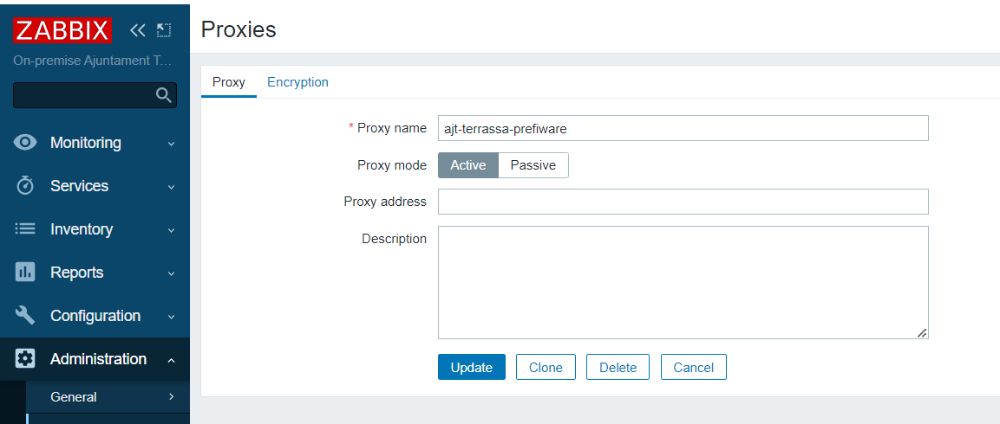
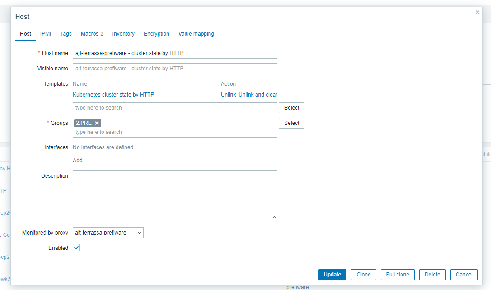
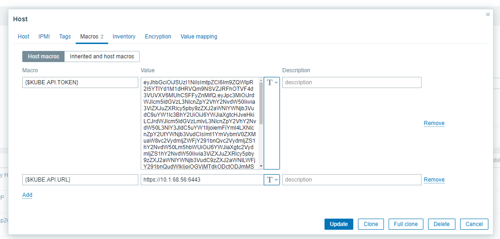
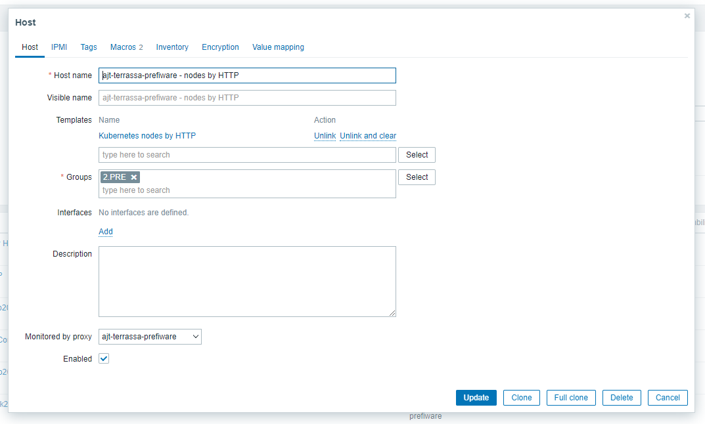
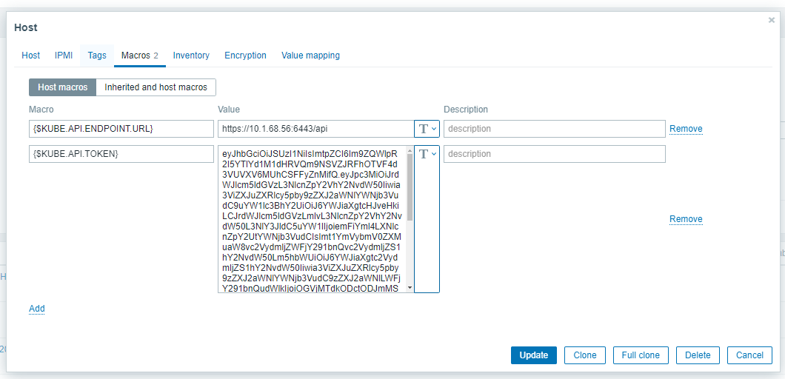
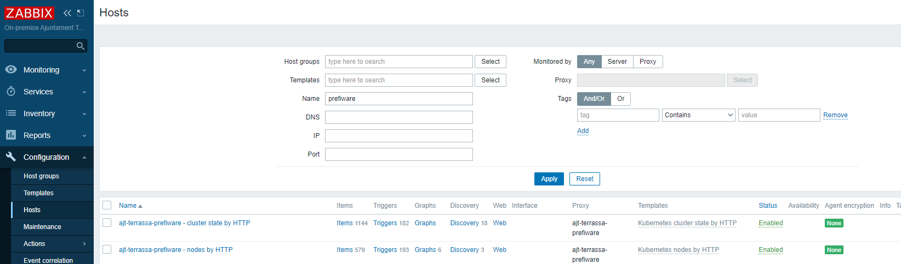

# Index:

* [Instalación de Zabbix](#id10)
* [Configuración en servidor de Zabbix](#id20)
* [Verificaciones](#id30)

# Instalación de Zabbix <div id='id10' />


```
$ cat values.yaml
zabbixAgent:
  enabled: true
zabbixProxy:
  nodeSelector:
    workload: lan
  env:
    - name: ZBX_HOSTNAME
      value: ajt-terrassa-prefiware     # Nombre del proxy que pondremos en Zabbix Server
    - name: ZBX_SERVER_HOST
      value: "10.1.0.52"                # IP del Zabbix Server
    - name: ZBX_CACHESIZE
      value: 256M
```

```
$ helm search repo zabbix -l | head -n 2
NAME                                    CHART VERSION   APP VERSION     DESCRIPTION
zabbix-chart-6.0/zabbix-helm-chrt       1.3.5           6.0.28          A Helm chart for deploying Zabbix agent and proxy

$ helm upgrade --install \
zabbix zabbix-chart-6.0/zabbix-helm-chrt \
--create-namespace \
--namespace zabbix-proxy \
--version=1.3.5 \
-f .yaml
```

# Configuración en servidor de Zabbix <div id='id20' />

Creamos el proxy en el servidor de Zabbix:



Sólo hay que crear dos "equipos" con las templates indicadas:
* Kubernetes_nodes_by_HTTP
* Kubernetes_cluster_state_by_HTTP


Necesitaremos los siguientes datos:

* Token:
```
$ kubectl get secret zabbix-service-account -n zabbix-proxy -o jsonpath={.data.token} | base64 -d
```
* URL de la API:
```
$ kubectl cluster-info
```

A partir de aquí realizaremos la configuración:









Ha de quedar así:



# Verificaciones <div id='id30' />

```
$ cat pod_roto.yaml
apiVersion: v1
kind: Pod
metadata:
  name: pod-roto
  namespace: default
spec:
  containers:
    - name: pod
      image: registre.ili.es/prker_com/library/ubuntu:20.04
      command: [ "/bin/bash", "-c", "--" ]
      args: [ "while true; do sleep 300; done;" ]
```

```
$ kubectl apply -f pod_roto.yaml
```


```
$ kubectl delete -f pod_roto.yaml
```