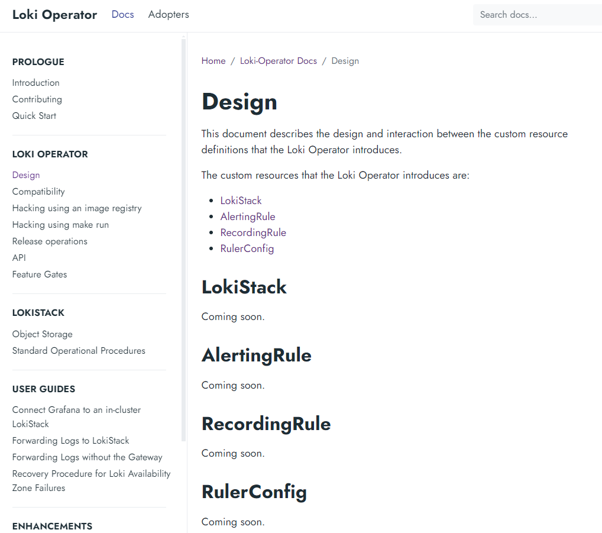

# Operator Loki

* [Getting Started](#id0)
* [Instalación](#id10)

## Getting Started <div id='id0' />

Es como si faltase documentación sobre el producto (ver **Coming soon** de la imagen), en cambio para cluster de OpenShift, está super documentado:



Ubicación del operator: https://loki-operator.dev/

Partimos de la siguiente base:

* Tenemos un cluster de K8S desplegado
* Tenemos un sistema de MinIO

Verificaremos que todo esté correcto

```
root@diba-master:~# kubectl get nodes
NAME            STATUS   ROLES           AGE   VERSION
diba-master     Ready    control-plane   59d   v1.28.6
diba-master-1   Ready    <none>          59d   v1.28.6
diba-master-2   Ready    <none>          59d   v1.28.6
diba-master-3   Ready    <none>          59d   v1.28.6
```

## Instalación <div id='id10' />

### Instalación del Operator

Información de la instalación: https://operatorhub.io/operator/loki-operator

```
root@diba-master:~# curl -sL https://github.com/operator-framework/operator-lifecycle-manager/releases/download/v0.28.0/install.sh | bash -s v0.28.0
root@diba-master:~# kubectl create -f https://operatorhub.io/install/loki-operator.yaml

root@diba-master:~# kubectl -n operators get pods
NAME                                               READY   STATUS    RESTARTS   AGE
loki-operator-controller-manager-866476445-h5bgw   2/2     Running   0          45s

root@diba-master:~# kubectl get csv -n operators
NAME                   DISPLAY                   VERSION   REPLACES               PHASE
loki-operator.v0.6.1   Community Loki Operator   0.6.1     loki-operator.v0.6.0   Succeeded

root@diba-master:~# kubectl get crd lokistacks.loki.grafana.com
NAME                          CREATED AT
lokistacks.loki.grafana.com   2024-07-14T08:20:33Z
```

### No sé

Crearemos una aplicación:

```
root@diba-master:~# cat cliente-01.yaml
apiVersion: v1
kind: Namespace
metadata:
  name: cliente-01
---
apiVersion: apps/v1
kind: Deployment
metadata:
  name: mi-primer-deployment
  namespace: cliente-01
spec:
  selector:
    matchLabels:
      app: mi-primer-deployment
  replicas: 2
  template:
    metadata:
       labels:
          app: mi-primer-deployment
    spec:
      containers:
      - name: mi-primer-deployment
        image: paulbouwer/hello-kubernetes:1.9
        ports:
        - containerPort: 8080
---
apiVersion: v1
kind: Service
metadata:
  name: mi-primer-service
  namespace: cliente-01
  labels:
     app: mi-primer-service
spec:
  type: ClusterIP
  selector:
    app: mi-primer-deployment
  ports:
    - port: 80
      targetPort: 8080
---
apiVersion: networking.k8s.io/v1
kind: Ingress
metadata:
  name: mi-primer-ingress
  namespace: cliente-01
  annotations:
    kubernetes.io/ingress.class: "nginx"
spec:
  rules:
    - host: www.dominio.cat
      http:
        paths:
          - path: /
            pathType: Prefix
            backend:
               service:
                  name: mi-primer-service
                  port:
                     number: 80
```

```
root@diba-master:~# kubectl apply -f cliente-01.yaml
root@diba-master:~# kubectl config set-context --current --namespace=cliente-01

root@diba-master:~# kubectl get pods
NAME                                    READY   STATUS    RESTARTS   AGE
mi-primer-deployment-864fdcf458-gbn45   1/1     Running   0          12m
mi-primer-deployment-864fdcf458-jlnbz   1/1     Running   0          12m
```

Accedemos a la consola de MinIO
* URL: [http://172.26.0.196:9001/](http://172.26.0.196:9001)
* Username: admin
* Password: superpassword

Dentro de la GUI de MinIO creamos: 
* un bucket:
  * cliente-01
* un access key:
  * accessKey: bR0i3JHWtWQ4fBdojXRi
  * secretKey: hzgZbezVuVLC0BwPOpZ40X4DY8Xkmcb5agjfOHXc

Creamos el secret con los datos generados por MinIO

```
root@diba-master:~# vim secret-minio-cliente-01.yaml
apiVersion: v1
kind: Secret
metadata:
  name: lokistack-minio
  namespace: cliente-01
stringData:
  access_key_id: bR0i3JHWtWQ4fBdojXRi
  access_key_secret: hzgZbezVuVLC0BwPOpZ40X4DY8Xkmcb5agjfOHXc
  bucketnames: cliente-01
  endpoint: http://172.26.0.196:900


root@diba-master:~# kubectl apply -f secret-minio-cliente-01.yaml
```

Desplegamos Loki: https://www.linkedin.com/pulse/improving-logging-stack-configuration-openshift-barreto

```
root@diba-master:~# vim lokistack-cliente-01.yaml
apiVersion: loki.grafana.com/v1
kind: LokiStack
metadata:
  name: lokistack-cliente-01
  namespace: cliente-01
spec:
  size: 1x.demo
  storage:
    schemas:
    - version: v13
      effectiveDate: 2023-10-15
    secret:
      name: lokistack-minio
      type: s3
  tenants:
    mode: openshift-logging
  storageClassName: standard

root@diba-master:~# kubectl apply -f lokistack-cliente-01.yaml
```

```
root@diba-master:~# kubectl get lokistack
NAME                   AGE
lokistack-cliente-01   13s

root@diba-master:~# kubectl describe lokistack lokistack-cliente-01
```