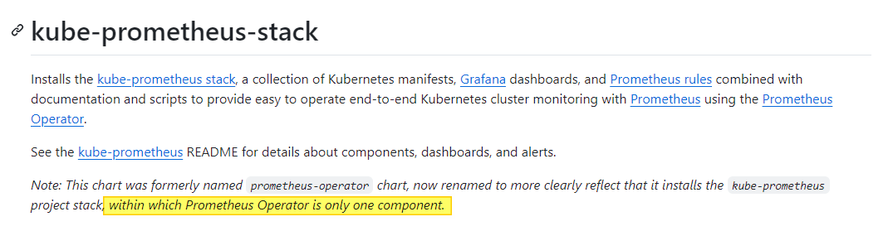

# Operator Prometheus

* [Getting Started](#id0)
* [Instalación](#id10)

## Getting Started <div id='id0' />

Ubicación del operator: https://prometheus-operator.dev/

No confundir con el [kube-prometheus-stack](https://github.com/prometheus-community/helm-charts/tree/main/charts/kube-prometheus-stack)



Partimos de la siguiente base:

* Tenemos un cluster de K8S desplegado


Verificaremos que todo esté correcto

```
root@diba-master:~# kubectl get nodes
NAME            STATUS   ROLES           AGE   VERSION
diba-master     Ready    control-plane   59d   v1.28.6
diba-master-1   Ready    <none>          59d   v1.28.6
diba-master-2   Ready    <none>          59d   v1.28.6
diba-master-3   Ready    <none>          59d   v1.28.6
```

## Instalación <div id='id10' />

### Instalación del Operator

No podemos instalar la versión que queramos, ha de ser compatible: https://github.com/prometheus-operator/kube-prometheus?tab=readme-ov-file#compatibility

```
root@diba-master:~# git clone https://github.com/prometheus-operator/kube-prometheus.git
root@diba-master:~# kubectl create -f kube-prometheus/manifests/setup/
root@diba-master:~# kubectl create -f kube-prometheus/manifests/

root@diba-master:~# kubectl -n monitoring get pods
NAME                                   READY   STATUS    RESTARTS   AGE
alertmanager-main-0                    2/2     Running   0          64s
alertmanager-main-1                    2/2     Running   0          64s
alertmanager-main-2                    2/2     Running   0          64s
blackbox-exporter-56cdcfc64f-jf6k4     3/3     Running   0          2m3s
grafana-cfdb695fc-9d9hz                1/1     Running   0          2m
kube-state-metrics-6587f97998-j6f4q    3/3     Running   0          119s
node-exporter-gj6hx                    2/2     Running   0          118s
node-exporter-m4ctn                    2/2     Running   0          118s
node-exporter-mwbp8                    2/2     Running   0          118s
node-exporter-v9xzn                    2/2     Running   0          118s
prometheus-adapter-77f8587965-2xglh    1/1     Running   0          115s
prometheus-adapter-77f8587965-qkkrz    1/1     Running   0          115s
prometheus-k8s-0                       2/2     Running   0          63s
prometheus-k8s-1                       2/2     Running   0          63s
prometheus-operator-84699f769b-xpct9   2/2     Running   0          115s
```

**Prometheus**

```
root@diba-master:~# kubectl -n monitoring --address 0.0.0.0 port-forward svc/prometheus-k8s 9090
```

Accedemos a la consola de [Prometheus](http://172.26.0.191:9090/targets?search=) y veremos que ya vienen preconfiguradas alerts y rules.

**Alertmanager**

```
root@diba-master:~kubectl -n monitoring --address 0.0.0.0 port-forward svc/alertmanager-main 9093
```

Accedemos a la consola de [Alertmanager](http://172.26.0.191:9093)

**Grafana**

```
root@diba-master:~# kubectl -n monitoring --address 0.0.0.0 port-forward svc/grafana 3000
```

Accedemos a la consola de [Grafana](http://172.26.0.191:3000). Usuario y password: admin/admin
