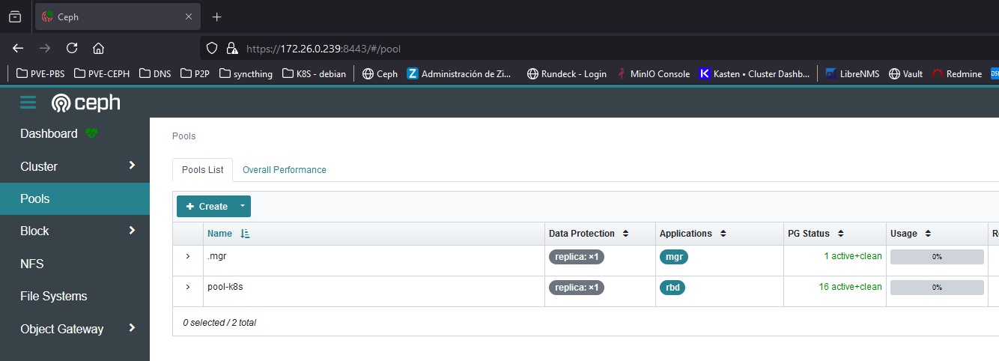

# Ceph Storage RBD

* [Getting Started](#id0)
* [Ceph](#id1)
* [Config Ceph](#id2)
* [Change SC to default](#id3)
* [Testing](#id4)
* [Enlace PV/PVC a Ceph](#id5)

## Getting Started <div id='id0' />

Partimos de la siguiente base:

* Tenemos un cluster de K8S desplegado
* Tenemos un sistema de Ceph desplegado (en esta caso es un All-In-One)

Verificaremos que todo esté correcto

```
root@kubespray-aio:~# kubectl get nodes
NAME               STATUS   ROLES           AGE    VERSION
kubespray-aio      Ready    control-plane   162d   v1.27.5
kubespray-aio-w1   Ready    <none>          161d   v1.27.5
kubespray-aio-w2   Ready    <none>          161d   v1.27.5
```

```
root@ceph-aio:~# ceph -s
  cluster:
    id:     7d2b3cca-f1eb-11ee-a886-593bc87d3824
    health: HEALTH_OK
            (muted: POOL_NO_REDUNDANCY)

  services:
    mon: 1 daemons, quorum ceph-aio (age 95s)
    mgr: ceph-aio.iaeehz(active, since 42s)
    osd: 3 osds: 3 up (since 52s), 3 in (since 2M)

  data:
    pools:   1 pools, 1 pgs
    objects: 2 objects, 449 KiB
    usage:   891 MiB used, 89 GiB / 90 GiB avail
    pgs:     1 active+clean
```

## Ceph <div id='id1' /> 


```
root@ceph-aio:~# ceph osd lspools
1 .mgr

root@ceph-aio:~# ceph mon dump | grep "fsid "
dumped monmap epoch 1
fsid 7d2b3cca-f1eb-11ee-a886-593bc87d3824

root@ceph-aio:~# ceph mon dump | grep 6789
dumped monmap epoch 1
0: [v2:172.26.0.239:3300/0,v1:172.26.0.239:6789/0] mon.ceph-aio
```

```
root@ceph-aio:~# ceph osd pool create pool-k8s 16
root@ceph-aio:~# ceph osd pool set pool-k8s size 1 --yes-i-really-mean-it
root@ceph-aio:~# rbd pool init pool-k8s
root@ceph-aio:~# ceph health mute POOL_NO_REDUNDANCY

root@ceph-aio:~# ceph osd lspools
1 .mgr
6 pool-k8s
```

Verificaremos via web que se ha creado el Pool correctamente:



Verificaremos que el Ceph este **HEALTH_OK**

```
root@ceph-aio:~# ceph -s
  cluster:
    id:     7d2b3cca-f1eb-11ee-a886-593bc87d3824
    health: HEALTH_OK
            (muted: POOL_NO_REDUNDANCY)

  services:
    mon: 1 daemons, quorum ceph-aio (age 4m)
    mgr: ceph-aio.iaeehz(active, since 3m)
    osd: 3 osds: 3 up (since 3m), 3 in (since 2M)

  data:
    pools:   2 pools, 17 pgs
    objects: 3 objects, 449 KiB
    usage:   891 MiB used, 89 GiB / 90 GiB avail
    pgs:     17 active+clean
```

```
root@ceph-aio:~# ceph auth add client.k8s mon 'allow r' osd 'allow rwx pool=pool-k8s'
root@ceph-aio:~# ceph auth get-key client.k8s
AQDs9H9mvNoLIRAAosZeAMUDg7am2bGbVi7zoA==
```

Verificar "cosas" del usuario:

```
root@ceph-aio:~# ceph auth get-key client.k8s
AQDs9H9mvNoLIRAAosZeAMUDg7am2bGbVi7zoA==

root@ceph-aio:~# ceph auth get client.k8s
[client.k8s]
        key = AQDs9H9mvNoLIRAAosZeAMUDg7am2bGbVi7zoA==
        caps mon = "allow r"
        caps osd = "allow rwx pool=pool-k8s"
```

## Config Ceph <div id='id2' /> 

```
root@diba-master:~# helm repo add ceph-csi https://ceph.github.io/csi-charts
root@diba-master:~# helm repo update

root@diba-master:~# helm search repo ceph-csi/ceph-csi-rbd
NAME                    CHART VERSION   APP VERSION     DESCRIPTION
ceph-csi/ceph-csi-rbd   3.11.0          3.11.0          Container Storage Interface (CSI) driver, provi...
```

```
root@diba-master:~# vim values-ceph-csi-rbd.yaml
csiConfig:
  - clusterID: "7d2b3cca-f1eb-11ee-a886-593bc87d3824"
    monitors:
      - "172.26.0.239:6789"

storageClass:
  create: true
  name: csi-rbd-sc
  clusterID: 7d2b3cca-f1eb-11ee-a886-593bc87d3824
  pool: pool-k8s

secret:
  create: true
  name: csi-rbd-secret
  userID: k8s
  userKey: AQDs9H9mvNoLIRAAosZeAMUDg7am2bGbVi7zoA==
```

```
root@diba-master:~# helm upgrade --install ceph-csi-rbd \
--create-namespace \
--namespace ceph-csi \
-f values-ceph-csi-rbd.yaml \
--version=3.11.0 \
ceph-csi/ceph-csi-rbd

root@kubespray-aio:~# helm -n ceph-csi ls
NAME            NAMESPACE       REVISION        UPDATED                                 STATUS          CHART                   APP VERSION
ceph-csi-rbd    ceph-csi        1               2024-06-29 13:12:31.60139992 +0200 CEST deployed        ceph-csi-rbd-3.11.0     3.11.0
```

```
root@diba-master:~# kubectl -n ceph-csi get pods
NAME                                        READY   STATUS    RESTARTS   AGE
ceph-csi-rbd-nodeplugin-6gvd2               3/3     Running   0          3m54s
ceph-csi-rbd-nodeplugin-gmr4c               3/3     Running   0          3m54s
ceph-csi-rbd-nodeplugin-t6nnp               3/3     Running   0          3m54s
ceph-csi-rbd-provisioner-66d99f8ffb-8bl2k   7/7     Running   0          3m54s
ceph-csi-rbd-provisioner-66d99f8ffb-jmrpq   7/7     Running   0          3m54s
ceph-csi-rbd-provisioner-66d99f8ffb-rm2fg   7/7     Running   0          3m54s

root@kubespray-aio:~# kubectl get sc
NAME         PROVISIONER        RECLAIMPOLICY   VOLUMEBINDINGMODE   ALLOWVOLUMEEXPANSION   AGE
csi-rbd-sc   rbd.csi.ceph.com   Delete          Immediate           true                   41s
```

## Change SC to default <div id='id3' />

```
root@kubespray-aio:~# kubectl get sc
NAME         PROVISIONER        RECLAIMPOLICY   VOLUMEBINDINGMODE   ALLOWVOLUMEEXPANSION   AGE
csi-rbd-sc   rbd.csi.ceph.com   Delete          Immediate           true                   4m48s

root@kubespray-aio:~# kubectl patch storageclass csi-rbd-sc -p '{"metadata": {"annotations":{"storageclass.kubernetes.io/is-default-class":"true"}}}'

root@kubespray-aio:~# kubectl get sc
NAME                   PROVISIONER        RECLAIMPOLICY   VOLUMEBINDINGMODE   ALLOWVOLUMEEXPANSION   AGE
csi-rbd-sc (default)   rbd.csi.ceph.com   Delete          Immediate           true                   4m59s
```

## Testing <div id='id4' />

```
root@kubespray-aio:~# kubectl create ns test-ceph
```

```
root@kubespray-aio:~# vim test-ceph.yaml
apiVersion: v1
kind: PersistentVolumeClaim
metadata:
  name: pvc-fs-apache
  namespace: test-ceph
spec:
  accessModes:
    - ReadWriteOnce
  volumeMode: Filesystem
  resources:
    requests:
      storage: 1Gi
  storageClassName: csi-rbd-sc
---
apiVersion: apps/v1
kind: Deployment
metadata:
  name: httpd-deployment
  namespace: test-ceph
spec:
  selector:
    matchLabels:
      app: httpd
  replicas: 2
  template:
    metadata:
      labels:
        app: httpd
    spec:
      containers:
      - name: httpd
        image: httpd
        ports:
        - containerPort: 80
        volumeMounts:
        - name: data
          mountPath: /mydata
      volumes:
      - name: data
        persistentVolumeClaim:
          claimName: pvc-fs-apache

root@kubespray-aio:~# kubectl apply -f test-ceph.yaml
```

```
root@kubespray-aio:~# kubectl -n test-ceph get pods
root@kubespray-aio:~# kubectl -n test-ceph get pvc

$ k exec -it httpd-deployment-7c889df479-sqjbw -- bash
root@httpd-deployment-7c889df479-sqjbw:/usr/local/apache2# df -h | grep mydata
```

Si falla todo verificar:

```
root@kubespray-aio:~# kubectl -n ceph-csi logs -f ceph-csi-rbd-nodeplugin-m5nhf
```

```
root@kubespray-aio:~# kubectl -n ceph-csi exec -it ceph-csi-rbd-nodeplugin-m5nhf -- bash
```

```
[root@kubespray-aio /]# timeout 5 bash -c "</dev/tcp/172.26.0.239/6789" && echo $?
0

[root@kubespray-aio /]# timeout 5 bash -c "</dev/tcp/172.26.0.239/3300" && echo $?
0
```

```
[root@kubespray-aio /]# ping -c 2 172.26.0.239
PING 172.26.0.239 (172.26.0.239) 56(84) bytes of data.
64 bytes from 172.26.0.239: icmp_seq=1 ttl=64 time=3.52 ms
64 bytes from 172.26.0.239: icmp_seq=2 ttl=64 time=0.691 ms

--- 172.26.0.239 ping statistics ---
2 packets transmitted, 2 received, 0% packet loss, time 1001ms
rtt min/avg/max/mdev = 0.691/2.103/3.516/1.413 ms
```

## Enlace PV/PVC a Ceph <div id='id5' />

Como saber el enlace que hay entre los diferentes nombres que usa K8S y Ceph

```
$ k get pvc
NAME            STATUS   VOLUME                                     CAPACITY   ACCESS MODES   STORAGECLASS   AGE
pvc-fs-apache   Bound    pvc-97727ce7-261f-40ef-a19e-efcb361ca7aa   1Gi        RWO            csi-rbd-sc     44h        

$ k describe pv pvc-97727ce7-261f-40ef-a19e-efcb361ca7aa | grep VolumeHandle
    VolumeHandle:      0001-0024-dd494d74-f6cd-11ec-a8ee-2ec1cc2a3fa9-0000000000000002-54a7278f-aacf-11ed-b85b-ee66881ed241
```

Con los comandos anteriores podemos observar que el storage de K8S que usa para enlazar con Ceph es: 

```
54a7278f-aacf-11ed-b85b-ee66881ed241

root@ceph-01:~# rbd ls pool-k8s
csi-vol-54a7278f-aacf-11ed-b85b-ee66881ed241

root@ceph-01:~# rbd info pool-k8s/csi-vol-54a7278f-aacf-11ed-b85b-ee66881ed241
rbd image 'csi-vol-54a7278f-aacf-11ed-b85b-ee66881ed241':
        size 1 GiB in 256 objects
        order 22 (4 MiB objects)
        snapshot_count: 0
        id: 23358f193cab
        block_name_prefix: rbd_data.23358f193cab
        format: 2
        features: layering
        op_features:
        flags:
        create_timestamp: Sun Feb 12 13:18:17 2023
        access_timestamp: Sun Feb 12 13:18:17 2023
        modify_timestamp: Sun Feb 12 13:18:17 2023
```