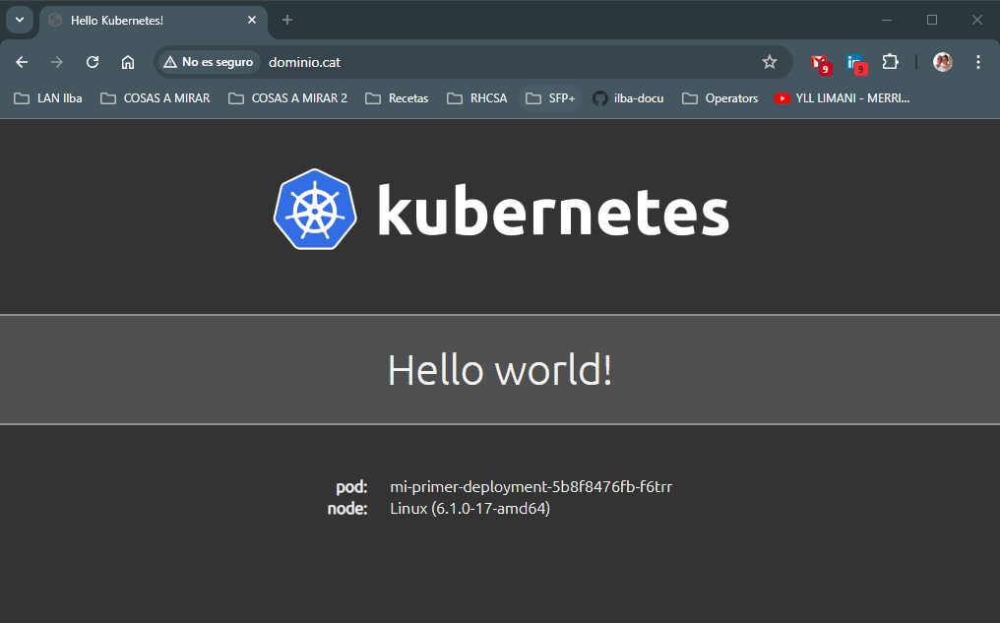

# Index:

* [Instalación de Istio](#id10)
* [Creación de un Ingress](#id20)

# Instalación de Istio <div id='id10' />

## Documentación

Documentación encontrada:

* xxxx

Notas importantes de Istio:

* Partimos de un cluster sin Ingress de ningún tipo
* Lo único que hay montado es el MetalLB

## Instalación

```
root@kubespray-aio:~# kubectl get nodes
NAME               STATUS   ROLES           AGE    VERSION
kubespray-aio      Ready    control-plane   169d   v1.27.5
kubespray-aio-w1   Ready    <none>          168d   v1.27.5
kubespray-aio-w2   Ready    <none>          168d   v1.27.5

root@kubespray-aio:~# kubectl get ns
NAME              STATUS   AGE
default           Active   169d
kube-node-lease   Active   169d
kube-public       Active   169d
kube-system       Active   169d
metallb-system    Active   169d
```

```
root@kubespray-aio:~# curl -L https://istio.io/downloadIstio | ISTIO_VERSION=1.20.3 TARGET_ARCH=x86_64 sh -
root@kubespray-aio:~# cp istio-1.20.3/bin/istioctl /usr/local/bin/istio-1.20.3
root@kubespray-aio:~# ln -s /usr/local/bin/istio-1.20.3 /usr/local/bin/istioctl

root@kubespray-aio:~# istioctl x precheck
✔ No issues found when checking the cluster. Istio is safe to install or upgrade!
  To get started, check out https://istio.io/latest/docs/setup/getting-started/

root@kubespray-aio:~# istioctl install --set profile=demo -y
✔ Istio core installed
✔ Istiod installed
✔ Egress gateways installed
✔ Ingress gateways installed
✔ Installation complete
Made this installation the default for injection and validation.

root@kubespray-aio:~# kubectl -n istio-system get pods
NAME                                    READY   STATUS    RESTARTS   AGE
istio-egressgateway-687cb674fc-59gs9    1/1     Running   0          37s
istio-ingressgateway-85c5875ff7-ctkb9   1/1     Running   0          37s
istiod-7fb4d64fb6-glmdm                 1/1     Running   0          58s

root@kubespray-aio:~# kubectl -n istio-system get svc
NAME                   TYPE           CLUSTER-IP      EXTERNAL-IP    PORT(S)                                                                      AGE
istio-egressgateway    ClusterIP      10.233.23.70    <none>         80/TCP,443/TCP                                                               45s
istio-ingressgateway   LoadBalancer   10.233.49.152   172.26.0.101   15021:30511/TCP,80:31774/TCP,443:31205/TCP,31400:31367/TCP,15443:31689/TCP   45s
istiod                 ClusterIP      10.233.44.147   <none>         15010/TCP,15012/TCP,443/TCP,15014/TCP                                        66s
```

# Creación de un Ingress<div id='id20' />

```
root@kubespray-aio:~# cat 01-istio-namespace.yaml
apiVersion: v1
kind: Namespace
metadata:
  name: test-ingress-istio
  labels:
    istio-injection: enabled
```

```
root@kubespray-aio:~# cat 05-istio-deployment.yaml
apiVersion: v1
kind: Namespace
metadata:
  name: test-ingress-istio
  labels:
    istio-injection: enabled
root@kubespray-aio:~# cat 05-istio-deployment.yaml
apiVersion: v1
kind: Service
metadata:
  name: mi-primer-service
  namespace: test-ingress-istio
  labels:
     app: mi-primer-service
spec:
  type: ClusterIP
  selector:
    app: mi-primer-deployment
  ports:
    - port: 80
      targetPort: 8080
---
apiVersion: apps/v1
kind: Deployment
metadata:
  name: mi-primer-deployment
  namespace: test-ingress-istio
spec:
  selector:
    matchLabels:
      app: mi-primer-deployment
  replicas: 2
  template:
    metadata:
       labels:
          app: mi-primer-deployment
    spec:
      containers:
      - name: mi-primer-deployment
        image: paulbouwer/hello-kubernetes:1.9
        ports:
        - containerPort: 8080
```

```
root@kubespray-aio:~# cat 10-istio-ingress.yaml
kind: Gateway
metadata:
  name: httpbin-gateway
  namespace: test-ingress-istio
spec:
  selector:
    #istio: ingress        # instalación con helm
    istio: ingressgateway  # instalación con istioctl
  servers:
  - port:
      number: 80
      name: http
      protocol: HTTP
    hosts:
    - "www.dominio.cat"
---
apiVersion: networking.istio.io/v1alpha3
kind: VirtualService
metadata:
  name: httpbin
  namespace: test-ingress-istio
spec:
  hosts:
  - "www.dominio.cat"
  gateways:
  - httpbin-gateway
  http:
  - match:
    - uri:
        prefix: /
    route:
    - destination:
        port:
          number: 80
        host: mi-primer-service
```

```
root@kubespray-aio:~# kubectl apply -f 01-istio-namespace.yaml
root@kubespray-aio:~# kubectl apply -f 05-istio-deployment.yaml
root@kubespray-aio:~# kubectl apply -f 10-istio-ingress.yaml
```

```
root@kubespray-aio:~# kubectl get ns test-ingress-istio --show-labels
NAME                 STATUS   AGE   LABELS
test-ingress-istio   Active   56s   istio-injection=enabled,kubernetes.io/metadata.name=test-ingress-istio

root@kubespray-aio:~# kubectl -n test-ingress-istio get pods
NAME                                    READY   STATUS    RESTARTS   AGE
mi-primer-deployment-5b8f8476fb-f6trr   2/2     Running   0          93s
mi-primer-deployment-5b8f8476fb-zzcf9   2/2     Running   0          93s

root@kubespray-aio:~# kubectl get -n test-ingress-istio pods mi-primer-deployment-5b8f8476fb-f6trr -o jsonpath='{.spec.containers[*].name}' && echo
mi-primer-deployment istio-proxy

root@kubespray-aio:~# kubectl -n istio-system get svc
NAME                   TYPE           CLUSTER-IP      EXTERNAL-IP    PORT(S)                                                                      AGE
istio-egressgateway    ClusterIP      10.233.23.70    <none>         80/TCP,443/TCP                                                               13m
istio-ingressgateway   LoadBalancer   10.233.49.152   172.26.0.101   15021:30511/TCP,80:31774/TCP,443:31205/TCP,31400:31367/TCP,15443:31689/TCP   13m
istiod                 ClusterIP      10.233.44.147   <none>         15010/TCP,15012/TCP,443/TCP,15014/TCP                                        14m

root@kubespray-aio:~# kubectl get vs -A
NAMESPACE            NAME      GATEWAYS              HOSTS                 AGE
test-ingress-istio   httpbin   ["httpbin-gateway"]   ["www.dominio.cat"]   4m10s
```

