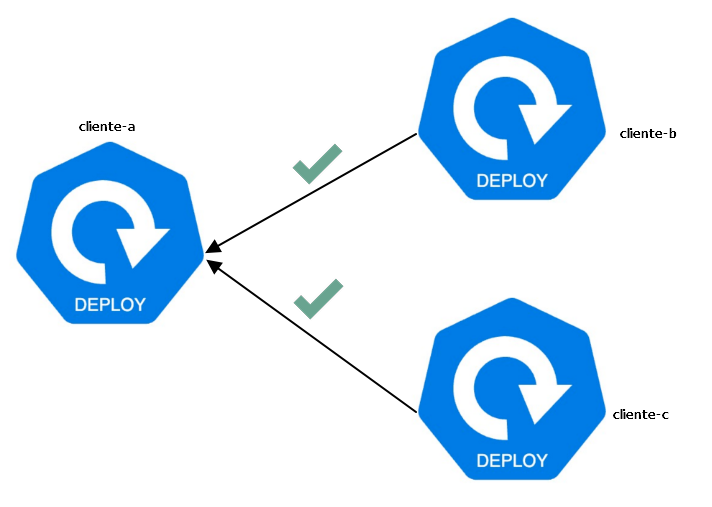
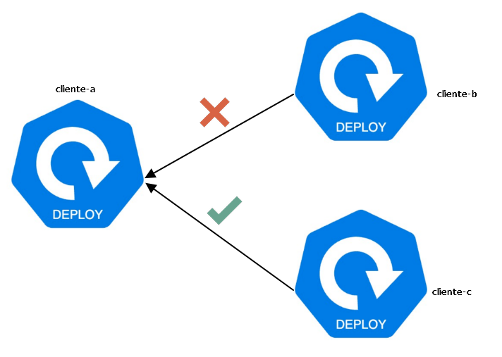

# Index:

* [Instalación](#id10)
* [Testing](#id20)
* [Ver logs](#id30)

# Instalación <div id='id10' />

The Kubernetes network policy specification defines the following behavior:

* If no network policies apply to a pod, then all traffic to/from that pod is allowed.
* If one or more network policies apply to a pod containing ingress rules, then only the ingress traffic specifically allowed by those policies is allowed.
* If one or more network policies apply to a pod containing egress rules, then only the egress traffic specifically allowed by those policies is allowed.

Para levantar el API del Networking de Calico con Kubespray, hemos de habilitar el siguiente flag:

```
calico_apiserver_enabled: true
```

de hecho, esto lo único que hace es que podamos interactuar con Calico desde el [kubectl, sin tener que instalar calicoctl](https://docs.tigera.io/calico/latest/operations/install-apiserver)

Para verificar que funciona, en el cluster hemos de ver lo siguiente:

```
root@k8s-test-cp:~# kubectl get ns
NAME               STATUS   AGE
calico-apiserver   Active   12h
...

root@k8s-test-cp:~# kubectl -n calico-apiserver get pods
NAME                               READY   STATUS    RESTARTS      AGE
calico-apiserver-c744cd8bb-nbgcv   1/1     Running   2 (11h ago)   12h
```

# Testing <div id='id20' />

## Preparación

```
root@k8s-test-cp:~# kubectl create ns cliente-a
root@k8s-test-cp:~# kubectl create ns cliente-b
root@k8s-test-cp:~# kubectl create ns cliente-c
```

```
root@k8s-test-cp:~# vim cliente.yaml
apiVersion: apps/v1
kind: Deployment
metadata:
  name: deployment-cliente-a
  namespace: cliente-a
  labels:
    app.kubernetes.io/name: cliente-a
spec:
  replicas: 1
  selector:
    matchLabels:
      app.kubernetes.io/name: cliente-a
  template:
    metadata:
      labels:
        app.kubernetes.io/name: cliente-a
    spec:
      containers:
        - name: container-cliente-a
          image: nginx
          ports:
            - name: http
              containerPort: 80
              protocol: TCP
---
apiVersion: v1
kind: Service
metadata:
  name: service-cliente-a
  namespace: cliente-a
spec:
  selector:
    app.kubernetes.io/name: cliente-a
  ports:
    - protocol: TCP
      port: 80
      targetPort: http
```

```
root@k8s-test-cp:~# kubectl apply -f cliente.yaml
root@k8s-test-cp:~# sed -i 's/cliente-a/cliente-b/g' cliente.yaml
root@k8s-test-cp:~# kubectl apply -f cliente.yaml
root@k8s-test-cp:~# sed -i 's/cliente-b/cliente-c/g' cliente.yaml
root@k8s-test-cp:~# kubectl apply -f cliente.yaml
```

Ahora disponemos de 3 clientes:
* cliente-a
* cliente-b
* cliente-c

```
root@k8s-test-cp:~# kubectl get pods -A
NAMESPACE          NAME                                       READY   STATUS      RESTARTS      AGE
...
cliente-a          deployment-cliente-a-6fbd9cb8c9-tdlkt      1/1     Running     0             10m
cliente-b          deployment-cliente-b-5dcf949cc5-vrctm      1/1     Running     0             9m57s
cliente-c          deployment-cliente-c-6bfc6fcbbc-rwv2n      1/1     Running     0             94s
...
```
## Pruebas



Verificaremos que desde el *pod-cliente-b* podemos acceder al *pod-cliente-a*:

```
root@k8s-test-cp:~# NAME_POD=`kubectl -n cliente-b get pods | grep cliente-b | awk '{print $1}'`
root@k8s-test-cp:~# kubectl -n cliente-b exec -it $NAME_POD -- bash

root@deployment-cliente-b-5dcf949cc5-vrctm:/# curl service-cliente-a.cliente-a.svc.cluster.local
...
<h1>Welcome to nginx!</h1>
...
```

Verificaremos que desde el *pod-cliente-c* podemos acceder al *pod-cliente-a*:

```
root@k8s-test-cp:~# NAME_POD=`kubectl -n cliente-c get pods | grep cliente-c | awk '{print $1}'`
root@k8s-test-cp:~# kubectl -n cliente-c exec -it $NAME_POD -- bash

root@deployment-cliente-c-6bfc6fcbbc-rwv2n:/# curl service-cliente-a.cliente-a.svc.cluster.local
...
<h1>Welcome to nginx!</h1>
...
```

## Bloqueo de tráfico http

### Aplicamos políticas

Vamos a hacer que el *pod-cliente-b* no puede acceder al puerto 80 (http) del *pod-cliente-a*.

En cambio del *pod-cliente-c*, podrá acceder al *pod-cliente-a* pot http

```
root@k8s-test-cp:~# vim network-policy-cliente-a.yaml
apiVersion: projectcalico.org/v3
kind: NetworkPolicy
metadata:
  name: netpolicies-cliente-a
  namespace: cliente-a 
spec:
  types:
    - Ingress
  ingress:
    - action: Allow
      protocol: TCP
      source:
        selector: app.kubernetes.io/name == 'cliente-c'
        namespaceSelector: kubernetes.io/metadata.name == 'cliente-c'
      destination:
        selector: app.kubernetes.io/name == 'cliente-a'
        ports:
        - 80
        - 443
```

Fijate, que en la NetworkPolicy, estamos acotando en el source:
* selector: app.kubernetes.io/name == 'cliente-c'
* namespaceSelector: kubernetes.io/metadata.name == 'cliente-c'

```
root@k8s-test-cp:~# kubectl apply -f network-policy-cliente-a.yaml
```

### Verificamos



Verificaremos que desde el pod-cliente-b **NO** podemos acceder al pod-cliente-a:

```
root@k8s-test-cp:~# NAME_POD=`kubectl -n cliente-b get pods | grep cliente-b | awk '{print $1}'`
root@k8s-test-cp:~# kubectl -n cliente-b exec -it $NAME_POD -- bash
root@deployment-cliente-b-5dcf949cc5-vrctm:/# curl service-cliente-a.cliente-a.svc.cluster.local --connect-timeout 5
curl: (28) Failed to connect to service-cliente-a.cliente-a.svc.cluster.local port 80 after 5000 ms: Timeout was reached
```

Verificaremos que desde el *pod-cliente-c* **SI** podemos acceder al *pod-cliente-a*:

```
root@k8s-test-cp:~# NAME_POD=`kubectl -n cliente-c get pods | grep cliente-c | awk '{print $1}'`
root@k8s-test-cp:~# kubectl -n cliente-c exec -it $NAME_POD -- bash

root@deployment-cliente-c-6bfc6fcbbc-rwv2n:/# curl service-cliente-a.cliente-a.svc.cluster.local --connect-timeout 5
...
<h1>Welcome to nginx!</h1>
...
```

```
root@k8s-test-cp:~# kubectl -n cliente-a get networkpolicy.p
NAME                    CREATED AT
netpolicies-cliente-a   2024-09-21T09:08:55Z
```

# Ver logs <div id='id30' />

```
root@k8s-test-cp:~# cat network-policy-cliente-a.yaml
apiVersion: projectcalico.org/v3
kind: NetworkPolicy
metadata:
  name: netpolicies-cliente-a
  namespace: cliente-a
spec:
  types:
    - Ingress
  ingress:
    - action: Allow
      protocol: TCP
      source:
        selector: app.kubernetes.io/name == 'cliente-c'
        namespaceSelector: kubernetes.io/metadata.name == 'cliente-c'
      destination:
        selector: app.kubernetes.io/name == 'cliente-a'
        ports:
        - 80
        - 443
    - action: Log
      protocol: TCP
      destination:
        selector: app.kubernetes.io/name == 'cliente-a'
        ports:
        - 80
```

```
root@k8s-test-cp:~# kubectl apply -f network-policy-cliente-a.yaml
```

Revisamos donde está el pod:

```
root@k8s-test-cp:~# kubectl -n cliente-a get pods -o wide
NAME                                    READY   STATUS      RESTARTS   AGE     IP              NODE            NOMINATED NODE   READINESS GATES
deployment-cliente-a-6fbd9cb8c9-hjkvz   1/1     Running     0          6h8m    10.233.113.82   k8s-test-wk01   <none>           <none>
```

Nos vamos al equipo **k8s-test-wk01**:

```
root@k8s-test-wk01:~# dmesg
[  799.618599] calico-packet: IN= OUT=calie5cb85a6dac SRC=10.233.113.81 DST=10.233.113.82 LEN=60 TOS=0x00 PREC=0x00 TTL=63 ID=36055 DF PROTO=TCP SPT=52580 DPT=80 WINDOW=64860 RES=0x00 SYN URGP=0 MARK=0x9b100000
```
