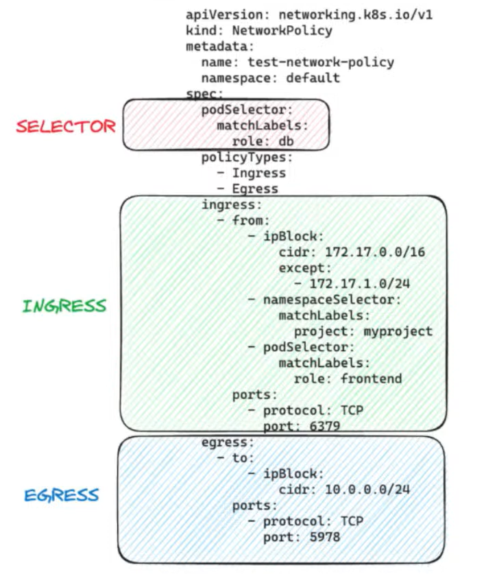
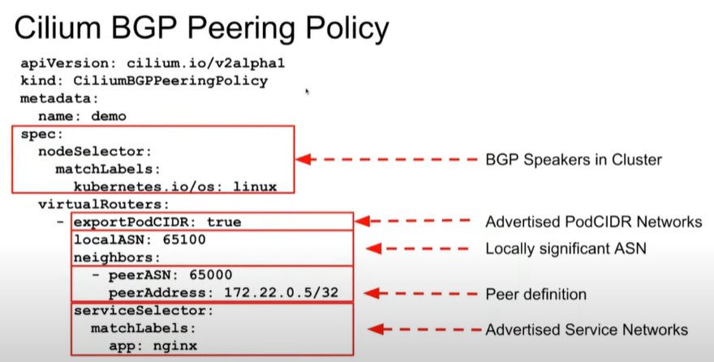

# Index:

* [Documentación personal](#id1)
  * [Cosas molonas de Cilium](#id2)
  * [Notas generales](#id3)
  * [Test](#id4)
* [Architecture](#id10) :two::zero:%
* [Network Policy](#id20) :one::eight:%
* [Service Mesh](#id30) :one::six:%
* [Network Observability](#id40) :one::zero:%
* [Installation and Configuration](#id50) :one::zero:%
* [Cluster Mesh](#id60) :one::zero:%
* [eBPF](#id70) :one::zero:%
* [BGP and External Networking](#id80) :zero::six:%

# Documentación personal 

## Cosas molonas de Cilium 

Cosas importantes a destacar de Cilium:

* First: eBPF based
* L3, L4 and L7 (envoy)
* [Ingress](https://docs.cilium.io/en/stable/network/servicemesh/ingress/) / [Gateway](https://docs.cilium.io/en/v1.15/network/servicemesh/gateway-api/gateway-api/) and [LB IPAM](https://docs.cilium.io/en/stable/network/lb-ipam/)
* Egress gateway
* Cluster Mesh
* External workloads
* Hubble
* Transparent Encryption (WireGuard / IPSec)
* [Tetragon ](https://youtu.be/EA-uBCVoFaM)
* Integración con [Constellation](https://cilium.io/blog/2022/10/17/constellation-network-encryption/)

## Notas generales 

Documentación, videos y labs:

* Labs:
  * [Isovalent library: LABS](https://isovalent.com/resource-library/labs/)
  * [Cilium interactive courses](https://cilium.io/labs/)
* Cilium Week:
  * [Session 1: Architecture and Installation](https://www.youtube.com/watch?v=kI1kpDrVw5I)
  * [Session 2: Network policy and observability](https://www.youtube.com/watch?v=lUxI_7iWPXo)
  * [Session 3: BGP, Service mesh & Cluster mesh](https://www.youtube.com/watch?v=eNx2wqSB7rY)
* [Test Online](https://cca.purutuladhar.com/)
* [Useful Questions for Success](https://www.youtube.com/watch?v=cOq7CaMD1FQ)

## Test 

* You are configuring CIDR-based policies in Cilium and need to assign a minimum valid security identity for a CIDR identity. What is the minimum value you should use?
  * 16777217 -> Represents 2^24 +1, which is the minimum valid value for CIDR-based security identities.
* What is the valid range for security identities in Cilium?
  * 1 to 2^32 -1
* What is the range of cluster-local security identities in Cilium?
  * 1 to 2^16 -1
* What mechanism does the Cilium Operator use to garbage collect stale security identities in CRD Identity allocation mode?
  * The operator periodically scans its local cache for identities that haven't received recent heartbeats and deletes them to free up resources.
* What advantage does Cilium Cluster Mesh provide by enabling shared services across multiple clusters?
  * It enables sharing of services like secrets management, logging, monitoring, or DNS between all clusters
* Which advantage does routing outbound traffic through a Cilium egress gateway node provide?
  * Routing outbound traffic through an egress gateway node ensures that the traffic appears from a stable and predictable IP address, which is beneficial for external systems.
* What are the prerequisites for enabling Cilium's egress gateway feature in a Kubernetes cluster?
  * Operators must provision network-facing interfaces and IP addresses on gateway nodes for the egress gateway to function correctly.
* Which of the following data stores is used by default in Cilium to propagate state between agents?
  * Kubernetes CRDs are the default data store for state propagation in Cilium.
* What type of metrics can Hubble provide regarding HTTP response codes in a Kubernetes cluster?
  * Hubble can provide the rate of 5xx or 4xx HTTP response codes for individual services or across clusters.
* After enabling IPsec encryption using the Cilium CLI, you observe that some traffic is not being encrypted. What could be a possible reason based on the configuration guidelines?
  * Traffic destined to the same node is not encrypted by design, as there is no benefit in encrypting local traffic.
* Your organization is transitioning from using the Kubernetes Ingress API to the Gateway API with Cilium to manage ingress traffic. You currently have Ingress resources with vendor-specific annotations. Which tool can assist in migrating these Ingress configurations to the Gateway API, and what is its current status?
  * The Ingress2Gateway tool is experimental and can accurately convert simple Ingress resources to Gateway API resources.
* You are deploying Cilium in a private cloud and want to reserve the first and last IP addresses of each CIDR block in your IP Pools to prevent potential network conflicts. Which configuration change should you make to your IP Pool specification?
  * If you wish to reserve the first and last IPs of CIDRs, you can set the .spec.allowFirstLastIPs field to No
* After successfully installing Cilium using the Cilium CLI, you want to run only the network performance tests between specific nodes labeled for performance testing. Which command and options should you use?
  * Using 'cilium connectivity perf' with the '--node-selector perf-test=true' correctly targets specific labeled nodes.
* You have an existing Kubernetes cluster using Calico as its default CNI plugin. You want to leverage Hubble for enhanced network observability without replacing Calico. Which Cilium installation option should you use?
  * --set cni.chainingMode=generic-veth correctly specifies the generic veth chaining mode compatible with Calico.
* How does eBPF ensure that injected programs do not compromise the stability and security of the Linux kernel?
  * eBPF programs are verified by the kernel to ensure they are safe and do not contain unsafe operations before they are executed.
* How can Hubble assist in proactively addressing issues before they impact users by utilizing performance data?
  * Generating performance metrics and setting up alerts allows teams to monitor key indicators like latency and error rates, and address issues before they affect users.
* After enabling Hubble redaction in your Cilium setup, you notice that HTTP query parameters are no longer visible in your observability reports. Which configuration option is responsible for this behavior?
  * --hubble-redact-http-urlquery
* How does the Gateway API improve the portability of configurations compared to the traditional Ingress API?
  * Removing vendor-specific annotations allows Gateway API resources to be more portable across different implementations.
* Which eBPF programs are used by Constellation’s solution to filter unencrypted pod-to-pod traffic for VXLAN and direct routing, respectively?
  * bpf_overlay is used for VXLAN, and bpf_host is used for direct routing.
* How does Cilium’s Gateway API implementation enhance protocol support beyond the traditional Ingress API?
  * Cilium enhances protocol support by extending beyond HTTP and HTTPS to include TCP, UDP, and gRPC, allowing for more versatile traffic management.
* You are managing a multi-team Kubernetes cluster and want to migrate from Ingress to Gateway API to allow different teams to manage their routes without affecting each other. Which Gateway API feature best supports this requirement?
  * Role-based personas with specific access to Gateway API objects allow different teams to manage their routes independently without interfering with each other.
* Which cilium-dbg subcommand is used to manage and retrieve information about network endpoints?
  * cilium-dbg endpoint
* Which flag would you use with a cilium-dbg command to output the results in JSONPath format?
  * '-o jsonpath='{...}'' correctly uses the '-o' flag to specify JSONPath output.
* You need to retrieve a list of all local endpoints in JSON format using the Cilium CLI. Which command should you use?
  * cilium-dbg endpoint list -o json
* Which cilium-dbg subcommand is used to add a new load balancer with specified frontend and backend addresses?
  * 'cilium-dbg service update' is used to add or update load balancer services by specifying frontend and backend addresses.
* How does the Endpoint Policy object in Cilium enforce network policies?
  * By using a map to lookup packet identities and applying corresponding L3/L4 policies.
* You have added an external workload named 'runtime' to your Cilium-managed Kubernetes cluster and executed the installation script on the external VM. However, when you check the CEW status, the IP address for 'runtime' is still showing as N/A. What is the most likely reason?
  * If the hostname does not match the CEW resource name, the workload may not successfully join the cluster, resulting in an IP of N/A.
* What capability of Hubble enables teams to identify potential security threats by monitoring unusual traffic patterns and detecting anomalies in real-time?
  * Security-focused observability
* How does eBPF enhance system performance in comparison to traditional kernel modules?
  * eBPF runs programs directly in the kernel, minimizing the need to move data between user space and kernel space, which enhances performance.
  * By avoiding the overhead of transferring data between user space and kernel space.
* Your organization is transitioning from using multiple Ingress Controllers with vendor-specific annotations to the Gateway API with Cilium. The current setup causes inconsistencies and management challenges. What is a key advantage of adopting the Gateway API in this scenario?
  * It centralizes traffic management and reduces dependency on annotations.
* What limitation is associated with using DNS-based Layer 3 policies in Cilium?
  * DNS-based policies require a proxy to handle DNS traffic.
  * DNS-based policies rely on a proxy to convert DNS names to IPs and respect DNS TTLs.
* Which IPAM mode in Cilium supports dynamic CIDR/IP allocation?
  * Multi-Pool
* In which IPAM mode does Cilium support multiple CIDRs per node?
  * Multi-Pool
* Which of the following IPAM modes in Cilium does not support multiple CIDRs per cluster?
  * Cluster Scope (default)
* What is a prerequisite for external workloads to have IP connectivity with the nodes in a Cilium-managed Kubernetes cluster?
  * External workloads must run in the same cloud provider virtual network or establish peering/VPN tunnels with the cluster nodes.
* You have a Pod selected by multiple policies in Cilium, including both Allow and Deny policies. A traffic attempt is made on a port where both an Allow and a Deny policy are present. What will be the outcome of this traffic attempt?
  * The traffic will be denied due to the Deny policy.
  * Deny policies take precedence and will block the traffic regardless of Allow policies.
* You have deployed Cilium's egress gateway in your Kubernetes cluster on AWS. However, some pod-to-pod traffic is exiting the cluster with the pod's own IP instead of the egress gateway's IP. What is the most likely cause based on Cilium's configuration guidelines?
  * There is a known delay before egress gateway policies are applied to newly created pods, causing some traffic to bypass the gateway initially.
  * There is a delay before egress gateway policies are enforced on new pods.
* How does Cilium enhance standard Kubernetes network policies?
  * By adding support for Layer 7 policies, allowing application-level controls.
* How does the Cilium Operator achieve high availability (HA) within a Kubernetes cluster?
  * By running multiple replicas and using Kubernetes leader election with lease locks.
* If you encounter IP allocation errors in Cilium's Cluster Scope IPAM mode, which Kubernetes command can you use to check the operator status?
  * kubectl get ciliumnodes -o jsonpath='{range .items[*]}{.metadata.name} {.status.ipam.operator-status} {end}'
  * This command retrieves the operator status field in the CiliumNode resources, which is essential for diagnosing IP allocation errors.
* Which of the following fields can be used to match HTTP requests in Cilium's Layer 7 policies?
  * Path, Method, Host, Headers
* Which of the following best describes the structure of a Cilium network policy rule?
  * Each rule can contain both ingress and egress sections.
---
* When deploying a global service in Cilium's Cluster Mesh, what type should the Kubernetes Service be defined as?
  * ClusterIP is used as per the example for defining global services.
* Which of the following is a security concern associated with sidecarless service meshes?
  * Using shared proxies in sidecarless architectures can introduce potential vulnerabilities and reduce the isolation between services.
* An administrator applies a Cilium network policy that intercepts all DNS traffic but does not set 'EnableDefaultDeny' for egress and ingress. What is the effect of this policy on network traffic?
  * DNS traffic is intercepted and allowed while other traffic remains unrestricted.
* Which control plane option in Cilium Service Mesh allows for the full capability of the Envoy proxy?
  * Envoy CRD
* You have enabled Cilium's Mutual Authentication Support in your Kubernetes cluster. What responsibility does the Cilium Operator have in this configuration?
  * Ensuring that each Cilium Identity has an associated identity in the certificate management system.
* What feature of Cilium’s Gateway API implementation allows different operational roles to manage traffic engineering without interfering with each other?
  * Role-specific Gateway API objects with decomposed responsibilities
  * Decomposing the Ingress API into multiple Gateway API objects allows different roles such as Infrastructure Providers, Cluster Operators, and Application Developers to manage traffic engineering according to their responsibilities.
* During IPsec key rotation in Cilium, what should be avoided to prevent cluster instability?
  * Performing key rotation during Cilium agent upgrades or downgrades
* What is the primary purpose of the Hubble Relay component in a Hubble observability setup?
  * To provide a cluster-wide API for querying Hubble flow data.
* In Cilium, what does security identity 0 represent in the eBPF datapath?
  * Any identity, acting as a wildcard allow
* You want to set up a policy in Cilium that enforces that endpoints labeled with `env=prod` can only be accessed by other endpoints that also have `env=prod`. Which Cilium policy field would you use to define this base requirement?
  * fromRequires (labels)
* What is a primary limitation of the Kubernetes Ingress API in handling advanced traffic routing?
  * The Ingress API supports basic routing but lacks (carece) native support for advanced features like traffic splitting and header modification.
* How does Cilium's Cluster Mesh contribute to high availability in a multi-region Kubernetes deployment?
  * By enabling automatic failover to other clusters if one cluster becomes unavailable.
* After deploying Constellation with Cilium, an admin notices that some pod-to-pod traffic remains unencrypted despite the network encryption settings. The firewall logs indicate traffic is being routed through eth0 and not the WireGuard interface. What is a likely cause based on Constellation’s implementation?
  * The IPCache has not yet been updated with the new endpoint’s identity.
  * The IPCache map in Cilium is responsible for determining whether traffic between pods should be encrypted. If a new endpoint's identity has not yet been updated in the IPCache, Cilium may route the traffic through eth0 without encryption, bypassing the WireGuard interface
* What is an advantage of using Endpoints Based Layer 3 policies in Cilium?
  * Policies are defined based on endpoint labels, removing the dependency on IP addresses.
  * It decouples policies from IP addressing.
* Which command is used to enable support for external workloads in a Cilium-managed Kubernetes cluster using the Cilium CLI?
  * cilium clustermesh enable --service-type LoadBalancer --enable-external-workloads
* What is the minimum recommended mask size for each CIDR block in Cilium's Cluster Scope IPAM clusterPoolIPv4PodCIDRList?
  * /30
* What is a possible consequence if the Cilium operator is temporarily unavailable in a cluster?
  * Delays in IP address management affecting the scheduling of new workloads.
* Which of the following best describes the connectivity model used by Cilium's Cluster Mesh to join multiple Kubernetes clusters into a unified network?
  * Cluster Mesh connects clusters regardless of their Pod CIDRs through eBPF-based routing.
* Which Cilium feature is incompatible with the egress gateway, as highlighted in the provided knowledge content?
  * CiliumEndpointSlice is directly stated as incompatible with the egress gateway feature.
  * While Cluster Mesh is incompatible, there is another feature specifically highlighted.
* Which script simplifies creating a Kubernetes cluster with Kind for running Cilium connectivity tests?
  * ./contrib/scripts/kind.sh
* How does Hubble facilitate a holistic view of a Kubernetes system's health by connecting network events with other system logs and metrics?
  * Cross-stack correlation
* Which Cilium feature utilizes XDP-based edge load-balancing to steer traffic into Kubernetes clusters or operate independently of Kubernetes?
  * Edge Load-Balancing
* Which Cilium CLI command is used to generate an installation script for external workloads?
  * 'cilium clustermesh vm install' is the correct command to generate an installation script for external workloads.
* What is the current recommended method to enable Layer 7 protocol visibility in Cilium?
  * Creating a CiliumNetworkPolicy that specifies L7 rules
* After migrating to a sidecarless service mesh, your team notices that implementing fine-grained security policies has become more challenging. What is a likely reason for this issue?
  * Shared proxies in sidecarless service meshes reduce the granularity of security controls
* What is an advantage of installing Cilium using the Cilium CLI over using Helm?
  * The Cilium CLI automatically manages Cilium operator replicas based on cluster configuration.
* In Cilium's Layer 7 policy rules, which of the following is true about the L7Rules structure?
  * Only one protocol-specific field (HTTP, Kafka, DNS) can be set per port.
* What is the minimum required version of the Cilium CLI to enable Cluster Mesh features as per the provided knowledge content?
  * v0.15.0 or later is required to enable Cluster Mesh features.
* What is the minimum required version of the Cilium CLI to run end-to-end connectivity tests for Cilium?
  * v0.15.0 meets the minimum required version for running end-to-end connectivity tests.
* In Cilium Layer 4 policies, which protocols can be specified in the PortProtocol structure?
  * TCP, UDP, and ANY
* Which personas are specifically addressed by the Gateway API to enhance role-based access in Kubernetes clusters?
  * Infrastructure Provider, Cluster Operator, and Application Developer.
---
* Which annotation is required to declare a Kubernetes service as global for load balancing across multiple Cilium-enabled Kubernetes clusters?
  * service.cilium.io/global: "true"
* After installing Cilium with CNI chaining mode on your Kubernetes cluster, you run the connectivity tests and notice that all L7 policy tests have failed. What is the most likely reason?
  * CNI chaining mode is incompatible with Cilium's L7 policy enforcement.
  * CNI chaining allows to use Cilium in combination with other CNI plugins.
* After deploying Cilium to replace iptables with eBPF in your Kubernetes cluster, you notice a significant reduction in network latency as the number of microservices increases. What is the most likely reason for this improvement?
  * eBPF employs efficient hash tables allowing for near O(log n) time complexity.
* You have deployed multiple ingress and deny policies to manage traffic to a server Pod in Cilium. When a client attempts to ping the server, which of the following outcomes is expected if there is a Deny policy on Layer 3 for the client Pod?
  * Ping will be denied because Deny policies on Layer 3 override allow policies.
* What aspect of Hubble ensures that it can handle the growth of Kubernetes clusters without causing significant performance overhead or increased costs?
  * Scalability ensures that Hubble can grow with Kubernetes clusters without performance degradation or cost increases.
* What is the primary advantage of using the XDP BPF hook in the Cilium datapath?
  * It achieves the highest packet processing performance by running BPF programs at the earliest point in the networking driver.
* Which of the following statements is true regarding the deprecation of Pod annotations for enabling Layer 7 visibility in Cilium?
  * Pod annotations have been replaced by CiliumNetworkPolicy for enabling L7 visibility.
  * Pod annotations were historically used for enabling L7 visibility but are now replaced by CiliumNetworkPolicy.
* You have deployed a Cilium network policy that includes only egress rules for endpoints labeled 'app=backend'. The 'EnableDefaultDeny' field is not specified in the policy. What is the behavior for ingress traffic to these backend endpoints?
  * Ingress traffic remains allowed by default for the selected endpoints.
* You have two Layer 7 rules for the same port: one for HTTP and another for DNS. What will happen when these rules are applied in Cilium?
  * The policy will be rejected due to mixing different Layer 7 rule types.
* Which command is used to create the 'cilium-ipsec-keys' secret in the 'kube-system' namespace with a generated PSK?
  * kubectl create -n kube-system secret generic cilium-ipsec-keys --from-literal=keys="3+ rfc4106(gcm(aes)) $(echo $(dd if=/dev/urandom count=20 bs=1 2> /dev/null | xxd -p -c 64)) 128"
* How does Cilium Service Mesh support both cloud and on-premises deployments for enterprises?
  * Through multi-cluster connectivity and security across different infrastructures
* You are planning to migrate your Kubernetes cluster to use a different IPAM mode in Cilium. What is the recommended approach to change the IPAM mode without causing connectivity disruptions?
  * Install a fresh Kubernetes cluster with the new IPAM configuration.
* Why is Cilium's egress gateway feature incompatible with the Cluster Mesh feature?
  * The egress gateway needs to reside within the same cluster as the pods it manages, making it incompatible with Cluster Mesh which spans multiple clusters.
* How does LB IPAM integrate with Cilium's BGP Control Plane and L2 Aware LB features?
  * LB IPAM handles IP allocation, while BGP Control Plane and L2 Aware LB manage load balancing and advertisement of these IPs
* You have two Kubernetes clusters, Cluster1 and Cluster2, which you plan to connect using Cilium's Cluster Mesh. During installation, you assign both clusters the same cluster ID. What is the likely outcome of this configuration?
  * Connection disruption and possible incorrect enforcement of network policies.
* You have deployed a global service named 'rebel-base' in two Kubernetes clusters using Cilium's Cluster Mesh. Initially, accessing the service from either cluster returns responses from both clusters. However, after setting the annotation 'service.cilium.io/shared: "false"' on the service in Cluster 1, what change occurs when accessing the service from Cluster 2?
  * Responses from Cluster 1 pods are no longer received when accessing the service from Cluster 2.
* Which Cilium component interacts with Kubernetes when a pod is scheduled or terminated, triggering necessary datapath configurations?
  * Cilium CNI Plugin
* After installing Cilium, you want to enable shell tab-completion for bash. Which command should you execute?
  * source <(cilium completion)
* What advantage does Cilium's policy-driven SSL termination & injection provide in a Kubernetes environment?
  * Allows SSL connections to be terminated on behalf of applications without sharing secrets directly with workloads
* You have multiple services in your Kubernetes cluster, but you want only services labeled with `env=production` to receive IPs from the `production-pool` IP Pool. How should you configure the `production-pool` IP Pool to achieve this?
  * Set `.spec.serviceSelector` to `{ "env": "production" }` in the `production-pool` specification.
* You have deployed Cilium with the policy enforcement mode set to 'always'. However, you observe that the health endpoint is unable to communicate with other services in the cluster. What configuration change should you consider to resolve this issue?
  * Enable communications to and from the health endpoint in the policies.
* Why did Constellation choose not to isolate the entire Kubernetes cluster in a VPN at the host level?
  * It would have made communication with the outside world cumbersome and impractical.
* What limitation is present when setting up support for external workloads in Cilium?
  * Transparent encryption of traffic to and from external workloads is currently not supported in this beta feature.
  * External workloads must have a kernel version of 4.19.57 or newer, not older.
  * External workloads must have Docker 20.10 or newer, not older versions.
* When configuring IPsec Transparent Encryption in Cilium, which Kubernetes namespace should the 'cilium-ipsec-keys' secret be deployed in?
  * kube-system
* What mechanism allows eBPF programs to be safely executed within the Linux kernel?
  * They run in a secure, sandboxed environment after being verified by the kernel.

# Architecture 

* Components
  * Cilium Agent
    * is responsible for managing the network policies in Cilium
    * enforce network policies and manage networking for pods
    * runs on every node in the cluster
  * Cilium Operator
    * Handles lifecycle management of Cilium components
    * clusters can generally function when the operator becomes unavailable
  * Hubble
    * provides visibility into network traffic and performance metrics in Cilium
  * Cluster Mesh
    * Connecting multiple Kubernetes clusters
  * Service Mesh
    * Traffic management between services
    * Layer 7
  * Datapath
    * The method of routing packets through the network stack

# Network Policy 

Network policies, Cilium can enforce both:

* Native Kubernetes NetworkPolicies (only L3 and L4)
* Enhanced CiliumNetworkPolicy (L3, L4 and L7)
  * CiliumNetworkPolicy
  * CiliumClusterwideNetworkPolicy

Overview of Network Policy:

* [Layer 3](https://docs.cilium.io/en/latest/security/policy/language/#layer-3-examples)
  * fromEndpoints
  * toEndpoints
  * fromRequires (separation of concern)
  * toServices
    * k8sService
    * k8sServiceSelector
  * toEntities
    * kube-apiserver
    * host
    * remote-node
    * world
  * fromNodes
  * toCIDR
  * toFQDNs
* [Layer 4](https://docs.cilium.io/en/latest/security/policy/language/#layer-4-examples)
  * toPorts
  * icmps
* [Layer 7](https://docs.cilium.io/en/latest/security/policy/language/#layer-7-examples)
  * HTTP
  * Kafka
  * DNS Policy and IP Discovery

Example NetworkPolicy:

# Service Mesh 

* Kubernetes Ingress
  * Cilium Ingress
  * Gateway API
    * Replacement for Kubernetes Ingress
* Encryption in transit
  * IPSec
  * WireGuard
    * Faster than IPSec
* Mutual Authentication (mTLS)
* L7-Aware traffic management
* Que es el SPIRE ¿?

# Installation and Configuration 

Tenemos dos formas de instalar Cilium:

* Cilium CLI tool
* Helm chart (esta es la que hemos usado y es la que recomienda Cilium)

# Cluster Mesh 

Cluster Mesh capabilities make it easy for workloads to communicate with services hosted in different Kubernetes clusters.

* Setup
  * Specify Cluster Name and ID
  * Shared CA
  * Enable Cluster Mesh
  * Connect Clusters
  * Test pod connectivity between clusters

* Requirements:
  * All Kubernetes worker nodes must be assigned a unique IP address, and all worker nodes must have IP connectivity between each other
  * All clusters must be assigned unique PodCIDR ranges to prevent pod IP addresses from overlapping across the mesh.
* Architecture:
  * Access to the Cluster Mesh API Servers running in each cluster is protected using TLS certificates.
  * State from multiple clusters is never mixed. Access from one cluster into another is always read-only. This ensures that the failure domain remains unchanged, i.e. failures in one cluster never propagate into other clusters
* Global Services:
  * Establishing service load-balancing between clusters is achieved by defining a Kubernetes service with an identical name and namespace in each cluster and adding the annotation service.cilium.io/global: "true" to declare it as a global service. Cilium agents will watch for this annotation and if it's set to true, will automatically perform load-balancing to the corresponding service endpoint pods located across clusters.
  * You can control this global load-balancing further by setting the annotation service.cilium.io/shared: to true/false in the service definition in different clusters, to explicitly include or exclude a particular cluster’s service from being included in the multi-cluster load-balancing. By default, setting service.cilium.io/global: "true" implies service.cilium.io/shared: "true" if it's not explicitly set.
  * In some cases, load-balancing across multiple clusters might not be ideal. The annotation service.cilium.io/affinity: "local|remote|none" can be used to specify the preferred endpoint destination.

# BGP and External Networking 

## BGP

* BGP
  * iBGP vs eBGP
  * TCP 179
  * bgpControlPlane: enabled: true
  * Graceful restart
  * BGP use OSPF for establishing egress connectivity
  * Command used to verify BGP peer status in a router: *show ip bgp summary*

Example CiliumBGPPeeringPolicy:

## External Networking

* External Networking ¿?
* External Networking - VTEP Integration ¿?
  * Use VXLAN
* Egress Networking ¿?
* Cilium-managed clusters ¿?