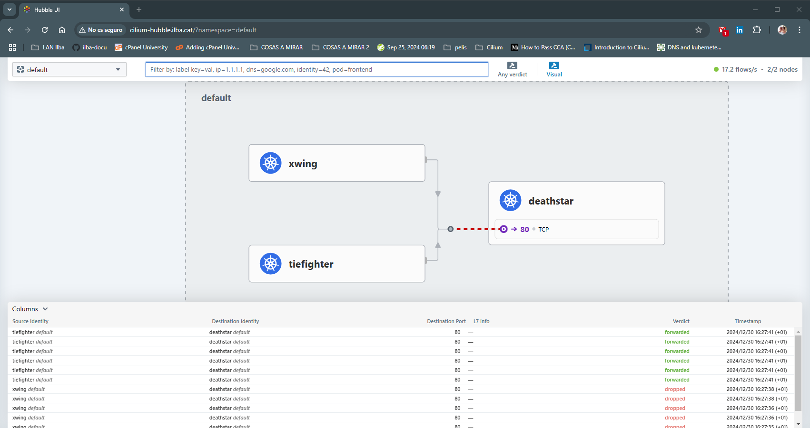

# Index Cilium Hubble:

* [Prerequisites](#id10)
* [Instalación](#id20)


# Prerequisites <div id='id10' />

Partimos de la base de un cluster de Kubernetes montado con el networking de Cilium:

```
root@k8s-cilium-01-cp:~# kubectl get nodes
NAME                 STATUS   ROLES           AGE   VERSION
k8s-cilium-01-cp     Ready    control-plane   5d    v1.30.4
k8s-cilium-01-wk01   Ready    <none>          5d    v1.30.4

root@k8s-cilium-01-cp:~# helm ls -A
NAME            NAMESPACE       REVISION        UPDATED                                 STATUS          CHART                   APP VERSION
cilium          kube-system     1               2024-12-29 10:45:00.265086756 +0100 CET deployed        cilium-1.16.5           1.16.5
```

# Instalación <div id='id20' />

Instalamos el juego de Star Wars de Cilium y verificaremos que tanto el X-Wing como el Tie Fighter, pueden acceder a la Death Star:

```
root@k8s-cilium-01-cp:~# kubectl create -f https://raw.githubusercontent.com/cilium/cilium/HEAD/examples/minikube/http-sw-app.yaml
```

```
root@k8s-cilium-01-cp:~# kubectl exec xwing -- curl --connect-timeout 5 -s -XPOST deathstar.default.svc.cluster.local/v1/request-landing
Ship landed
root@k8s-cilium-01-cp:~# kubectl exec tiefighter -- curl --connect-timeout 5 -s -XPOST deathstar.default.svc.cluster.local/v1/request-landing
Ship landed
```

Crearemos la [política](./files/allow-empire-in-namespace.yaml), para que sólo los Tie Fighter tengan acceso a la Death Star:

```
root@k8s-cilium-01-cp:~# kubectl apply -f allow-empire-in-namespace.yaml
```

```
root@k8s-cilium-01-cp:~# kubectl exec xwing -- curl --connect-timeout 5 -s -XPOST deathstar.default.svc.cluster.local/v1/request-landing
command terminated with exit code 28
root@k8s-cilium-01-cp:~# kubectl exec tiefighter -- curl --connect-timeout 5 -s -XPOST deathstar.default.svc.cluster.local/v1/request-landing
Ship landed
```

Una vez verificado que los X-Wing no tienen acceso a la Death Star, instalaremos Hubble:

```
root@k8s-cilium-01-cp:~# helm repo add cilium https://helm.cilium.io/
root@k8s-cilium-01-cp:~# helm repo update

helm upgrade --install \
cilium cilium/cilium \
--namespace kube-system \
--version=1.16.5 \
-f values-cilium-Hubble.yaml

root@k8s-cilium-01-cp:~# kubectl -n kube-system get ingress
NAME        CLASS    HOSTS                    ADDRESS        PORTS   AGE
hubble-ui   cilium   cilium-hubble.ilba.cat   172.26.0.101   80      38s
```

Lo único que hemos hecho en el values, eshabilitar Hubble y el relay:

```
hubble:
  relay:
    enabled: true
  ui:
    enabled: true
    ingress:
      enabled: true
      className: "cilium"
      hosts:
        - cilium-hubble.ilba.cat
```

Haremos un poco de tráfico, para poder ver alguna cosa en el Hubble y accederemos:

```
root@k8s-cilium-01-cp:~# kubectl exec xwing -- curl --connect-timeout 5 -s -XPOST deathstar.default.svc.cluster.local/v1/request-landing
command terminated with exit code 28
root@k8s-cilium-01-cp:~# kubectl exec tiefighter -- curl --connect-timeout 5 -s -XPOST deathstar.default.svc.cluster.local/v1/request-landing
Ship landed
```

URL de acceso: http://cilium-hubble.ilba.cat/?namespace=default


