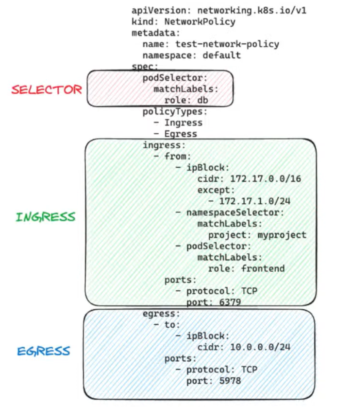
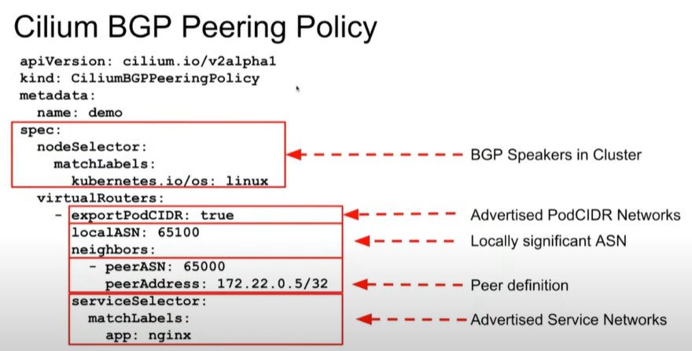

# Index:

* [Documentación personal](#id1)
  * [Cosas molonas de Cilium](#id2)
  * [Documentación](#id3)
* [Cilium Certified Associate (CCA)](#id9)
  * [Architecture](#id10) :two::zero:%
  * [Network Policy](#id20) :one::eight:%
  * [Service Mesh](#id30) :one::six:%
  * [Network Observability](#id40) :one::zero:%
  * [Installation and Configuration](#id50) :one::zero:%
  * [Cluster Mesh](#id60) :one::zero:%
  * [eBPF](#id70) :one::zero:%
  * [BGP and External Networking](#id80) :zero::six:%

# Documentación personal 

## Cosas molonas de Cilium 

Cosas importantes a destacar de Cilium:

* First: eBPF based
* L3, L4 and L7 (envoy)
* [Ingress](https://docs.cilium.io/en/stable/network/servicemesh/ingress/) / [Gateway](https://docs.cilium.io/en/v1.15/network/servicemesh/gateway-api/gateway-api/) and [LB IPAM](https://docs.cilium.io/en/stable/network/lb-ipam/)
* Egress gateway
* Cluster Mesh
* External workloads
* Hubble
* Transparent Encryption (WireGuard / IPSec)
* [Tetragon ](https://youtu.be/EA-uBCVoFaM)
* Integración con [Constellation](https://cilium.io/blog/2022/10/17/constellation-network-encryption/)

## Documentación 

Documentación, videos y labs:

* Labs:
  * [Isovalent library: LABS](https://isovalent.com/resource-library/labs/)
  * [Cilium interactive courses](https://cilium.io/labs/)
* Cilium Week:
  * [Session 1: Architecture and Installation](https://www.youtube.com/watch?v=kI1kpDrVw5I)
  * [Session 2: Network policy and observability](https://www.youtube.com/watch?v=lUxI_7iWPXo)
  * [Session 3: BGP, Service mesh & Cluster mesh](https://www.youtube.com/watch?v=eNx2wqSB7rY)
* [Test Online](https://cca.purutuladhar.com/)
* [Useful Questions for Success](https://www.youtube.com/watch?v=cOq7CaMD1FQ)

# Cilium Certified Associate (CCA) 

## Architecture 

* Components
  * Cilium Agent
    * is responsible for managing the network policies in Cilium
    * enforce network policies and manage networking for pods
    * runs on every node in the cluster
  * Cilium Operator
    * Handles lifecycle management of Cilium components
    * clusters can generally function when the operator becomes unavailable
  * Hubble
    * provides visibility into network traffic and performance metrics in Cilium
  * Cluster Mesh
    * Connecting multiple Kubernetes clusters
  * Service Mesh
    * Traffic management between services
    * Layer 7
  * Datapath
    * The method of routing packets through the network stack

## Network Policy 

Network policies, Cilium can enforce both:

* Native Kubernetes NetworkPolicies (only L3 and L4)
* Enhanced CiliumNetworkPolicy (L3, L4 and L7)
  * CiliumNetworkPolicy
  * CiliumClusterwideNetworkPolicy

Overview of Network Policy:

* [Layer 3](https://docs.cilium.io/en/latest/security/policy/language/#layer-3-examples)
  * fromEndpoints
  * toEndpoints
  * fromRequires (separation of concern)
  * toServices
    * k8sService
    * k8sServiceSelector
  * toEntities
    * kube-apiserver
    * host
    * remote-node
    * world
  * fromNodes
  * toCIDR
  * toFQDNs
* [Layer 4](https://docs.cilium.io/en/latest/security/policy/language/#layer-4-examples)
  * toPorts
  * icmps
* [Layer 7](https://docs.cilium.io/en/latest/security/policy/language/#layer-7-examples)
  * HTTP
  * Kafka
  * DNS Policy and IP Discovery

Example NetworkPolicy:

## Service Mesh 

* Kubernetes Ingress
  * Cilium Ingress
  * Gateway API
    * Replacement for Kubernetes Ingress
* Encryption in transit
  * IPSec
  * WireGuard
    * Faster than IPSec
* Mutual Authentication (mTLS)
* L7-Aware traffic management
* Que es el SPIRE ¿?

## Installation and Configuration 

Tenemos dos formas de instalar Cilium:

* Cilium CLI tool
* Helm chart (esta es la que hemos usado y es la que recomienda Cilium)

## Cluster Mesh 

Cluster Mesh capabilities make it easy for workloads to communicate with services hosted in different Kubernetes clusters.

* Setup
  * Specify Cluster Name and ID
  * Shared CA
  * Enable Cluster Mesh
  * Connect Clusters
  * Test pod connectivity between clusters

* Requirements:
  * All Kubernetes worker nodes must be assigned a unique IP address, and all worker nodes must have IP connectivity between each other
  * All clusters must be assigned unique PodCIDR ranges to prevent pod IP addresses from overlapping across the mesh.
* Architecture:
  * Access to the Cluster Mesh API Servers running in each cluster is protected using TLS certificates.
  * State from multiple clusters is never mixed. Access from one cluster into another is always read-only. This ensures that the failure domain remains unchanged, i.e. failures in one cluster never propagate into other clusters
* Global Services:
  * Establishing service load-balancing between clusters is achieved by defining a Kubernetes service with an identical name and namespace in each cluster and adding the annotation service.cilium.io/global: "true" to declare it as a global service. Cilium agents will watch for this annotation and if it's set to true, will automatically perform load-balancing to the corresponding service endpoint pods located across clusters.
  * You can control this global load-balancing further by setting the annotation service.cilium.io/shared: to true/false in the service definition in different clusters, to explicitly include or exclude a particular cluster’s service from being included in the multi-cluster load-balancing. By default, setting service.cilium.io/global: "true" implies service.cilium.io/shared: "true" if it's not explicitly set.
  * In some cases, load-balancing across multiple clusters might not be ideal. The annotation service.cilium.io/affinity: "local|remote|none" can be used to specify the preferred endpoint destination.

## BGP and External Networking 

### BGP

* BGP
  * iBGP vs eBGP
  * TCP 179
  * bgpControlPlane: enabled: true
  * Graceful restart
  * BGP use OSPF for establishing egress connectivity
  * Command used to verify BGP peer status in a router: *show ip bgp summary*

Example CiliumBGPPeeringPolicy:

### External Networking

* External Networking ¿?
* External Networking - VTEP Integration ¿?
  * Use VXLAN
* Egress Networking ¿?
* Cilium-managed clusters ¿?