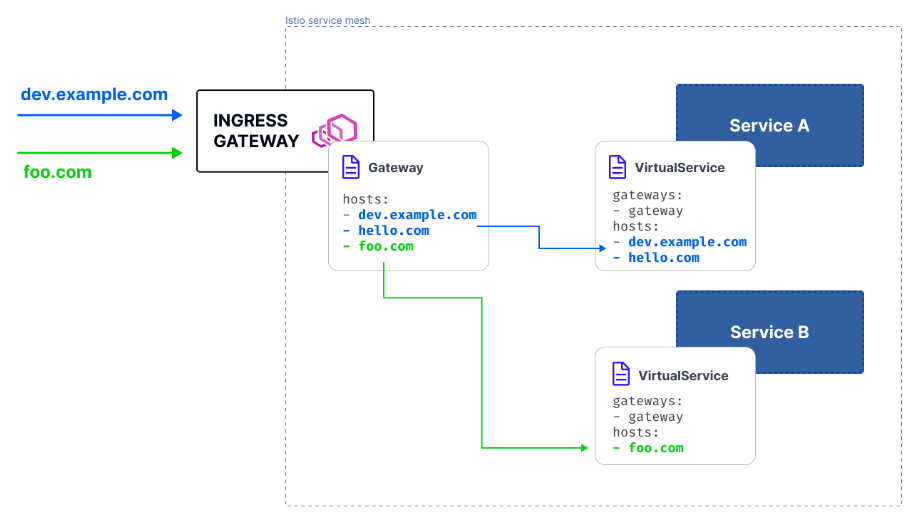
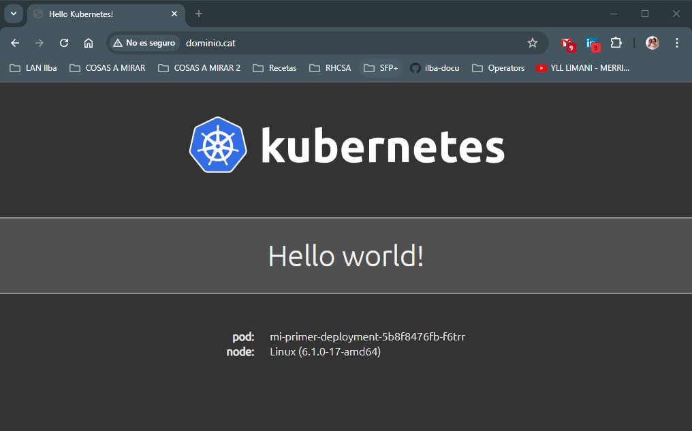
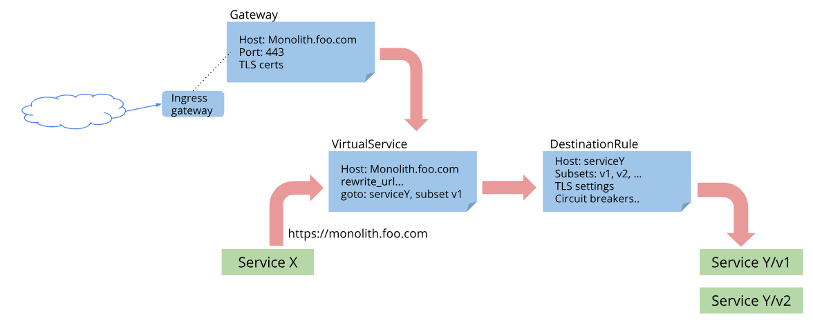
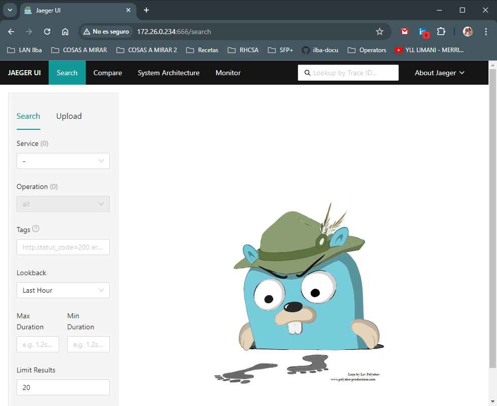

# Index:

* [Instalación de Istio](#id10)
  * [Descargandonos el Binario](#id11) Recomendada
  * [Via HELM](#id12)
* [Creación de un Ingress](#id20)
  * [Service / Deployment](#id21)
  * [Gateway / VirtualService](#id22)
  * [DestinationRule](#id23)
* [How to Route the Traffic?](#id30)
  * [Route based on weights](#id31)
  * [Match and route the traffic](#id32)
  * [Redirect the traffic (HTTP 301)](#id33)
  * [Mirror the traffic to another destination](#id34)
* [Jaeger](#id40) FALLA
* [Kiali](#id50) FALLA

# Instalación de Istio <div id='id10' />

## Documentación

Notas importantes de Istio:

* Partimos de un cluster sin Ingress de ningún tipo
* Lo único que hay montado es el MetalLB

## Descargandonos el Binario <div id='id11' />

```
root@kubespray-aio:~# kubectl get nodes
NAME               STATUS   ROLES           AGE    VERSION
kubespray-aio      Ready    control-plane   169d   v1.27.5
kubespray-aio-w1   Ready    <none>          168d   v1.27.5
kubespray-aio-w2   Ready    <none>          168d   v1.27.5

root@kubespray-aio:~# kubectl get ns
NAME              STATUS   AGE
default           Active   169d
kube-node-lease   Active   169d
kube-public       Active   169d
kube-system       Active   169d
metallb-system    Active   169d
```

```
root@kubespray-aio:~# curl -L https://istio.io/downloadIstio | ISTIO_VERSION=1.20.3 TARGET_ARCH=x86_64 sh -
root@kubespray-aio:~# cp istio-1.20.3/bin/istioctl /usr/local/bin/istio-1.20.3
root@kubespray-aio:~# ln -s /usr/local/bin/istio-1.20.3 /usr/local/bin/istioctl

root@kubespray-aio:~# istioctl x precheck
✔ No issues found when checking the cluster. Istio is safe to install or upgrade!
  To get started, check out https://istio.io/latest/docs/setup/getting-started/

root@kubespray-aio:~# istioctl install --set profile=demo -y
✔ Istio core installed
✔ Istiod installed
✔ Egress gateways installed
✔ Ingress gateways installed
✔ Installation complete
Made this installation the default for injection and validation.

root@kubespray-aio:~# kubectl -n istio-system get pods
NAME                                    READY   STATUS    RESTARTS   AGE
istio-egressgateway-687cb674fc-59gs9    1/1     Running   0          37s
istio-ingressgateway-85c5875ff7-ctkb9   1/1     Running   0          37s
istiod-7fb4d64fb6-glmdm                 1/1     Running   0          58s

root@kubespray-aio:~# kubectl -n istio-system get svc
NAME                   TYPE           CLUSTER-IP      EXTERNAL-IP    PORT(S)                                                                      AGE
istio-egressgateway    ClusterIP      10.233.23.70    <none>         80/TCP,443/TCP                                                               45s
istio-ingressgateway   LoadBalancer   10.233.49.152   172.26.0.101   15021:30511/TCP,80:31774/TCP,443:31205/TCP,31400:31367/TCP,15443:31689/TCP   45s
istiod                 ClusterIP      10.233.44.147   <none>         15010/TCP,15012/TCP,443/TCP,15014/TCP                                        66s
```

## Via Helm <div id='id12' />

```
root@kubespray-aio:~# helm repo add istio https://istio-release.storage.googleapis.com/charts && helm repo update

root@kubespray-aio:~# kubectl create ns istio-system

root@kubespray-aio:~# helm install istio-base istio/base -n istio-system --set defaultRevision=default

root@kubespray-aio:~# helm -n istio-system ls
NAME            NAMESPACE       REVISION        UPDATED                                         STATUS          CHART           APP VERSION
istio-base      istio-system    1               2024-07-06 08:38:31.152764741 +0200 CEST        deployed        base-1.22.2     1.22.2

root@kubespray-aio:~# helm install istiod istio/istiod -n istio-system --wait

root@kubespray-aio:~# helm -n istio-system ls
NAME            NAMESPACE       REVISION        UPDATED                                         STATUS          CHART           APP VERSION
istio-base      istio-system    1               2024-07-06 08:38:31.152764741 +0200 CEST        deployed        base-1.22.2     1.22.2
istiod          istio-system    1               2024-07-06 08:39:01.60726576 +0200 CEST         deployed        istiod-1.22.2   1.22.2

root@kubespray-aio:~# kubectl create ns istio-ingress

root@kubespray-aio:~# kubectl get ns istio-ingress --show-labels
NAME            STATUS   AGE   LABELS
istio-ingress   Active   39s   kubernetes.io/metadata.name=istio-ingress

root@kubespray-aio:~# echo "kind: DaemonSet" > values-istio.yaml
root@kubespray-aio:~# helm upgrade --install istio-ingress istio/gateway -n istio-ingress -f values-istio.yaml --wait

root@kubespray-aio:~# kubectl -n istio-ingress get pods -o wide
NAME                  READY   STATUS    RESTARTS   AGE   IP              NODE               NOMINATED NODE   READINESS GATES
istio-ingress-dl8k2   1/1     Running   0          32s   10.233.111.67   kubespray-aio      <none>           <none>
istio-ingress-m2sv5   1/1     Running   0          32s   10.233.109.29   kubespray-aio-w1   <none>           <none>
istio-ingress-xw4jp   1/1     Running   0          32s   10.233.112.20   kubespray-aio-w2   <none>           <none>

root@kubespray-aio:~# helm -n istio-ingress ls
NAME            NAMESPACE       REVISION        UPDATED                                         STATUS          CHART           APP VERSION
istio-ingress   istio-ingress   1               2024-07-06 08:40:09.378262571 +0200 CEST        deployed        gateway-1.22.2  1.22.2

root@kubespray-aio:~# POD=`kubectl -n istio-ingress get pods | grep istio-ingress | awk '{print $1}' | tail -1`
root@kubespray-aio:~# kubectl -n istio-ingress logs -f $POD
....
2024-07-06T06:40:42.055182Z     info    Readiness succeeded in 1.110894429s
2024-07-06T06:40:42.056220Z     info    Envoy proxy is ready
```

# Creación de un Ingress<div id='id20' />

```
root@kubespray-aio:~# cat 01-istio-namespace.yaml
apiVersion: v1
kind: Namespace
metadata:
  name: test-ingress-istio
  labels:
    istio-injection: enabled
```

## Service / Deployment<div id='id21' />

```
root@kubespray-aio:~# cat 05-istio-deployment.yaml
apiVersion: v1
kind: Service
metadata:
  name: mi-primer-service
  namespace: test-ingress-istio
  labels:
     app: mi-primer-service
spec:
  type: ClusterIP
  selector:
    app: mi-primer-deployment
  ports:
    - port: 80
      targetPort: 8080
---
apiVersion: apps/v1
kind: Deployment
metadata:
  name: mi-primer-deployment
  namespace: test-ingress-istio
spec:
  selector:
    matchLabels:
      app: mi-primer-deployment
  replicas: 2
  template:
    metadata:
       labels:
          app: mi-primer-deployment
    spec:
      containers:
      - name: mi-primer-deployment
        image: paulbouwer/hello-kubernetes:1.9
        ports:
        - containerPort: 8080
```

## Gateway / VirtualService<div id='id22' />

Ejemplo de Gateway y VirtualService:



```
root@kubespray-aio:~# cat 10-istio-ingress.yaml
apiVersion: networking.istio.io/v1alpha3
kind: Gateway
metadata:
  name: httpbin-gateway
  namespace: test-ingress-istio
spec:
  selector:
    istio: ingress        # instalación con helm
    #istio: ingressgateway  # instalación con istioctl
  servers:
  - port:
      number: 80
      name: http
      protocol: HTTP
    hosts:
    - "www.dominio.cat"
---
apiVersion: networking.istio.io/v1alpha3
kind: VirtualService
metadata:
  name: httpbin
  namespace: test-ingress-istio
spec:
  hosts:
  - "www.dominio.cat"
  gateways:
  - httpbin-gateway
  http:
  - match:
    - uri:
        prefix: /
    route:
    - destination:
        port:
          number: 80
        host: mi-primer-service
```

```
root@kubespray-aio:~# kubectl apply -f 01-istio-namespace.yaml
root@kubespray-aio:~# kubectl apply -f 05-istio-deployment.yaml
root@kubespray-aio:~# kubectl apply -f 10-istio-ingress.yaml
```

```
root@kubespray-aio:~# kubectl get ns test-ingress-istio --show-labels
NAME                 STATUS   AGE   LABELS
test-ingress-istio   Active   56s   istio-injection=enabled,kubernetes.io/metadata.name=test-ingress-istio

root@kubespray-aio:~# kubectl -n test-ingress-istio get pods
NAME                                    READY   STATUS    RESTARTS   AGE
mi-primer-deployment-5b8f8476fb-f6trr   2/2     Running   0          93s
mi-primer-deployment-5b8f8476fb-zzcf9   2/2     Running   0          93s

root@kubespray-aio:~# POD=`kubectl -n test-ingress-istio get pods | grep mi-primer- | awk '{print $1}' | tail -1`
root@kubespray-aio:~# kubectl get -n test-ingress-istio pods $POD -o jsonpath='{.spec.containers[*].name}' && echo
mi-primer-deployment istio-proxy

root@kubespray-aio:~# kubectl -n istio-system get svc
NAME                   TYPE           CLUSTER-IP      EXTERNAL-IP    PORT(S)                                                                      AGE
istio-egressgateway    ClusterIP      10.233.23.70    <none>         80/TCP,443/TCP                                                               13m
istio-ingressgateway   LoadBalancer   10.233.49.152   172.26.0.101   15021:30511/TCP,80:31774/TCP,443:31205/TCP,31400:31367/TCP,15443:31689/TCP   13m
istiod                 ClusterIP      10.233.44.147   <none>         15010/TCP,15012/TCP,443/TCP,15014/TCP                                        14m

root@kubespray-aio:~# kubectl get vs -A
NAMESPACE            NAME      GATEWAYS              HOSTS                 AGE
test-ingress-istio   httpbin   ["httpbin-gateway"]   ["www.dominio.cat"]   4m10s
```



## DestinationRule <div id='id23' />



[Aquí](https://istio.io/latest/docs/reference/config/networking/destination-rule/)  podremos ver varios ejemplos, pero dejo uno:

```
apiVersion: networking.istio.io/v1
kind: DestinationRule
metadata:
  name: bookinfo-ratings-port
spec:
  host: ratings.prod.svc.cluster.local
  trafficPolicy: # Apply to all ports
    portLevelSettings:
    - port:
        number: 80
      loadBalancer:
        simple: LEAST_REQUEST
    - port:
        number: 9080
      loadBalancer:
        simple: ROUND_ROBIN
```

# How to Route the Traffic? <div id='id30' />

## Route based on weights <div id='id31' />

```
apiVersion: networking.istio.io/v1beta1
kind: VirtualService
metadata:
  name: customers-route
spec:
  hosts:
  - customers.default.svc.cluster.local
  http:
  - name: customers-v1-routes
    route:
    - destination:
        host: customers.default.svc.cluster.local
        subset: v1
      weight: 70
  - name: customers-v2-routes
    route:
    - destination:
        host: customers.default.svc.cluster.local
        subset: v2
      weight: 30
```

## Match and route the traffic <div id='id32' />

```
apiVersion: networking.istio.io/v1beta1
kind: VirtualService
metadata:
  name: customers-route
spec:
  hosts:
  - customers.default.svc.cluster.local
  http:
  - match:
    - headers:
        user-agent:
          regex: ".*Firefox.*"
    route:
    - destination:
        host: customers.default.svc.cluster.local
        subset: v1
  - route:
    - destination:
        host: customers.default.svc.cluster.local
        subset: v2
```

## Redirect the traffic (HTTP 301) <div id='id33' />

```
apiVersion: networking.istio.io/v1beta1
kind: VirtualService
metadata:
  name: customers-route
spec:
  hosts:
  - customers.default.svc.cluster.local
  http:
  - match:
    - uri:
        exact: /api/v1/helloWorld
    redirect:
      uri: /v1/hello
      authority: hello-world.default.svc.cluster.local
```

## Mirror the traffic to another destination <div id='id34' />

```
apiVersion: networking.istio.io/v1beta1
kind: VirtualService
metadata:
  name: customers-route
spec:
  hosts:
    - customers.default.svc.cluster.local
  http:
  - route:
    - destination:
        host: customers.default.svc.cluster.local
        subset: v1
      weight: 100
    mirror:
      host: customers.default.svc.cluster.local
      subset: v2
    mirrorPercentage:
      value: 100.0
```

# Jaeger <div id='id40' />

Instalación de Jaeger

```
root@kubespray-aio:~# kubectl -n istio-system get cm istio -o yaml
apiVersion: v1
data:
  mesh: |-
    accessLogFile: /dev/stdout
    defaultConfig:
      discoveryAddress: istiod.istio-system.svc:15012
      proxyMetadata: {}
      tracing:
        zipkin:
          address: zipkin.istio-system:9411
          ....

root@kubespray-aio:~# helm repo add jaegertracing https://jaegertracing.github.io/helm-charts && helm repo update

root@kubespray-aio:~# kubectl create ns istio-observability

root@kubespray-aio:~# vim values-jaeger.yaml
collector:
  service:
    zipkin:
      port: 9411
      nodePort:

root@kubespray-aio:~# helm upgrade --install jaeger jaegertracing/jaeger -n istio-observability -f values-jaeger.yaml

root@kubespray-aio:~# helm ls -n istio-observability
NAME            NAMESPACE               REVISION        UPDATED                                         STATUS          CHART                   APP VERSION
jaeger          istio-observability     1               2024-07-06 08:08:19.215108385 +0200 CEST        deployed        jaeger-3.1.0            1.53.0
```

:memo: esperar un rato + o - 10 minutos

```
root@kubespray-aio:~# kubectl -n istio-observability get pods
NAME                                READY   STATUS      RESTARTS       AGE
jaeger-agent-2mhk8                  1/1     Running     0              3m51s
jaeger-agent-xxhs2                  1/1     Running     0              3m51s
jaeger-agent-zv7jh                  1/1     Running     0              3m51s
jaeger-cassandra-0                  1/1     Running     0              3m51s
jaeger-cassandra-1                  0/1     Running     0              95s
jaeger-cassandra-schema-wbjm6       0/1     Completed   0              3m51s
jaeger-collector-78d5d578bd-nt85t   1/1     Running     5 (2m ago)     3m50s
jaeger-query-6b98b9b7d5-zlmfh       2/2     Running     5 (108s ago)   3m50s
```

Testing de acceso:

```
root@kubespray-aio:~# kubectl port-forward svc/jaeger-query 666:80 -n istio-observability --address 0.0.0.0
```



Se que esto es feo, pero ahora no se como hacerlo de otra forma.

```
root@kubespray-aio:~# kubectl -n istio-observability get svc
NAME               TYPE        CLUSTER-IP     EXTERNAL-IP   PORT(S)                                         AGE
...
jaeger-collector   ClusterIP   10.233.2.224   <none>        14250/TCP,14268/TCP,9411/TCP,14269/TCP          7m2s
...

root@kubespray-aio:~# kubectl -n istio-system edit cm istio
apiVersion: v1
data:
  mesh: |-
    defaultConfig:
      discoveryAddress: istiod.istio-system.svc:15012
      tracing:
        zipkin:
          address: jaeger-collector.istio-observability.svc.cluster.local:9411  <----
    defaultProviders:
      metrics:
      - prometheus
```
# Kiali <div id='id50' />

Instalación de Kiali

```
root@kubespray-aio:~# helm repo add kiali https://kiali.org/helm-charts && helm repo update

root@kubespray-aio:~# vim values-kiali.yaml
istio_namespace: "istio-system"
auth:
  strategy: "anonymous"

helm upgrade --install \
--namespace istio-observability \
-f values-kiali.yaml \
kiali-server \
kiali/kiali-server

root@kubespray-aio:~# helm ls -n istio-observability
NAME            NAMESPACE               REVISION        UPDATED                                         STATUS          CHART                   APP VERSION
jaeger          istio-observability     1               2024-07-06 08:08:19.215108385 +0200 CEST        deployed        jaeger-3.1.0            1.53.0
kiali-server    istio-observability     1               2024-07-06 08:19:29.580183939 +0200 CEST        deployed        kiali-server-1.86.2     v1.86.2
```

Testing de acceso:

```
root@kubespray-aio:~# kubectl port-forward svc/kiali 20001:20001 -n istio-observability --address 0.0.0.0
```

