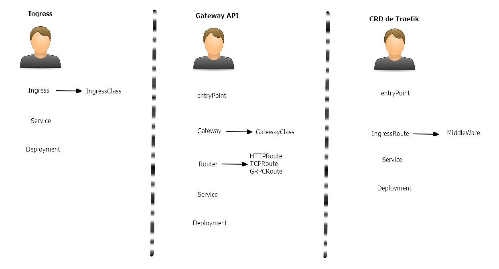

# Index traefik:

* [Indice](#id10)
  * [Puntualizaciones](#id11)
  * [Esquema](#id12)
* [Instalación](#id20)
* [Formas de trabajar](#id30)
  * [Gateway API](#id31)
  * [CRD Traefik](#id32)
      * [Middleware: ipAllowList](#id35)
* [Enable Debug](#id40)

# Indice <div id='id10' />

Copiar los _yamls_ al cluster:

```
$ clear && cd $HOME/ilba/ilba-docu/Varios-k8s/Traefik && scp files/* 172.26.0.230:"/root/"
```

## Puntualizaciones <div id='id11' />

Cosas _random_ que hemos de saber:

* Ingress:
  * Es muy simple en comparación con el [Gateway API](https://gateway-api.sigs.k8s.io/#introduction)
  * Solamente soporta HTTP (no soporta TCP / UDP / gRPC)
* Gateway API
  * Es la evolución del Ingress
  * Es un standard
  * No es un competidor del Service Mesh
  * El estado de les implementaciones, lo podemos ver en su [web oficial](https://gateway-api.sigs.k8s.io/implementations/#gateway-controller-implementation-status)
* CRD de Traefik
  * Más potente que el Gateway API
  * Los [Middleware](https://doc.traefik.io/traefik/reference/routing-configuration/kubernetes/crd/http/middleware/), sólo se pueden implementar con IngressRoute.

## Esquema <div id='id12' />



# Instalación <div id='id20' />

```
root@k8s-test-cp:~# k get nodes
NAME            STATUS   ROLES           AGE     VERSION
k8s-test-cp     Ready    control-plane   4h41m   v1.33.7
k8s-test-wk01   Ready    <none>          4h40m   v1.33.7
k8s-test-wk02   Ready    <none>          4h40m   v1.33.7
k8s-test-wk03   Ready    <none>          4h40m   v1.33.7
```

```
root@k8s-test-cp:~# helm repo add traefik https://traefik.github.io/charts && helm repo update
```

```
helm upgrade --install \
traefik traefik/traefik \
--create-namespace \
--namespace traefik \
--version=38.0.1 \
-f values-traefik-v1.yaml
```

```
root@k8s-test-cp:~# helm -n traefik ls
NAME    NAMESPACE       REVISION        UPDATED                                 STATUS          CHART           APP VERSION
traefik traefik         1               2025-12-25 11:01:18.123218677 +0100 CET deployed        traefik-38.0.1  v3.6.5

root@k8s-test-cp:~# kubectl -n traefik get pods
NAME                       READY   STATUS    RESTARTS   AGE
traefik-5495d8f5c5-594kf   1/1     Running   0          16s
```

# Formas de trabajar <div id='id30' />

## Gateway API <div id='id31' />

```
k apply -f 01-Namespace.yaml && \
k apply -f 02-Deployment.yaml && \
k apply -f 03-Service.yaml && \
k apply -f 04-GatewayClass.yaml && \
k apply -f 05-Gateway.yaml && \
k apply -f 06-HTTPRoute.yaml
```

```
root@k8s-test-cp:~# k get gatewayclass
NAME      CONTROLLER                      ACCEPTED   AGE
traefik   traefik.io/gateway-controller   True       147m

root@k8s-test-cp:~# k get gateway -A
NAMESPACE   NAME          CLASS     ADDRESS        PROGRAMMED   AGE
test1       gateway-api   traefik   172.26.0.101   True         147m

root@k8s-test-cp:~# k get httproute -A
NAMESPACE   NAME             HOSTNAMES            AGE
test1       test-httproute   ["test1.ilba.cat"]   16m
```

```
$ curl -H "Host: test1.ilba.cat" "http://172.26.0.101/"
```

## CRD Traefik <div id='id32' />

```
root@k8s-test-cp:~# k apply -f 10-IngressRoute.yaml

root@k8s-test-cp:~# k get ingressroute -A
NAMESPACE   NAME                 AGE
test1       test1-ingressroute   16s
```

```
$ curl -H "Host: test2.ilba.cat" "http://172.26.0.101/"
```

### Middleware: ipAllowList <div id='id35' />


```
root@k8s-test-cp:~# helm -n traefik uninstall traefik
```

```
helm upgrade --install \
traefik traefik/traefik \
--create-namespace \
--namespace traefik \
--version=38.0.1 \
-f values-traefik-v2.yaml
```

```
root@k8s-test-cp:~# k -n traefik get svc traefik -o yaml | grep TrafficPolicy
  externalTrafficPolicy: Local
  internalTrafficPolicy: Cluster

root@k8s-test-cp:~# kubectl -n traefik get pods -o wide
NAME            READY   STATUS    RESTARTS   AGE   IP               NODE            NOMINATED NODE   READINESS GATES
traefik-2pz5w   1/1     Running   0          12s   10.233.74.137    k8s-test-wk03   <none>           <none>
traefik-8svwh   1/1     Running   0          12s   10.233.113.71    k8s-test-wk01   <none>           <none>
traefik-ktmqz   1/1     Running   0          12s   10.233.120.135   k8s-test-wk02   <none>           <none>
```

```
root@k8s-test-cp:~# k apply -f 15-IngressRoute-Middleware.yaml

root@k8s-test-cp:~# k get ingressroute -A
NAMESPACE   NAME                            AGE
test1       test1-ingressroute              4m27s
test1       test1-ingressroute-middleware   10s
```

```
$ curl -H "Host: test3.ilba.cat" "http://172.26.0.101/" && echo
<!DOCTYPE html>
<html>
<head>
    <title>Hello Kubernetes!</title>
    ...
```

```
root@k8s-test-cp:~# k apply -f 16-Middleware-deny.yaml
```

```
$ curl -H "Host: test3.ilba.cat" "http://172.26.0.101/" && echo
Forbidden
```

# Enable Debug <div id='id40' />

```
root@k8s-test-cp:~# kubectl edit deployment traefik -n traefik
        - --log.level=INFO / DEBUG
```

```
root@k8s-test-cp:~# k -n traefik logs -f deploy/traefik
2025-12-25T21:37:08Z DBG github.com/traefik/traefik/v3/pkg/middlewares/ipallowlist/ip_allowlist.go:78 > Rejecting IP 10.233.72.0: "10.233.72.0" matched none of the trusted IPs middlewareName=test1-test1-ipallowlist@kubernetescrd middlewareType=IPAllowLister
```