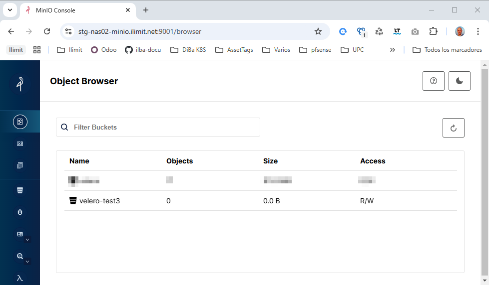

# Index:

* [Instalación de Velero](#id8)
* [Instalación de CEPH RBD (Velero)](#id81)
* [Velero Backup Storage Locations (BSL)](#id82)
* [Velero Backup Hooks + Restore BBDD en otro NS](#id83)
* [Clonar una aplicación (modificando ingress)](#id84)
* [Cambio de storage de Velero (MinIO to MinIO)](#id85)
* [Comandos útiles](#id200)
  * [show backup-location](#id201)
  * [delete backup](#id202)

# Instalación de Velero <div id='id8' />

## Prerequisites

Necesidades:

* Cluster de K8s
* Sistema de Object Storage (MinIO/Ceph/etc...)
* Sistema de CSI (Ceph/NFS/etc...)

## Documentación

Documentación encontrada:

* Velero is an open-source backup solution for Kubernetes, maintained by VMWare-Tanzu.
* Velero backs-up Kubernetes resources and PV’s data into a backup storage location like AWS S3 bucket, or any cloud object storage. It uses restic or Kopia (Starting from velero 1.10) tool to upload data inside a persistent volume to object storage.
* Using the appropriate CSI driver for your storage provides additional features like efficient snapshots and clones.

Notas importantes  de Velero:
* No hace backups de:
  - CRD's
  - RBAC's
* No es application-aware, por eso se usa los Backup Hooks
* Para instalar se puede usar un HELM, pero la documentación oficial indica usar el binario

Nuestro CSI ha de tener esto:

* External Snapshotter
* VolumeSnapshotClass CRD

```
root@diba-master:~# kubectl get crd | grep volumesnapshot
volumesnapshotclasses.snapshot.storage.k8s.io         2024-06-14T05:41:38Z
volumesnapshotcontents.snapshot.storage.k8s.io        2024-06-14T05:41:38Z
volumesnapshotlocations.velero.io                     2024-06-14T17:20:46Z
volumesnapshots.snapshot.storage.k8s.io               2024-06-14T05:41:38Z
```

```
root@diba-master:~# kubectl api-resources | grep snapshot.storage
volumesnapshotclasses             vsclass,vsclasses   snapshot.storage.k8s.io/v1             false        VolumeSnapshotClass
volumesnapshotcontents            vsc,vscs            snapshot.storage.k8s.io/v1             false        VolumeSnapshotContent
volumesnapshots                   vs                  snapshot.storage.k8s.io/v1             true         VolumeSnapshot
```

Si no lo encontramos, hemos de instalar este Helm ([revisar si hay alguno más oficial](https://artifacthub.io/packages/helm/piraeus-charts/snapshot-controller)):


```
helm repo add piraeus-charts https://piraeus.io/helm-charts/
helm repo update

helm upgrade --install \
snapshot-controller piraeus-charts/snapshot-controller \
--create-namespace \
--namespace snapshot-controller \
--version=3.0.6
```

## Montaje de MinIO (por si no lo tenemos)

Recordemos que en Proxmox, la CPU ha de ser: "x86-64-v2-AES"

```
root@diba-minio:~# cat /etc/docker-compose/docker-compose.yaml
version: '3'

services:
  minio:
    container_name: minio
    hostname: minio
    image: minio/minio:RELEASE.2024-06-11T03-13-30Z
    command: server /data --console-address ":9001"
    ports:
      - 9000:9000
      - 9001:9001
    volumes:
      - minio_data:/data
      - /etc/localtime:/etc/localtime:ro
    environment:
      - MINIO_ROOT_USER=admin
      - MINIO_ROOT_PASSWORD=superpassword

volumes:
  minio_data:
    driver: local
```

Accedemos a la consola
* URL: [http://172.26.0.196:9001/](http://172.26.0.196:9001)
* Username: admin
* Password: superpassword

Crearemos el bucket:


## Instalación de Velero

Descargamos el [binario de velero](https://github.com/vmware-tanzu/velero/releases):

```
root@diba-master:~# VELERO_RELEASE=v1.14.1
root@diba-master:~# wget https://github.com/vmware-tanzu/velero/releases/download/$VELERO_RELEASE/velero-$VELERO_RELEASE-linux-amd64.tar.gz
root@diba-master:~# tar xzvf velero-$VELERO_RELEASE-linux-amd64.tar.gz
root@diba-master:~# mv velero-$VELERO_RELEASE-linux-amd64/velero /usr/local/sbin/velero-$VELERO_RELEASE-linux-amd64
root@diba-master:~# ln -s /usr/local/sbin/velero-$VELERO_RELEASE-linux-amd64 /usr/local/sbin/velero
root@diba-master:~# rm -rf velero-$VELERO_RELEASE-linux-amd64
```

Creamos el Token en el MinIO:


```
root@diba-master:~# cat <<EOF >> credentials-velero
[default]
aws_access_key_id = 1sIIyWpZqUIKGstjMMp8
aws_secret_access_key = nHN5jtoouRddrkg01lE9dIs50QM7ddwsjbhF2IeZ
EOF
```

Notas de instalación de velero:
* Plugin para [AWS](https://github.com/vmware-tanzu/velero-plugin-for-aws?tab=readme-ov-file#compatibility)
* Plugin para [CSI](https://github.com/vmware-tanzu/velero-plugin-for-csi?tab=readme-ov-file#compatibility)

```
root@diba-master:~# PLUGIN_AWS=v1.10.1
root@diba-master:~# PLUGIN_CSI=v0.7.1
```


A partir de la versión: 1.31, [no es necesario indicar el plugin de CSI](https://github.com/vmware-tanzu/velero/issues/2527#issuecomment-626755147), ya viene integrado. 

```
...
--plugins velero/velero-plugin-for-aws:$PLUGIN_AWS,velero/velero-plugin-for-csi:$PLUGIN_CSI \
...
```

Si lo ponemos nos saldrá el siguiente error:

```
An error occurred: unable to register plugin (kind=BackupItemActionV2, name=velero.io/csi-pvc-backupper, command=/plugins/velero-plugin-for-csi) because another plugin is already registered for this kind and name (command=/velero)
```

```
velero install \
--provider aws \
--features=EnableCSI \
--plugins velero/velero-plugin-for-aws:$PLUGIN_AWS \
--bucket velero \
--secret-file ./credentials-velero \
--use-volume-snapshots=true \
--backup-location-config region=minio,s3ForcePathStyle="true",s3Url=http://172.26.0.35:9000 \
--use-node-agent
```


```
root@diba-master:~# kubectl -n velero get pods
NAME                      READY   STATUS    RESTARTS   AGE
node-agent-2424t          1/1     Running   0          14s
node-agent-4nk6j          1/1     Running   0          14s
node-agent-64lbj          1/1     Running   0          14s
velero-6d887568cd-tsckw   1/1     Running   0          14s

root@diba-master:~# velero version
Client:
        Version: v1.13.2
        Git commit: 4d961fb6fec384ed7f3c1b7c65c818106107f5a6
Server:
        Version: v1.13.2
```

```
root@diba-master:~# kubectl get sc
NAME      PROVISIONER      RECLAIMPOLICY   VOLUMEBINDINGMODE   ALLOWVOLUMEEXPANSION   AGE
nfs-csi   nfs.csi.k8s.io   Delete          Immediate           false                  11h
```

```
root@diba-master:~# kubectl annotate storageclass/nfs-csi storageclass.kubernetes.io/is-default-class=true
```

## Tests de Velero


```
root@diba-master:~# cat test-nfs.yaml
kind: PersistentVolumeClaim
apiVersion: v1
metadata:
  name: test-dynamic-volume-claim
  namespace: default
spec:
  storageClassName: nfs-csi
  accessModes:
    - ReadWriteOnce
  resources:
    requests:
      storage: 666Mi
---
apiVersion: v1
kind: Pod
metadata:
  name: nginx
  namespace: default
spec:
  containers:
  - name: nginx
    image: nginx
    volumeMounts:
    - name: nfs-server
      mountPath: /usr/share/nginx/html
  volumes:
  - name: nfs-server
    persistentVolumeClaim:
      claimName: test-dynamic-volume-claim
```

```
root@diba-master:~# kubectl apply -f test-nfs.yaml

root@diba-master:~# kubectl exec -it nginx bash
root@nginx:/# echo "Hello World ;-)" >  /usr/share/nginx/html/index.html
root@nginx:/# exit

root@diba-master:~# kubectl get pods -o wide
NAME    READY   STATUS    RESTARTS   AGE     IP             NODE            NOMINATED NODE   READINESS GATES
nginx   1/1     Running   0          2m38s   10.38.25.118   diba-master-1   <none>           <none>

root@diba-master:~# curl 10.38.25.118
Hello World ;-)
```

```
velero backup create "backup-$(date +"%H-%M")" \
--include-namespaces default \
--include-resources pvc,pv \
--default-volumes-to-fs-backup
```

```
root@diba-master:~# velero backup get
NAME           STATUS      ERRORS   WARNINGS   CREATED                          EXPIRES   STORAGE LOCATION   SELECTOR
backup-10-04   Completed   0        0          2024-06-15 10:04:10 +0200 CEST   29d       default            <none>
```

Accedemos a la consola
* URL: [http://172.26.0.196:9001/](http://172.26.0.196:9001)
* Username: admin
* Password: superpassword

# Instalación de CEPH RBD (Velero) <div id='id81' />


Partimos de la base que tenemos un Ceph (AllInOne) montado y funcionando:

```
root@ceph-aio:~# ceph -s
  cluster:
    id:     7d2b3cca-f1eb-11ee-a886-593bc87d3824
    health: HEALTH_OK
            (muted: POOL_NO_REDUNDANCY)

  services:
    mon: 1 daemons, quorum ceph-aio (age 100s)
    mgr: ceph-aio.iaeehz(active, since 48s)
    osd: 3 osds: 3 up (since 59s), 3 in (since 10w)

  data:
    pools:   1 pools, 1 pgs
    objects: 2 objects, 449 KiB
    usage:   891 MiB used, 89 GiB / 90 GiB avail
    pgs:     1 active+clean
```

```
root@ceph-aio:~# ceph osd lspools
1 .mgr

root@ceph-aio:~# ceph mon dump | grep "fsid "
dumped monmap epoch 1
fsid 7d2b3cca-f1eb-11ee-a886-593bc87d3824

root@ceph-aio:~# ceph mon dump | grep 6789
dumped monmap epoch 1
0: [v2:172.26.0.239:3300/0,v1:172.26.0.239:6789/0] mon.ceph-aio

root@ceph-aio:~# ceph osd pool create pool-k8s 16
root@ceph-aio:~# ceph osd pool set pool-k8s size 1 --yes-i-really-mean-it
root@ceph-aio:~# rbd pool init pool-k8s
root@ceph-aio:~# ceph health mute POOL_NO_REDUNDANCY

root@ceph-aio:~# ceph osd lspools
1 .mgr
6 pool-k8s

root@ceph-aio:~# ceph auth add client.k8s mon 'allow r' osd 'allow rwx pool=pool-k8s'
root@ceph-aio:~# ceph auth get-key client.k8s
AQB6Jm1mQz0hHBAAUEP8Fa2Kuk3s5SmRRPtFJQ==

root@ceph-aio:~# ceph -s
  cluster:
    id:     7d2b3cca-f1eb-11ee-a886-593bc87d3824
    health: HEALTH_OK
            (muted: POOL_NO_REDUNDANCY)

  services:
    mon: 1 daemons, quorum ceph-aio (age 10m)
    mgr: ceph-aio.iaeehz(active, since 10m)
    osd: 3 osds: 3 up (since 10m), 3 in (since 10w)

  data:
    pools:   2 pools, 17 pgs
    objects: 3 objects, 449 KiB
    usage:   891 MiB used, 89 GiB / 90 GiB avail
    pgs:     17 active+clean
```

```
root@diba-master:~# helm repo add ceph-csi https://ceph.github.io/csi-charts
root@diba-master:~# helm repo update

root@diba-master:~# helm search repo ceph-csi/ceph-csi-rbd
NAME                    CHART VERSION   APP VERSION     DESCRIPTION
ceph-csi/ceph-csi-rbd   3.11.0          3.11.0          Container Storage Interface (CSI) driver, provi...

root@diba-master:~# vim values-ceph-csi-rbd.yaml
csiConfig:
  - clusterID: "7d2b3cca-f1eb-11ee-a886-593bc87d3824"
    monitors:
      - "172.26.0.239:6789"

storageClass:
  create: true
  name: csi-rbd-sc
  clusterID: 7d2b3cca-f1eb-11ee-a886-593bc87d3824
  pool: pool-k8s

secret:
  create: true
  name: csi-rbd-secret
  userID: k8s
  userKey: AQB6Jm1mQz0hHBAAUEP8Fa2Kuk3s5SmRRPtFJQ==

root@diba-master:~# helm upgrade --install ceph-csi-rbd \
--create-namespace \
--namespace ceph-csi \
-f values-ceph-csi-rbd.yaml \
--version=3.11.0 \
ceph-csi/ceph-csi-rbd

root@diba-master:~# helm -n ceph-csi ls
NAME            NAMESPACE       REVISION        UPDATED                                         STATUS          CHART                   APP VERSION
ceph-csi-rbd    ceph-csi        1               2024-06-15 07:50:20.956726143 +0200 CEST        deployed        ceph-csi-rbd-3.11.0     3.11.0

root@diba-master:~# kubectl -n ceph-csi get pods
NAME                                        READY   STATUS    RESTARTS   AGE
ceph-csi-rbd-nodeplugin-6gvd2               3/3     Running   0          3m54s
ceph-csi-rbd-nodeplugin-gmr4c               3/3     Running   0          3m54s
ceph-csi-rbd-nodeplugin-t6nnp               3/3     Running   0          3m54s
ceph-csi-rbd-provisioner-66d99f8ffb-8bl2k   7/7     Running   0          3m54s
ceph-csi-rbd-provisioner-66d99f8ffb-jmrpq   7/7     Running   0          3m54s
ceph-csi-rbd-provisioner-66d99f8ffb-rm2fg   7/7     Running   0          3m54s

root@diba-master:~# kubectl get sc
NAME                PROVISIONER        RECLAIMPOLICY   VOLUMEBINDINGMODE   ALLOWVOLUMEEXPANSION   AGE
csi-rbd-sc          rbd.csi.ceph.com   Delete          Immediate           true                   62s
nfs-csi (default)   nfs.csi.k8s.io     Delete          Immediate           false                  24h
```

## Test velero con RBD

```
root@diba-master:~# kubectl create ns test-rbd

root@diba-master:~# vim test-rbd.yaml
kind: PersistentVolumeClaim
apiVersion: v1
metadata:
  name: test-dynamic-volume-claim
  namespace: test-rbd
spec:
  storageClassName: csi-rbd-sc
  accessModes:
    - ReadWriteOnce
  resources:
    requests:
      storage: 2Gi
---
apiVersion: v1
kind: Pod
metadata:
  name: nginx
  namespace: test-rbd
spec:
  containers:
  - name: nginx
    image: nginx
    volumeMounts:
    - name: nfs-server
      mountPath: /usr/share/nginx/html
  volumes:
  - name: nfs-server
    persistentVolumeClaim:
      claimName: test-dynamic-volume-claim

root@diba-master:~# kubectl apply -f test-rbd.yaml

root@diba-master:~# kubectl -n test-rbd exec -it nginx -- df -h | grep rbd
/dev/rbd0       2.0G   24K  1.9G   1% /usr/share/nginx/html
```

```
velero backup create "backup-$(date +"%H-%M")" \
--include-namespaces test-rbd \
--include-resources pvc,pv \
--default-volumes-to-fs-backup
```

```
root@diba-master:~# velero backup get
NAME           STATUS      ERRORS   WARNINGS   CREATED                          EXPIRES   STORAGE LOCATION   SELECTOR
backup-10-04   Completed   0        0          2024-06-15 10:04:10 +0200 CEST   29d       default            <none>
backup-10-05   Completed   0        0          2024-06-15 10:05:05 +0200 CEST   29d       default            <none>
```

# Velero Backup Storage Locations (BSL) <div id='id82' />

Es este apartado realizaremos un backup en un storage diferente del "default", que es el que creamos cuando desplegamos Velero.
Cabe destacar que todos los buckets están hechos en el mismo MinIO.... vamos que sólo hay un MinIO

Por defecto sólo tenemos este backup-location:

```
root@diba-master:~# velero backup-location get
NAME      PROVIDER   BUCKET/PREFIX   PHASE       LAST VALIDATED                   ACCESS MODE   DEFAULT
default   aws        velero          Available   2024-06-16 09:04:11 +0200 CEST   ReadWrite     true
```

Accederemos a la consola de MinIO y crearemos dos buckets más, dentro de nuestro MinIO, que se llamaran:
* batman
* robin

Accedemos a la consola
* URL: [http://172.26.0.196:9001/](http://172.26.0.196:9001)
* Username: admin
* Password: superpassword


Le indicaremos a Velero la existencia de los dos nuevos buckets: batman y robin

```
root@diba-master:~# velero backup-location create batman \
--provider aws \
--config region=minio,s3ForcePathStyle="true",s3Url=http://172.26.0.196:9000 \
--bucket batman

root@diba-master:~# velero backup-location create robin \
--provider aws \
--config region=minio,s3ForcePathStyle="true",s3Url=http://172.26.0.196:9000 \
--bucket robin
```

Verificemos que los dos buckets hayan pasado la "PHASE" y estén "Available"

```
root@diba-master:~# velero backup-location get
NAME      PROVIDER   BUCKET/PREFIX   PHASE       LAST VALIDATED                   ACCESS MODE   DEFAULT
batman    aws        batman          Available   2024-06-16 09:18:44 +0200 CEST   ReadWrite
default   aws        velero          Available   2024-06-16 09:19:11 +0200 CEST   ReadWrite     true
robin     aws        robin           Available   2024-06-16 09:19:45 +0200 CEST   ReadWrite
```

Lanzaremos un backup contra el bucket de batman y verificaremos que se han copiado los datos:

```
root@diba-master:~# velero backup create "backup-$(date +"%H-%M")" \
--include-namespaces test-rbd \
--include-resources pvc,pv \
--default-volumes-to-fs-backup \
--storage-location batman

root@diba-master:~# velero backup get
NAME           STATUS      ERRORS   WARNINGS   CREATED                          EXPIRES   STORAGE LOCATION   SELECTOR
backup-09-20   Completed   0        0          2024-06-16 09:20:29 +0200 CEST   29d       batman             <none>
```


# Velero Backup Hooks + Restore BBDD en otro NS <div id='id83' />

## Velero Backup Hooks

```
root@diba-master:~# kubectl create ns test-mysql-hooks

root@diba-master:~# vim test-mysql-hooks.yaml
kind: PersistentVolumeClaim
apiVersion: v1
metadata:
  name: mysql-data
  namespace: test-mysql-hooks
spec:
  storageClassName: csi-rbd-sc
  accessModes:
    - ReadWriteOnce
  resources:
    requests:
      storage: 2Gi
---
apiVersion: v1
kind: Pod
metadata:
  name: mysql
  namespace: test-mysql-hooks
  labels:
    name: mysql
spec:
  containers:
    - name: mysql
      image: mysql:8.0.32
      env:
        - name: MYSQL_ROOT_PASSWORD
          value: r00tme_2024
      volumeMounts:
        - name: mysql-data
          mountPath: /var/lib/mysql
  volumes:
    - name: mysql-data
      persistentVolumeClaim:
        claimName: mysql-data

root@diba-master:~# kubectl apply -f test-mysql-hooks.yaml

root@diba-master:~# kubectl -n test-mysql-hooks get pods
NAME    READY   STATUS    RESTARTS   AGE
mysql   1/1     Running   0          41s

root@diba-master:~# kubectl -n test-mysql-hooks exec -it mysql -- df -h | grep rbd
/dev/rbd0       2.0G  200M  1.7G  11% /var/lib/mysql
```

Insertaremos datos en la BBDD:

```
root@diba-master:~# kubectl -n test-mysql-hooks exec -it mysql -- mysql -u root -p
    r00tme_2024

mysql> CREATE DATABASE agenda;
mysql> USE agenda;
mysql> CREATE TABLE datos (id INT, nombre VARCHAR(20), apellido VARCHAR(20));
mysql> INSERT INTO datos (id,nombre,apellido) VALUES(1,"Oscar","Mas");
mysql> INSERT INTO datos (id,nombre,apellido) VALUES(2,"Nuria","Ilari");

mysql> SELECT * FROM agenda.datos;
+------+--------+----------+
| id   | nombre | apellido |
+------+--------+----------+
|    1 | Oscar  | Mas      |
|    2 | Nuria  | Ilari    |
+------+--------+----------+
2 rows in set (0.00 sec)

mysql> quit
```

En este punto añadiremos las "Annotations"

```
root@diba-master:~# cat test-mysql-hooks.yaml

root@diba-master:~# kubectl apply -f test-mysql-hooks.yaml

root@diba-master:~# kubectl -n test-mysql-hooks describe pod mysql | grep velero
Annotations:      backup.velero.io/backup-volumes: mysql-data
                  post.hook.backup.velero.io/command: ["mysql", "--password=r00tme_2024", "-e", "UNLOCK TABLES"]
                  pre.hook.backup.velero.io/command: ["mysql", "--password=r00tme_2024", "-e", "FLUSH TABLES WITH READ LOCK"]
```

```
root@diba-master:~# velero backup create "backup-$(date +"%H-%M")" \
--include-namespaces test-mysql-hooks \
--default-volumes-to-fs-backup

root@diba-master:~# velero backup get
NAME           STATUS       ERRORS   WARNINGS   CREATED                          EXPIRES   STORAGE LOCATION   SELECTOR
backup-13-21   InProgress   0        0          2024-06-16 13:21:39 +0200 CEST   29d       default            <none>

root@diba-master:~# velero backup logs backup-13-21
time="2024-06-16T11:21:41Z" level=info msg="running exec hook" backup=velero/backup-13-21 hookCommand="[mysql --password=r00tme_2024 -e FLUSH TABLES WITH READ LOCK]" hookContainer=mysql hookName="<from-annotation>" hookOnError=Fail hookPhase=pre hookSource=annotation hookTimeout="{30s}" hookType=exec logSource="pkg/podexec/pod_command_executor.go:133" name=mysql namespace=test-mysql-hooks resource=pods
time="2024-06-16T11:21:41Z" level=info msg="stdout: " backup=velero/backup-13-21 hookCommand="[mysql --password=r00tme_2024 -e FLUSH TABLES WITH READ LOCK]" hookContainer=mysql hookName="<from-annotation>" hookOnError=Fail hookPhase=pre hookSource=annotation hookTimeout="{30s}" hookType=exec logSource="pkg/podexec/pod_command_executor.go:180" name=mysql namespace=test-mysql-hooks resource=pods
time="2024-06-16T11:21:41Z" level=info msg="stderr: mysql: [Warning] Using a password on the command line interface can be insecure.\n" backup=velero/backup-13-21 hookCommand="[mysql --password=r00tme_2024 -e FLUSH TABLES WITH READ LOCK]" hookContainer=mysql hookName="<from-annotation>" hookOnError=Fail hookPhase=pre hookSource=annotation hookTimeout="{30s}" hookType=exec logSource="pkg/podexec/pod_command_executor.go:181" name=mysql namespace=test-mysql-hooks resource=pods
time="2024-06-16T11:21:52Z" level=info msg="running exec hook" backup=velero/backup-13-21 hookCommand="[mysql --password=r00tme_2024 -e UNLOCK TABLES]" hookContainer=mysql hookName="<from-annotation>" hookOnError=Fail hookPhase=post hookSource=annotation hookTimeout="{30s}" hookType=exec logSource="pkg/podexec/pod_command_executor.go:133" name=mysql namespace=test-mysql-hooks resource=pods
time="2024-06-16T11:21:53Z" level=info msg="stdout: " backup=velero/backup-13-21 hookCommand="[mysql --password=r00tme_2024 -e UNLOCK TABLES]" hookContainer=mysql hookName="<from-annotation>" hookOnError=Fail hookPhase=post hookSource=annotation hookTimeout="{30s}" hookType=exec logSource="pkg/podexec/pod_command_executor.go:180" name=mysql namespace=test-mysql-hooks resource=pods
time="2024-06-16T11:21:53Z" level=info msg="stderr: mysql: [Warning] Using a password on the command line interface can be insecure.\n" backup=velero/backup-13-21 hookCommand="[mysql --password=r00tme_2024 -e UNLOCK TABLES]" hookContainer=mysql hookName="<from-annotation>" hookOnError=Fail hookPhase=post hookSource=annotation hookTimeout="{30s}" hookType=exec logSource="pkg/podexec/pod_command_executor.go:181" name=mysql namespace=test-mysql-hooks resource=pods

root@diba-master:~# velero backup get
NAME           STATUS      ERRORS   WARNINGS   CREATED                          EXPIRES   STORAGE LOCATION   SELECTOR
backup-13-21   Completed   0        0          2024-06-16 13:21:39 +0200 CEST   29d       default            <none>
```

## Restore BBDD en otro NS

Revisaremos que todo esté correcto:

```
root@diba-master:~# kubectl -n test-mysql-hooks get pods
NAME    READY   STATUS    RESTARTS      AGE
mysql   1/1     Running   1 (19h ago)   21h

root@diba-master:~# kubectl -n test-mysql-hooks exec -it mysql -- mysql -u root -p
    r00tme_2024

mysql> SELECT * FROM agenda.datos;
+------+--------+----------+
| id   | nombre | apellido |
+------+--------+----------+
|    1 | Oscar  | Mas      |
|    2 | Nuria  | Ilari    |
+------+--------+----------+
2 rows in set (0.08 sec)

mysql> quit
```

Lanzaremos un backup:

```
velero backup create "backup-$(date +"%H-%M")" \
--include-namespaces test-mysql-hooks \
--default-volumes-to-fs-backup

root@diba-master:~# velero backup get
NAME           STATUS      ERRORS   WARNINGS   CREATED                          EXPIRES   STORAGE LOCATION   SELECTOR
backup-09-30   Completed   0        0          2024-06-17 09:30:32 +0200 CEST   29d       default            <none>
```

Restauraremos en otro NS, para poder coger los datos:

```
root@diba-master:~# velero restore create --from-backup backup-09-30 --namespace-mappings test-mysql-hooks:restore-mysql-hooks
```

Creamos una fila en el original, para verificar que todo sea correcto y verificaremos al restauración:

```
root@diba-master:~# kubectl -n test-mysql-hooks exec -it mysql -- mysql -u root -p
    r00tme_2024

mysql> INSERT INTO agenda.datos (id,nombre,apellido) VALUES(3,"Abril","Mas");
mysql> SELECT * FROM agenda.datos;
+------+--------+----------+
| id   | nombre | apellido |
+------+--------+----------+
|    1 | Oscar  | Mas      |
|    2 | Nuria  | Ilari    |
|    3 | Abril  | Mas      |
+------+--------+----------+
3 rows in set (0.00 sec)

mysql> quit

root@diba-master:~# kubectl -n restore-mysql-hooks exec -it mysql -- mysql -u root -p
    r00tme_2024

mysql> SELECT * FROM agenda.datos;
+------+--------+----------+
| id   | nombre | apellido |
+------+--------+----------+
|    1 | Oscar  | Mas      |
|    2 | Nuria  | Ilari    |
+------+--------+----------+
2 rows in set (0.01 sec)

mysql> quit
```

# Clonar una aplicación (modificando ingress) <div id='id84' />

## La aplicación

Esta es la aplicación de demo, para después restaurarla

```
root@k8s-test-cp:~# vim app-ilba.yaml
apiVersion: v1
kind: Namespace
metadata:
  name: app-ilba
---
apiVersion: apps/v1
kind: Deployment
metadata:
  name: app-ilba-deployment
  namespace: app-ilba
  labels:
    app.kubernetes.io/name: app-ilba
spec:
  replicas: 1
  selector:
    matchLabels:
      app.kubernetes.io/name: app-ilba
  template:
    metadata:
      labels:
        app.kubernetes.io/name: app-ilba
    spec:
      containers:
        - name: app-kubernetes
          image: nginx
          ports:
            - name: http
              containerPort: 80
              protocol: TCP
---
apiVersion: v1
kind: Service
metadata:
  name: app-ilba-service
  namespace: app-ilba
spec:
  selector:
    app.kubernetes.io/name: app-ilba
  ports:
    - protocol: TCP
      port: 80
      targetPort: http
---
apiVersion: networking.k8s.io/v1
kind: Ingress
metadata:
  name: app-ilba-ingress
  namespace: app-ilba
spec:
  ingressClassName: nginx               
  rules:
  - host: app-ilba.ilba.cat
    http:
      paths:
      - path: /
        pathType: Prefix
        backend:
          service:
            name: app-ilba-service
            port:
              number: 80
```

```
root@k8s-test-cp:~# kubectl apply -f app-ilba.yaml

root@k8s-test-cp:~# kubectl get ingress -A
NAMESPACE         NAME               CLASS   HOSTS                      ADDRESS        PORTS   AGE
app-ilba          app-ilba-ingress   nginx   app-ilba.ilba.cat          172.26.0.101   80      31s

root@k8s-test-cp:~# curl -s -H "Host: app-ilba.ilba.cat" 172.26.0.101
...
<h1>Welcome to nginx!</h1>
...
```

Realizamos un backup de la applicación:

```
root@k8s-test-cp:~# velero backup create "backup-app-ilba" --include-namespaces app-ilba --default-volumes-to-fs-backup

root@k8s-test-cp:~# velero get backups
NAME              STATUS      ERRORS   WARNINGS   CREATED                          EXPIRES   STORAGE LOCATION   SELECTOR
backup-app-ilba   Completed   0        0          2024-09-23 14:55:40 +0200 CEST   29d       default            <none>
```

## Clonamos la aplicación

Restauramos el namespace **app-ilba** a **app-ilba-restore**, pero le indicamos que no recuperamos los **ingress**:

```
velero restore create \
--from-backup backup-app-ilba \
--namespace-mappings app-ilba:app-ilba-restore \
--exclude-resources \
ingress.extensions,ingress.networking.k8s.io
```

```
root@k8s-test-cp:~# kubectl get ingress -A
NAMESPACE         NAME               CLASS   HOSTS                      ADDRESS        PORTS   AGE
app-ilba          app-ilba-ingress   nginx   app-ilba.ilba.cat          172.26.0.101   80      8m33s

root@k8s-test-cp:~# kubectl -n app-ilba-restore get pods
NAME                                   READY   STATUS    RESTARTS   AGE
app-ilba-deployment-6bf9fd859f-znxkh   1/1     Running   0          32s
```

Cogemos el  el ingress del NS **app-ilba** y lo aplicamos en el NS **app-ilba-restore**:

```
root@k8s-test-cp:~# kubectl -n app-ilba get ingress app-ilba-ingress -o yaml > app-ilba-restore.yaml

root@k8s-test-cp:~# sed -i 's/app-ilba.ilba.cat/app-ilba-restore.ilba.cat/g' app-ilba-restore.yaml
root@k8s-test-cp:~# sed -i 's/namespace: app-ilba/namespace: app-ilba-restore/g' app-ilba-restore.yaml

root@k8s-test-cp:~# kubectl apply -f app-ilba-restore.yaml
```

```
root@k8s-test-cp:~# kubectl get ingress -A
NAMESPACE          NAME               CLASS   HOSTS                       ADDRESS        PORTS   AGE
app-ilba-restore   app-ilba-ingress   nginx   app-ilba-restore.ilba.cat   172.26.0.101   80      65s
app-ilba           app-ilba-ingress   nginx   app-ilba.ilba.cat           172.26.0.101   80      44m

root@k8s-test-cp:~# curl -s -H "Host: app-ilba-restore.ilba.cat" 172.26.0.101
...
<h1>Welcome to nginx!</h1>
...
```

# Cambio de storage de Velero (MinIO to MinIO) <div id='id85' />

Este es el storage por defecto que hay configurado:

```
root@ilimit-paas-k8s-test3-cp01:~# kubectl get BackupStorageLocation -A
NAMESPACE   NAME             PHASE       LAST VALIDATED   AGE   DEFAULT
velero      velero-backups   Available   59s              26d   true

root@ilimit-paas-k8s-test3-cp01:~# velero backup-location get
NAME             PROVIDER   BUCKET/PREFIX   PHASE       LAST VALIDATED                  ACCESS MODE   DEFAULT
velero-backups   aws        velero          Available   2024-11-19 09:32:09 +0100 CET   ReadWrite     true
```

Verificamos el acceso al MinIO:
* URL: https://stg-nas02-minio.ilimit.net:9001/
* Username: admin
* Password: xxxxxxx



Configuración del nuevo storage de MinIO

```
$ cat <<EOF > credentials-velero-stg-nas02.file
[default]
aws_access_key_id=xxxxxxxxxxx
aws_secret_access_key=yyyyyyyyyyyyyyyyyyyyyyyyyyyyyyyyyyyyyy
EOF

$ kubectl create secret generic -n velero credentials-velero-stg-nas02 --from-file=aws=credentials-velero-stg-nas02.file

$ kubectl -n velero get secret credentials-velero-stg-nas02
NAME                           TYPE     DATA   AGE
credentials-velero-stg-nas02   Opaque   1      37s

$ velero backup-location create velero-stg-nas02 \
--provider aws \
--bucket velero-test3 \
--config region=minio,s3ForcePathStyle="true",s3Url=https://stg-nas02-minio.ilimit.net:9000 \
--credential=credentials-velero-stg-nas02=aws

$ kubectl get BackupStorageLocation -A
NAMESPACE   NAME               PHASE       LAST VALIDATED   AGE   DEFAULT
velero      velero-backups     Available   8s               26d   true
velero      velero-stg-nas02   Available   58s              10m

$ velero backup-location get
NAME               PROVIDER   BUCKET/PREFIX   PHASE       LAST VALIDATED                  ACCESS MODE   DEFAULT
velero-backups     aws        velero          Available   2024-11-19 10:42:09 +0100 CET   ReadWrite     true
velero-stg-nas02   aws        velero-test3    Available   2024-11-19 10:43:02 +0100 CET   ReadWrite

$ kubectl -n velero get backupstoragelocations velero-stg-nas02 -oyaml
apiVersion: velero.io/v1
kind: BackupStorageLocation
metadata:
  creationTimestamp: "2024-11-19T09:43:02Z"
  generation: 2
  name: velero-stg-nas02
  namespace: velero
  resourceVersion: "10192614"
  uid: aa0de707-ac4c-45d2-b50a-76a13ac015de
spec:
  accessMode: ReadWrite
  config:
    region: minio
    s3ForcePathStyle: "true"
    s3Url: https://stg-nas02-minio.ilimit.net:9000
  credential:
    key: aws
    name: credentials-velero-stg-nas02
  objectStorage:
    bucket: velero-test3
  provider: aws
status:
  lastValidationTime: "2024-11-19T09:43:02Z"
  phase: Available
```

Verificamos que funciona:

```
$ velero backup create "backup-$(date +"%H-%M")" \
--include-namespaces client-advanced-farmacia \
--storage-location velero-stg-nas02

$ velero backup get |grep 
NAME                                                  STATUS      ERRORS   WARNINGS   CREATED                         EXPIRES   STORAGE LOCATION   SELECTOR
backup-10-49                                          Completed   0        0          2024-11-19 10:49:22 +0100 CET   29d       velero-stg-nas02   <none>
dccomics-basic-stack-schedule-backup-20241119000039   Completed   0        1          2024-11-19 01:02:19 +0100 CET   1d        velero-backups     <none>
....
```


Antes de cambiar el storage, borraremos todos los backups que estén apuntando a "velero-backups":

```
$ velero backup get
NAME                                                  STATUS      ERRORS   WARNINGS   CREATED                         EXPIRES   STORAGE LOCATION   SELECTOR
backup-10-49                                          Completed   0        0          2024-11-19 10:49:22 +0100 CET   29d       velero-stg-nas02   <none>
dccomics-basic-stack-schedule-backup-20241119000039   Completed   0        1          2024-11-19 01:02:19 +0100 CET   1d        velero-backups     <none>
dccomics-basic-stack-schedule-backup-20241118000036   Completed   0        1          2024-11-18 01:00:36 +0100 CET   14h       velero-backups     <none>
...

$ velero backup delete dccomics-basic-stack-.....

root@ilimit-paas-k8s-test3-cp01:~/velero# velero backup get
NAME           STATUS      ERRORS   WARNINGS   CREATED                         EXPIRES   STORAGE LOCATION   SELECTOR
backup-10-49   Completed   0        0          2024-11-19 10:49:22 +0100 CET   29d       velero-stg-nas02   <none>
```

Ahora cambiaremos el storage por defecto:

```
$ kubectl -n velero get BackupStorageLocation
NAME               PHASE       LAST VALIDATED   AGE   DEFAULT
velero-backups     Available   50s              26d   true
velero-stg-nas02   Available   40s              10m

$ velero backup-location get
NAME               PROVIDER   BUCKET/PREFIX   PHASE       LAST VALIDATED                  ACCESS MODE   DEFAULT
velero-backups     aws        velero          Available   2024-11-19 10:54:09 +0100 CET   ReadWrite     true
velero-stg-nas02   aws        velero-test3    Available   2024-11-19 10:54:19 +0100 CET   ReadWrite
```

```
$ kubectl -n velero delete BackupStorageLocation velero-backups
$ velero backup-location set velero-stg-nas02 --default
```

```
root@ilimit-paas-k8s-test3-cp01:~/velero# kubectl -n velero get BackupStorageLocation
NAME               PHASE       LAST VALIDATED   AGE   DEFAULT
velero-stg-nas02   Available   15s              21m   true

root@ilimit-paas-k8s-test3-cp01:~/velero# velero backup-location get
NAME               PROVIDER   BUCKET/PREFIX   PHASE       LAST VALIDATED                  ACCESS MODE   DEFAULT
velero-stg-nas02   aws        velero-test3    Available   2024-11-19 11:03:50 +0100 CET   ReadWrite     true
```
# Comandos útiles <div id='id200' />

## show backup-location <div id='id201' />

```
root@ilimit-paas-k8s-pre-cp01:~# velero backup-location get
NAME             PROVIDER   BUCKET/PREFIX   PHASE       LAST VALIDATED                  ACCESS MODE   DEFAULT
velero-backups   aws        velero          Available   2025-03-21 09:31:59 +0100 CET   ReadWrite     true
```

```
root@ilimit-paas-k8s-pre-cp01:~# kubectl -n velero get backupstoragelocations -oyaml
apiVersion: v1
items:
- apiVersion: velero.io/v1
  kind: BackupStorageLocation
  metadata:
    annotations:
      meta.helm.sh/release-name: velero
      meta.helm.sh/release-namespace: velero
    creationTimestamp: "2025-01-24T08:03:55Z"
    generation: 142334
    labels:
      app.kubernetes.io/instance: velero
      app.kubernetes.io/managed-by: Helm
      app.kubernetes.io/name: velero
      helm.sh/chart: velero-7.2.1
    name: velero-backups
    namespace: velero
    resourceVersion: "25868716"
    uid: 235aa8ab-f16e-4013-9189-5d4910a68e30
  spec:
    accessMode: ReadWrite
    config:
      publicUrl: https://stg-nas02-minio.ilimit.net:9000
      region: default
      s3ForcePathStyle: "true"
      s3Url: https://stg-nas02-minio.ilimit.net:9000
    default: true
    objectStorage:
      bucket: velero
    provider: aws
  status:
    lastSyncedTime: "2025-03-21T08:32:08Z"
    lastValidationTime: "2025-03-21T08:31:59Z"
    phase: Available
kind: List
metadata:
  resourceVersion: ""
```

## delete backup <div id='id202' />

```
root@ilimit-paas-k8s-pre-cp01:~# velero backup get
NAME                                                                STATUS      ERRORS   WARNINGS   CREATED                         EXPIRES   STORAGE LOCATION   SELECTOR
...
prueba-basic-stack-schedule-backup-20250321000008                   Deleting    0        1          2025-03-21 01:01:15 +0100 CET   1d        velero-backups     <none>
...
```

```
root@ilimit-paas-k8s-pre-cp01:~# velero backup describe prueba-basic-stack-schedule-backup-20250321000008
..
Deletion Attempts (1 failed):
  2025-03-21 13:36:20 +0100 CET: Processed
  Errors:
    error getting backup's volume snapshots: rpc error: code = Unknown desc = operation error S3: HeadObject, https response error StatusCode: 403, RequestID: 182ED19D969D5805, HostID: dd9025bab4ad464b049177c95eb6ebf374d3b3fd1af9251148b658df7ac2e3e8, api error Forbidden: Forbidden
    error to connect backup repo: error to connect to storage: error retrieving storage config from bucket "velero": The Access Key Id you provided does not exist in our records.
    rpc error: code = Unknown desc = operation error S3: ListObjectsV2, https response error StatusCode: 403, RequestID: 182ED19D97729776, HostID: dd9025bab4ad464b049177c95eb6ebf374d3b3fd1af9251148b658df7ac2e3e8, api error InvalidAccessKeyId: The Access Key Id you provided does not exist in our records.
```

```
root@ilimit-paas-k8s-pre-cp01:~# kubectl -n velero delete backups.velero.io prueba-basic-stack-schedule-backup-20250321000008
backup.velero.io "prueba-basic-stack-schedule-backup-20250321000008" deleted
```