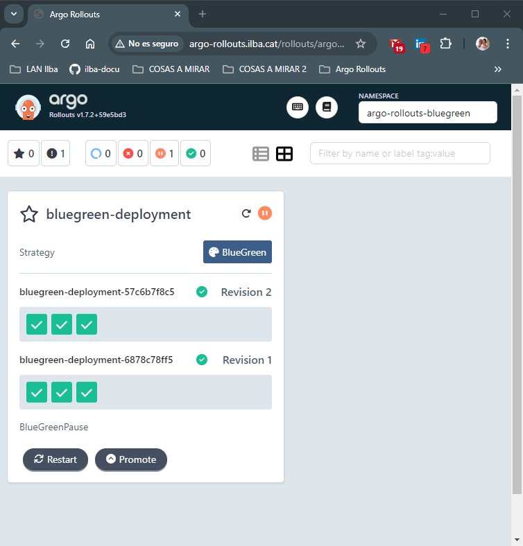
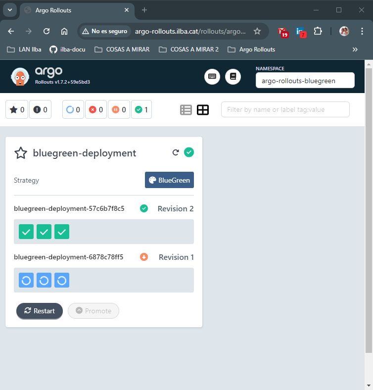
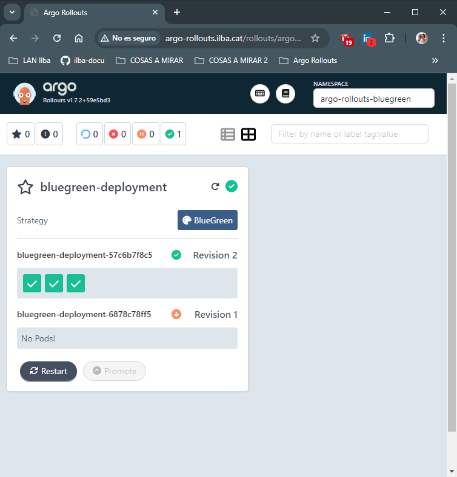

# Index:

* [Argo Rollout](#id05)
* [Instalación de Argo Rollout](#id10)
* [Blue-Green](#id20)

# Argo Rollout <div id='id05' />

## Qué es Argo Rollout ?

Argo Rollout in an advanced deployment controller for Kubernetes.

Extend the existing funcionality of Kubernetes native deployments

It allows the develoer to define varius strategies for updating an application

Provide additional deployment startegies like:
* [Blue-Green](#id20)
* Canary
* Weighted traffic shifting
* etc...

## Key Features
Características principales: 

* Advanced Deployment Strategies: support more controlled deployment method to reduce risk
* Automated Rollbacks: in case of failer or suboptimal performance
* Customizable Metrics: custom metrics for accessing success and making automated decisions

# Instalación de Argo Rollout <div id='id10' />

## Instalación de Argo Rollout

```
root@kubespray-aio:~# kubectl get nodes
NAME               STATUS   ROLES           AGE    VERSION
kubespray-aio      Ready    control-plane   231d   v1.27.5
kubespray-aio-w1   Ready    <none>          230d   v1.27.5
kubespray-aio-w2   Ready    <none>          230d   v1.27.5
```

Instalación de Argo Rollout

```
root@kubespray-aio:~# helm repo add argo https://argoproj.github.io/argo-helm
root@kubespray-aio:~# helm repo update

root@kubespray-aio:~# cat values-argo-rollouts.yaml
dashboard:
  enabled: true
  ingress:
    enabled: true
    ingressClassName: "nginx"
    hosts:
      - argo-rollouts.ilba.cat
    paths:
      - /
    pathType: Prefix

$ helm upgrade --install \
argo-rollouts argo/argo-rollouts \
--create-namespace \
--namespace argo-rollouts \
--version=2.37.5 \
-f values-argo-rollouts.yaml
```

Verificación de la instalación

```
root@kubespray-aio:~# helm -n argo-rollouts ls
NAME            NAMESPACE       REVISION        UPDATED                                         STATUS          CHART                   APP VERSION
argo-rollouts   argo-rollouts   1               2024-08-30 22:45:00.436885545 +0200 CEST        deployed        argo-rollouts-2.37.5    v1.7.2

root@kubespray-aio:~# kubectl -n argo-rollouts get pods
NAME                                      READY   STATUS    RESTARTS   AGE
argo-rollouts-6966f96b8d-jbg5d            0/1     Running   0          11s
argo-rollouts-6966f96b8d-rfdfh            0/1     Running   0          11s
argo-rollouts-dashboard-5467dfcdd-8lmzk   1/1     Running   0          11s

root@kubespray-aio:~# kubectl -n argo-rollouts get ingress
NAME                      CLASS   HOSTS                    ADDRESS        PORTS   AGE
argo-rollouts-dashboard   nginx   argo-rollouts.ilba.cat   172.26.0.101   80      34h
```
## Instalación del  plugin

xxxx

```
$ kubectl argo rollouts version
xxxx
```

# Blue-Green <div id='id20' />

## Qué es Blue-Green ?

A blue-green deployment is a technique for releasing new software versions by maintaining two separate yet identical environments, called the blue and the green. The existing production environment is called the blue environment, whereas the new software version is deployed to the green environment. Upon a thorough test and validation, the green environment is switched to the production environment by routing traffic to the green environment. This makes the green environment the new blue environment. The former blue can be taken down once the new Blue environment becomes stable.


## Trabajando con blue/green

```
root@kubespray-aio:~# cat 01-namespace.yaml
apiVersion: v1
kind: Namespace
metadata:
  name: argo-rollouts-bluegreen
```

```
root@kubespray-aio:~# cat 02-argo-rollouts-ingress.yaml
apiVersion: networking.k8s.io/v1
kind: Ingress
metadata:
  name: bluegreen-deployment
  namespace: argo-rollouts-bluegreen
spec:
  ingressClassName: nginx
  rules:
  - host: www.dominio.cat
    http:
      paths:
      - path: /
        pathType: Prefix
        backend:
          service:
            name: bluegreen-active
            port:
              number: 80
```

Vamos a usar **kind: Rollout** en vez del típico **kind: deployment** 

Documentación del [kind: Rollout](https://argo-rollouts.readthedocs.io/en/stable/features/specification/)

```
root@kubespray-aio:~# cat 03-argo-rollouts-rollout.yaml
apiVersion: argoproj.io/v1alpha1
kind: Rollout
metadata:
  name: bluegreen-deployment
  namespace: argo-rollouts-bluegreen
spec:
  replicas: 3
  revisionHistoryLimit: 3
  selector:
    matchLabels:
      app: bluegreen-deployment
  template:
    metadata:
      labels:
        app: bluegreen-deployment
    spec:
      containers:
      - name: bluegreen-demo
        image: argoproj/rollouts-demo:blue
        imagePullPolicy: Always
        ports:
        - containerPort: 8080
  strategy:
    blueGreen:
      activeService: bluegreen-active
      previewService: bluegreen-preview
      autoPromotionEnabled: false
```

```
root@kubespray-aio:~# cat 04-argo-rollouts-service.yaml
kind: Service
apiVersion: v1
metadata:
  name: bluegreen-active
  namespace: argo-rollouts-bluegreen
spec:
  selector:
    app: bluegreen-deployment
  ports:
  - protocol: TCP
    port: 80
    targetPort: 8080

---
kind: Service
apiVersion: v1
metadata:
  name: bluegreen-preview
  namespace: argo-rollouts-bluegreen
spec:
  selector:
    app: bluegreen-deployment
  ports:
  - protocol: TCP
    port: 80
    targetPort: 8080
```

```
root@kubespray-aio:~# kubectl apply -f 01-namespace.yaml && sleep 2 && kubectl apply -f .
```

Accedemos a la consola de Argo Rollout
* URL: [http://argo-rollouts.ilba.cat/rollouts/argo-rollouts-bluegreen](http://argo-rollouts.ilba.cat/rollouts/argo-rollouts-bluegreen)


Verificaciones:

```
root@kubespray-aio:~# kubectl -n argo-rollouts-bluegreen get pods
NAME                                    READY   STATUS    RESTARTS   AGE
bluegreen-deployment-6878c78ff5-blbcp   1/1     Running   0          45s
bluegreen-deployment-6878c78ff5-fws68   1/1     Running   0          45s
bluegreen-deployment-6878c78ff5-kdsrg   1/1     Running   0          45s
```

```
root@kubespray-aio:~# kubectl -n argo-rollouts-bluegreen get rollout
NAME                   DESIRED   CURRENT   UP-TO-DATE   AVAILABLE   AGE
bluegreen-deployment   3         3         3            3           56s
```

```
root@kubespray-aio:~# kubectl -n argo-rollouts-bluegreen argo rollouts kist rollouts
xxxxx
```

```
root@kubespray-aio:~# kubectl argo rollouts -n argo-rollouts-bluegreen get rollout bluegreen-deployment
xxxxx
```

En este caso usaremos la imagen **yellow**, pero podriamos usar cualquiera del [repositorio del Argo Rollouts Demo](https://hub.docker.com/r/argoproj/rollouts-demo/tags)

```
root@kubespray-aio:~# kubectl argo rollouts -n argo-rollouts-bluegreen set image bluegreen-deployment "*=argoproj/rollouts-demo:yellow"
```



```
root@kubespray-aio:~# kubectl -n argo-rollouts-bluegreen get rollout
```

```
root@kubespray-aio:~# kubectl argo rollouts -n argo-rollouts-bluegreen promote bluegreen-deployment
xxxxx
```








```
root@kubespray-aio:~# kubectl -n argo-rollouts-bluegreen get rollout
NAME                   DESIRED   CURRENT   UP-TO-DATE   AVAILABLE   AGE
bluegreen-deployment   3         3         3            3           5m50s
```

```
root@kubespray-aio:~# kubectl -n argo-rollouts-bluegreen argo rollouts kist rollouts
xxxxx
```

```
root@kubespray-aio:~# kubectl argo rollouts -n argo-rollouts-bluegreen get rollout bluegreen-deployment
Name:            bluegreen-deployment
Namespace:       argo-rollouts-bluegreen
Status:          ✔ Healthy
Strategy:        BlueGreen
Images:          argoproj/rollouts-demo:yellow (stable, active)
Replicas:
  Desired:       3
  Current:       3
  Updated:       3
  Ready:         3
  Available:     3

NAME                                              KIND        STATUS        AGE    INFO
⟳ bluegreen-deployment                            Rollout     ✔ Healthy     8m13s
├──# revision:2
│  └──⧉ bluegreen-deployment-57c6b7f8c5           ReplicaSet  ✔ Healthy     6m13s  stable,active
│     ├──□ bluegreen-deployment-57c6b7f8c5-4nbjx  Pod         ✔ Running     6m13s  ready:1/1
│     ├──□ bluegreen-deployment-57c6b7f8c5-8xmvv  Pod         ✔ Running     6m13s  ready:1/1
│     └──□ bluegreen-deployment-57c6b7f8c5-sd9mr  Pod         ✔ Running     6m13s  ready:1/1
└──# revision:1
   └──⧉ bluegreen-deployment-6878c78ff5           ReplicaSet  • ScaledDown  7m53s
```
