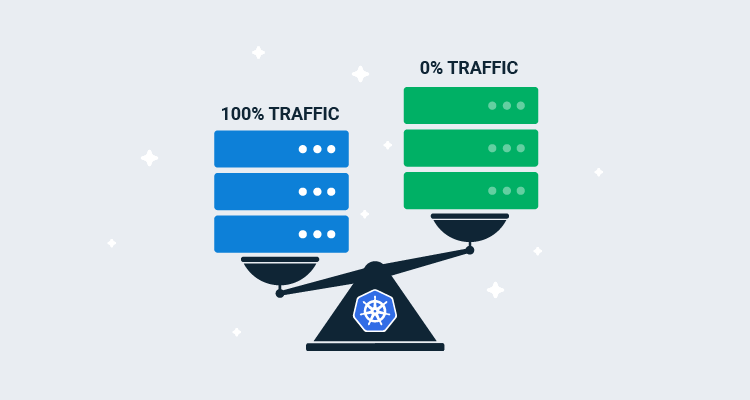
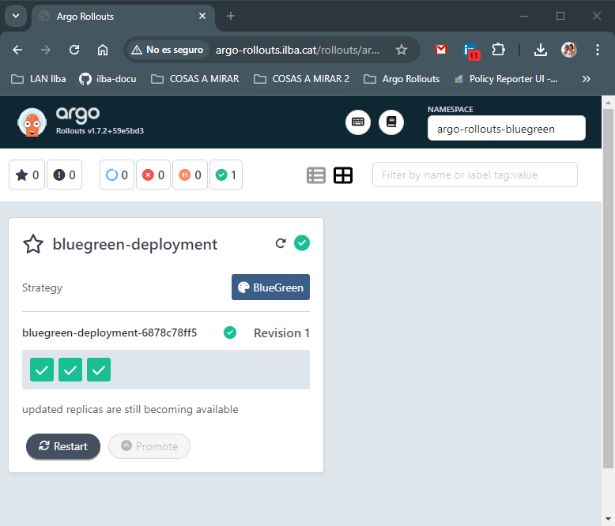

# Index:

* [Instalación de Argo Rollout](#id10)
* [blue/green](#id20)

# Instalación de Argo Rollout <div id='id10' />

Instalación de Argo Rollout

```
root@kubespray-aio:~# helm repo add argo https://argoproj.github.io/argo-helm
root@kubespray-aio:~# helm repo update

root@kubespray-aio:~# cat values-argo-rollouts.yaml
dashboard:
  enabled: true
  ingress:
    enabled: true
    ingressClassName: "nginx"
    hosts:
      - argo-rollouts.ilba.cat
    paths:
      - /
    pathType: Prefix

helm upgrade --install \
argo-rollouts argo/argo-rollouts \
--create-namespace \
--namespace argo-rollouts \
--version=2.37.5 \
-f values-argo-rollouts.yaml
```

Verificación de la instalación

```
root@kubespray-aio:~# helm -n argo-rollouts ls
NAME            NAMESPACE       REVISION        UPDATED                                         STATUS          CHART                   APP VERSION
argo-rollouts   argo-rollouts   1               2024-08-30 22:45:00.436885545 +0200 CEST        deployed        argo-rollouts-2.37.5    v1.7.2

root@kubespray-aio:~# kubectl -n argo-rollouts get pods
NAME                                      READY   STATUS    RESTARTS   AGE
argo-rollouts-6966f96b8d-jbg5d            0/1     Running   0          11s
argo-rollouts-6966f96b8d-rfdfh            0/1     Running   0          11s
argo-rollouts-dashboard-5467dfcdd-8lmzk   1/1     Running   0          11s

root@kubespray-aio:~# kubectl -n argo-rollouts get ingress
NAME                      CLASS   HOSTS                    ADDRESS        PORTS   AGE
argo-rollouts-dashboard   nginx   argo-rollouts.ilba.cat   172.26.0.101   80      34h
```

# blue/green <div id='id20' />

## Qué es blue/green ?

A blue-green deployment is a technique for releasing new software versions by maintaining two separate yet identical environments, called the blue and the green. The existing production environment is called the blue environment, whereas the new software version is deployed to the green environment. Upon a thorough test and validation, the green environment is switched to the production environment by routing traffic to the green environment. This makes the green environment the new blue environment. The former blue can be taken down once the new Blue environment becomes stable.



## Trabajando con blue/green

```
root@kubespray-aio:~# cat 01-namespace.yaml
apiVersion: v1
kind: Namespace
metadata:
  name: argo-rollouts-bluegreen
```

```
root@kubespray-aio:~# cat 02-argo-rollouts-ingress.yaml
apiVersion: networking.k8s.io/v1
kind: Ingress
metadata:
  name: bluegreen-deployment
  namespace: argo-rollouts-bluegreen
spec:
  ingressClassName: nginx
  rules:
  - http:
      paths:
      - path: /
        pathType: Prefix
        backend:
          service:
            name: bluegreen-active
            port:
              number: 80
```

Vamos a usar **kind: Rollout** en vez del típico **kind: deployment**

```
root@kubespray-aio:~# cat 03-argo-rollouts-rollout.yaml
apiVersion: argoproj.io/v1alpha1
kind: Rollout
metadata:
  name: bluegreen-deployment
  namespace: argo-rollouts-bluegreen
spec:
  replicas: 3
  revisionHistoryLimit: 3
  selector:
    matchLabels:
      app: bluegreen-deployment
  template:
    metadata:
      labels:
        app: bluegreen-deployment
    spec:
      containers:
      - name: bluegreen-demo
        image: argoproj/rollouts-demo:blue
        imagePullPolicy: Always
        ports:
        - containerPort: 8080
  strategy:
    blueGreen:
      activeService: bluegreen-active
      previewService: bluegreen-preview
      autoPromotionEnabled: false
```

```
root@kubespray-aio:~# vim 04-argo-rollouts-service.yaml
kind: Service
apiVersion: v1
metadata:
  name: bluegreen-active
  namespace: argo-rollouts-bluegreen
spec:
  selector:
    app: bluegreen-deployment
  ports:
  - protocol: TCP
    port: 80
    targetPort: 8080

---
kind: Service
apiVersion: v1
metadata:
  name: bluegreen-preview
  namespace: argo-rollouts-bluegreen
spec:
  selector:
    app: bluegreen-deployment
  ports:
  - protocol: TCP
    port: 80
    targetPort: 8080
```

```
kubectl apply -f 01-namespace.yaml && \
kubectl apply -f 02-argo-rollouts-ingress.yaml && \
kubectl apply -f 03-argo-rollouts-rollout.yaml && \
kubectl apply -f 04-argo-rollouts-service.yaml
```

Accedemos a la consola de Argo Rollout
* URL: [http://argo-rollouts.ilba.cat/rollouts/argo-rollouts-bluegreen](http://argo-rollouts.ilba.cat/rollouts/argo-rollouts-bluegreen)



Verificaciones:

```
root@kubespray-aio:~# kubectl -n argo-rollouts-bluegreen get pods
NAME                                    READY   STATUS    RESTARTS   AGE
bluegreen-deployment-6878c78ff5-9t6cl   1/1     Running   0          4m24s
bluegreen-deployment-6878c78ff5-bg7lr   1/1     Running   0          4m24s
bluegreen-deployment-6878c78ff5-zkxms   1/1     Running   0          4m24s

root@kubespray-aio:~# kubectl -n argo-rollouts-bluegreen get rollout
NAME                   DESIRED   CURRENT   UP-TO-DATE   AVAILABLE   AGE
bluegreen-deployment   3         3         3            3           11m
```