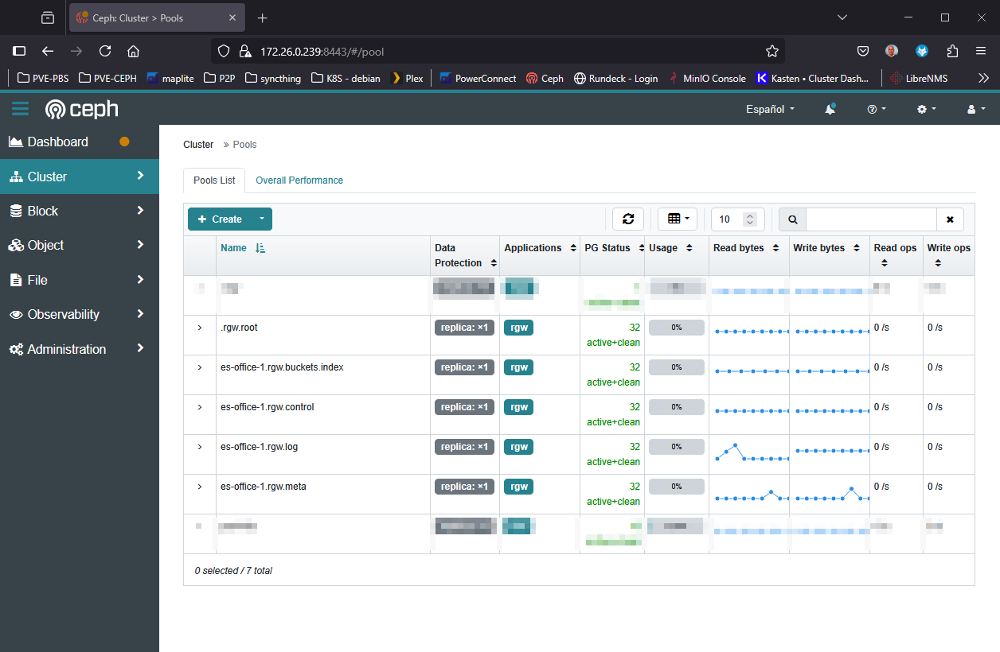

# Index:

* [Prerequisites](#id10)
* [Configuración](#id20)
* [Comandos útiles](#id30)

# Esquema <div id='id10' />

En Ceph se llama: Ceph Object Gateway o RADOS Gateway (RGW), pero realmente es el sistema de [Object Storage](https://en.wikipedia.org/wiki/Object_storage)

Partimos de la base de un Ceph desplegado, en este caso es un Ceph All-In-One

# Configuración <div id='id20' />

```
root@ceph-aio:~# cephadm shell
```

```
root@ceph-aio:/# ceph -s
    ...
    health: HEALTH_OK
    ...

root@ceph-aio:/# ceph orch host ls
HOST      ADDR          LABELS  STATUS
ceph-aio  172.26.0.239  _admin
1 hosts in cluster
```

```
root@ceph-aio:/# radosgw-admin realm create --rgw-realm=default --default
root@ceph-aio:/# ceph osd pool set .rgw.root size 1 --yes-i-really-mean-it <- DESDE OTRA CONSOLA

root@ceph-aio:/# radosgw-admin zonegroup create --rgw-zonegroup=default --master --default
root@ceph-aio:/# radosgw-admin zone create --rgw-zonegroup=default --rgw-zone=es-office-1 --master --default
root@ceph-aio:/# ceph orch apply rgw default es-office-1 --placement="1 ceph-aio"
```

Esperar a que aparezcan via GUI de Ceph todos los pools e ir disminuyendo las replicas a "1"

```
root@ceph-aio:/# ceph osd pool set es-office-1.rgw.log size 1 --yes-i-really-mean-it
root@ceph-aio:/# ceph osd pool set es-office-1.rgw.control size 1 --yes-i-really-mean-it
root@ceph-aio:/# ceph osd pool set es-office-1.rgw.meta size 1 --yes-i-really-mean-it
```

```
root@ceph-aio:/# ceph health mute POOL_NO_REDUNDANCY
root@ceph-aio:/# ceph status
```

```
root@ceph-aio:/# radosgw-admin user create \
--uid="oscar.mas" \
--display-name="Oscar Mas" \
--email="oscarmash@gmail.com"
```

Una vez creado el usuario, nos dar el access_key y el secret_key.

```
  ...
  "user": "oscar.mas",
  "access_key": "F8VBJKCIBB5UD0PLTC2X",
  "secret_key": "UHt6P0JzTqEx904pAhTwmHyiB3NgdlXgIDleWpdZ",
  ...
```

Configurar quota para el usuario que hemos creado:

```
root@ceph-aio:/# radosgw-admin quota set \
--quota-scope=user \
--uid=oscar.mas \
--max-size=20G

root@ceph-aio:/# radosgw-admin quota enable --quota-scope=user --uid=oscar.mas
```

Verificaremos el correcto funcionamiento desde el mismo equipo que realiza las funcionalidades del Ceph:

```
root@ceph-aio:/# exit

root@ceph-aio:~# apt update && apt install -y awscli

root@ceph-aio:~# aws configure
AWS Access Key ID [None]: 
AWS Secret Access Key [None]: 
Default region name [None]: es-office-1
Default output format [None]: json
```

```
root@ceph-aio:~# cat .aws/config
root@ceph-aio:~# cat .aws/credentials
```

```
root@ceph-aio:~# aws s3api create-bucket --bucket bucket-test --endpoint-url http://ceph-aio

root@ceph-aio:/# ceph osd pool set es-office-1.rgw.buckets.index size 1 --yes-i-really-mean-it <- DESDE OTRA CONSOLA
```

Al final los pools han de quedar así:



Verificaremos el funcionamiento creando un fichero y subiendolo a nuestro bucket:

```
root@ceph-aio:~# dd if=/dev/zero of=file_5G.data bs=1 count=0 seek=5G

root@ceph-aio:~# ls -lha *.data
-rw-r--r-- 1 root root 5.0G Jun 24 18:33 file_5G.data
```

# Comandos útiles <div id='id30' />

### Ver los usuarios existentes

```
root@ceph-aio:/# radosgw-admin user list
[
    "system-user",
    "oscar.mas",
    "dashboard"
]
```

### Eliminar un usuario

```
root@ceph-aio:/# radosgw-admin user rm --uid=system-user --purge-keys --purge-data
```

### Mostrar información del usuario

```
root@ceph-aio:/# radosgw-admin user info --uid=oscar.mas
```

### Ver los buckets que hay creados

```
root@ceph-aio:/# radosgw-admin bucket list
[
    "bucket-test"
]
```

### Ver espacio usado

```
root@ceph-aio:/# ceph df
--- RAW STORAGE ---
CLASS    SIZE   AVAIL     USED  RAW USED  %RAW USED
hdd    65 GiB  63 GiB  1.5 GiB   1.5 GiB       2.29
TOTAL  65 GiB  63 GiB  1.5 GiB   1.5 GiB       2.29

--- POOLS ---
POOL                       ID  PGS   STORED  OBJECTS     USED  %USED  MAX AVAIL
.mgr                        1    1  449 KiB        2  452 KiB      0     60 GiB
pool-k8s                    2   16  1.4 GiB      429  1.4 GiB   2.23     60 GiB
.rgw.root                   3   32  1.6 KiB        6   24 KiB      0     60 GiB
default.rgw.log             4   32  3.6 KiB      178  136 KiB      0     60 GiB
default.rgw.control         5   32      0 B        8      0 B      0     60 GiB
default.rgw.meta            6   32    846 B        4   16 KiB      0     60 GiB
default.rgw.buckets.index   7   32      0 B        0      0 B      0     20 GiB
```
