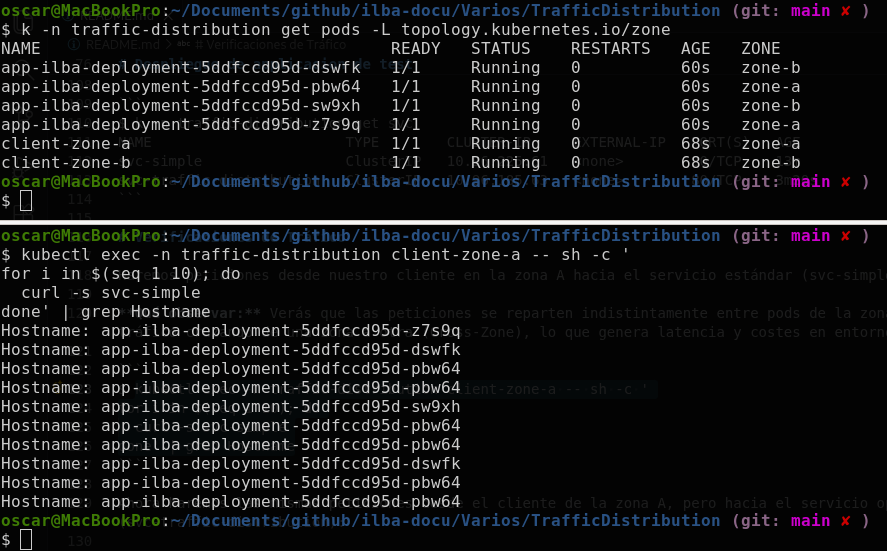
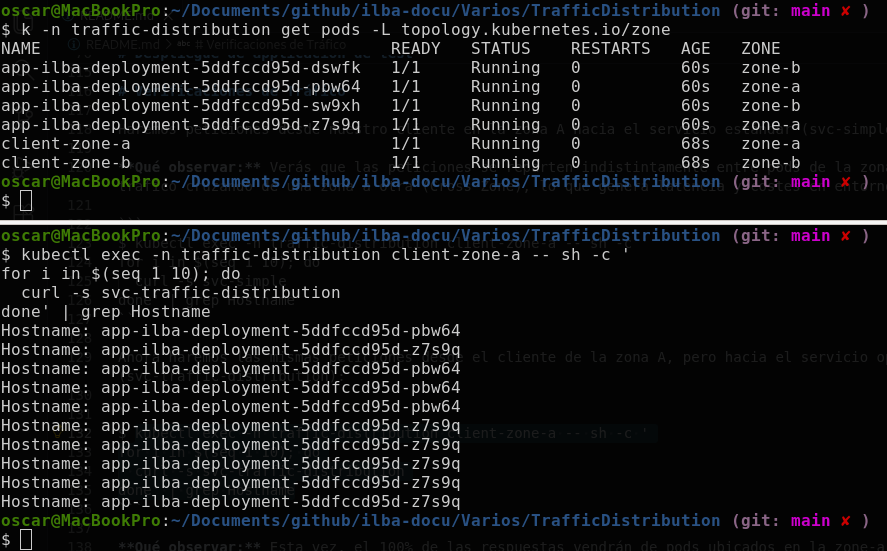

# Enrutamiento inteligente con trafficDistribution en Kubernetes

En Kubernetes, el tráfico que entra a un Service se distribuye por defecto entre todos los pods disponibles, sin importar en qué nodo o zona de disponibilidad estén. Esto genera dos problemas en clústeres grandes: latencia innecesaria (por enviar tráfico de un nodo a otro) y altos costos de transferencia de datos (porque los proveedores de nube cobran por mover datos entre diferentes zonas de disponibilidad).

Para solucionar esto, Kubernetes introduce dos opciones de distribución de tráfico en el servicio:

* PreferSameNode: El tráfico se envía prioritariamente a un pod que esté en el mismo nodo por el que entra la petición. Si no hay ninguno allí, se redirige a cualquier otro nodo del clúster.
* PreferSameZone: El tráfico se dirige a pods que estén dentro de la misma zona de disponibilidad. Si esa zona no tiene pods activos, el tráfico se distribuye al resto del clúster (esta opción antes se llamaba PreferClose).

Es muy importante no confundir estas nuevas opciones de trafficDistribution con las políticas de tráfico ya existentes:

* externalTrafficPolicy: Controla el tráfico que viene desde fuera del clúster y se decide si se procesa en el nodo que ha recibido la petición (Local) o se distribuye por todo el clúster (Cluster).
* internalTrafficPolicy: Controla el tráfico dentro del clúster (entre los pods), permitiendo restringir de forma estricta que las peticiones solo vayan a pods del mismo nodo (Local) en lugar de repartirse de forma aleatoria (Cluster).

# Configuración previa del sistema (Sysctl para Kind y Cilium)

Todo el lab que aremos, lo hemos hecho con "kind", ya que Cilium necesita un accedo intensivo a nuestro equipo, habremos de modificar los siguientes valores (de nuestro equipo físico), sinó nos encontraremos con el siguiente error:

```
Error: failed to create fsnotify watcher: too many open files
```

```
$ sudo bash
$ echo "fs.inotify.max_user_watches=524288" | tee -a /etc/sysctl.conf
$ echo "fs.inotify.max_user_instances=512" | tee -a /etc/sysctl.conf
$ sysctl -p
```

# Instalación y Preparación del Entorno

Crearemos nuestro cluster de kubernetes con kind:

```
$ kind create cluster --name k8s-kind-oscar --config files/kind-cluster-config.yaml
```

Instalamos Cilium utilizando Helm, indicandole los valores (*files/values-cilium.yaml*) para nuestro entorno de pruebas

```
$ helm upgrade --install cilium cilium/cilium -n kube-system -f files/values-cilium.yaml --version=1.19.3
```

Verificaremos el correcto funcionamiento, verificando que todos los componentes de Cilium estén en estado Running:

```
$ k -n kube-system get pods -l app.kubernetes.io/part-of=cilium
NAME                              READY   STATUS    RESTARTS   AGE
cilium-5b4vc                      1/1     Running   0          2m9s
cilium-envoy-4fx4w                1/1     Running   0          2m9s
cilium-envoy-6wjjc                1/1     Running   0          2m9s
cilium-envoy-lr5n2                1/1     Running   0          2m9s
cilium-envoy-svhjh                1/1     Running   0          2m9s
cilium-envoy-tz2sr                1/1     Running   0          2m9s
cilium-j752d                      1/1     Running   0          2m9s
cilium-operator-8b589448d-drvm2   1/1     Running   0          2m9s
cilium-operator-8b589448d-wr4f6   1/1     Running   0          2m9s
cilium-v82lz                      1/1     Running   0          2m9s
cilium-w4zd4                      1/1     Running   0          2m9s
cilium-zv99d                      1/1     Running   0          2m9s
```

Comprobamos que nuestros nodos se hayan creado correctamente y que estén distribuidos en distintas zonas de disponibilidad (zone-a y zone-b):

```
$ k get nodes -L topology.kubernetes.io/zone
NAME                           STATUS   ROLES           AGE     VERSION   ZONE
k8s-kind-oscar-control-plane   Ready    control-plane   3m8s    v1.35.1   
k8s-kind-oscar-worker          Ready    <none>          2m53s   v1.35.1   zone-a
k8s-kind-oscar-worker2         Ready    <none>          2m52s   v1.35.1   zone-a
k8s-kind-oscar-worker3         Ready    <none>          2m52s   v1.35.1   zone-b
k8s-kind-oscar-worker4         Ready    <none>          2m52s   v1.35.1   zone-b

```

# Despliegue de applicacion de test

Desplegaremos el entorno de pruebas basado es:

* files/00-NS.yaml: Namespace
* files/05-Pod.yaml: Dos pods de pruebas (uno en cada zona)
* files/10-Deployment.yaml: Deployment para que los services puedan acceder a algun pod
* files/15-Service-Simple.yaml: Servicio de K8s **sin** la opción: trafficDistribution
* files/16-Service-TrafficDistribution.yaml: Servicio de K8s **con** la opción: trafficDistribution

```
$ k apply -f files/00-NS.yaml
$ k apply -f files/05-Pod.yaml
$ k apply -f files/10-Deployment.yaml
$ k apply -f files/15-Service-Simple.yaml
$ k apply -f files/16-Service-TrafficDistribution.yaml
```

Confirmamos que los pods de la aplicación estén distribuidos entre las zonas zone-a y zone-b y que tengamos un pod cliente en cada zona para realizar las pruebas:

```
$ k -n traffic-distribution get pods -L topology.kubernetes.io/zone
NAME                                   READY   STATUS    RESTARTS   AGE   ZONE
app-ilba-deployment-5ddfccd95d-dswfk   1/1     Running   0          28s   zone-b
app-ilba-deployment-5ddfccd95d-pbw64   1/1     Running   0          28s   zone-a
app-ilba-deployment-5ddfccd95d-sw9xh   1/1     Running   0          28s   zone-b
app-ilba-deployment-5ddfccd95d-z7s9q   1/1     Running   0          28s   zone-a
client-zone-a                          1/1     Running   0          36s   zone-a
client-zone-b                          1/1     Running   0          36s   zone-b
```

Verificamos que ambos servicios estén listos y tengan asignada su IP virtual (ClusterIP)

```
$ k -n traffic-distribution get svc
NAME                       TYPE        CLUSTER-IP     EXTERNAL-IP   PORT(S)   AGE
svc-simple                 ClusterIP   10.96.225.61   <none>        80/TCP    13m
svc-traffic-distribution   ClusterIP   10.96.185.63   <none>        80/TCP    3m20s
```

# Verificaciones de Tráfico

Haremos peticiones desde nuestro cliente en la zona A hacia el servicio estándar (svc-simple):

**Qué observar:** Verás que las peticiones se reparten indistintamente entre pods de la zona A y de la zona B. Hay tráfico cruzando de una zona a otra (Cross-Zone), lo que genera latencia y costes en entornos cloud reales.

```
$ kubectl exec -n traffic-distribution client-zone-a -- sh -c '
for i in $(seq 1 10); do
  curl -s svc-simple
done' | grep Hostname
```



Ahora haremos las mismas peticiones desde el cliente de la zona A, pero hacia el servicio optimizado (svc-traffic-distribution):

```
$ kubectl exec -n traffic-distribution client-zone-a -- sh -c '
for i in $(seq 1 10); do
  curl -s svc-traffic-distribution
done' | grep Hostname
```



**Qué observar:** Esta vez, el 100% de las respuestas vendrán de pods ubicados en la zone-a (el tráfico se mantiene local, evitando saltos de red innecesarios).
