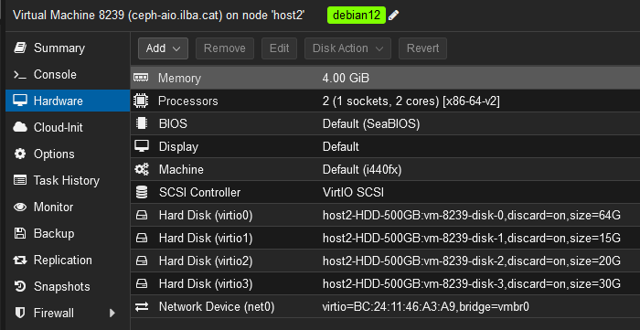
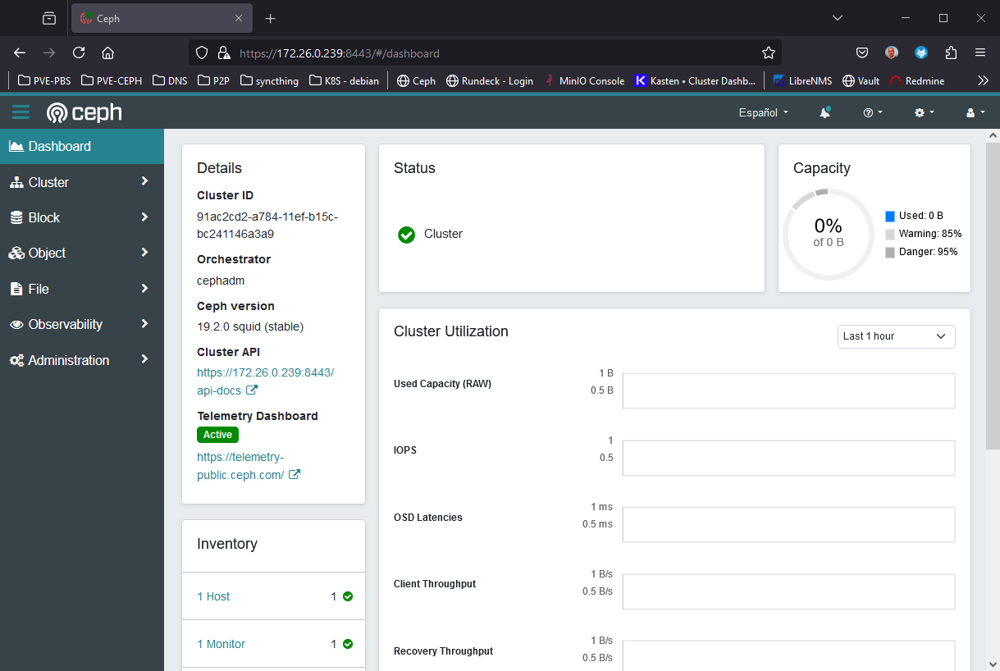

# Ceph all-in-one

* [Getting Started](#id0)
* [Desplegar ceph](#id1)


## Getting Started <div id='id1' />

Instalación base:

* El microprocesador de los equipos del cluster de K8s, han de tener el flag: x86-64-v2
* Equipo con Debian 12 pelado, sin docker
* Varios discos duros aparte del S.O. (sólo añadirlos, no tocar nada)



Dudas:

* Saber las [versiones de Ceph](https://docs.ceph.com/en/latest/releases/index.html)


## Desplegar ceph <div id='id1' />


```
root@ceph-aio:~# cat /etc/debian_version
12.8

root@ceph-aio:~# lsblk
NAME   MAJ:MIN RM  SIZE RO TYPE MOUNTPOINTS
vda    254:0    0   64G  0 disk
├─vda1 254:1    0   63G  0 part /
├─vda2 254:2    0    1K  0 part
└─vda5 254:5    0  975M  0 part [SWAP]
vdb    254:16   0   15G  0 disk
vdc    254:32   0   20G  0 disk
vdd    254:48   0   30G  0 disk
```

```
root@ceph-aio:~# apt update && apt install -y cephadm
root@ceph-aio:~# cephadm add-repo --release squid

root@ceph-aio:~# apt-cache show versions cephadm | grep Version
Version: 19.2.0-1~bpo12+1
Version: 16.2.11+ds-2

root@ceph-aio:~# useradd -m -s /bin/bash cephadm
root@ceph-aio:~# echo "cephadm ALL=(ALL:ALL) NOPASSWD:ALL" >> /etc/sudoers.d/cephadm
root@ceph-aio:~# chmod 0440 /etc/sudoers.d/cephadm
root@ceph-aio:~# mkdir -p /home/cephadm/.ssh
root@ceph-aio:~# chown cephadm:cephadm -R /home/cephadm/
root@ceph-aio:~# passwd cephadm
root@ceph-aio:~# apt update && apt install -y cephadm=19.2.0-1~bpo12+1

root@ceph-aio:~# su cephadm -
cephadm@ceph-aio:/root$ sudo cephadm bootstrap --mon-ip 172.26.0.239

```

```
root@ceph-aio:~# cephadm shell
```

Configuraciones para all-in-one:

```
root@ceph-aio:/# ceph orch apply osd --all-available-devices
```

Eperamos hasta que veamos todos los discos en up:

```
root@ceph-aio:/# ceph osd status
ID  HOST       USED  AVAIL  WR OPS  WR DATA  RD OPS  RD DATA  STATE
 0  ceph-aio  26.4M  14.9G      0        0       0        0   exists,up
 1  ceph-aio  26.4M  19.9G      0        0       0        0   exists,up
 2  ceph-aio  26.4M  29.9G      0        0       0        0   exists,up
```

```
root@ceph-aio:/# echo "C@dinor1988" > dashboard_password.yml
root@ceph-aio:/# ceph dashboard ac-user-set-password admin -i dashboard_password.yml
root@ceph-aio:/# ceph mgr module enable telemetry
root@ceph-aio:/# ceph telemetry on --license sharing-1-0
root@ceph-aio:/# ceph config set global mon_allow_pool_size_one true
root@ceph-aio:/# ceph osd pool set .mgr size 1 --yes-i-really-mean-it
root@ceph-aio:/# ceph health mute POOL_NO_REDUNDANCY
```

```
root@ceph-aio:/# ceph -s
  cluster:
    id:     0e62a892-a69e-11ef-bae6-bc241146a3a9
    health: HEALTH_OK

  services:
    mon: 1 daemons, quorum ceph-aio (age 19m)
    mgr: ceph-aio.iphepd(active, since 15m)
    osd: 3 osds: 0 up, 3 in (since 57s)

  data:
    pools:   0 pools, 0 pgs
    objects: 0 objects, 0 B
    usage:   0 B used, 0 B / 0 B avail
    pgs:
```

Accedemos al Ceph via Web:

* URL: https://172.26.0.239:8443/
* Username: admin
* Password: C@dinor1988



