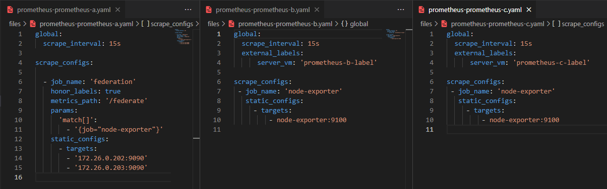
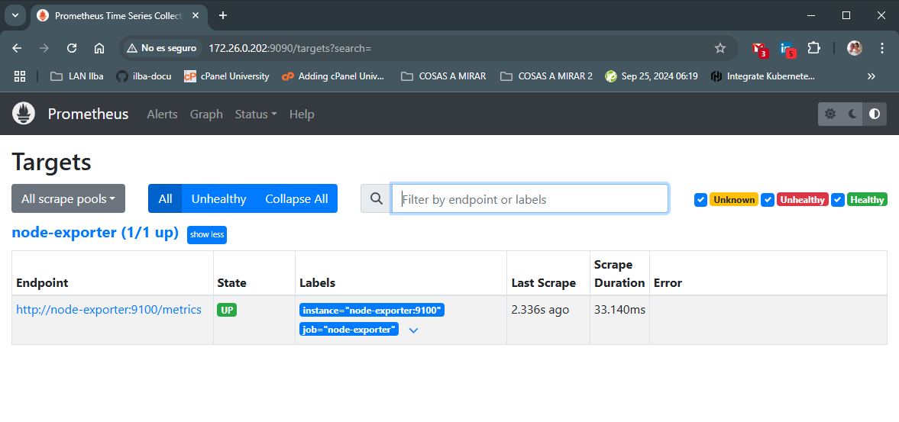
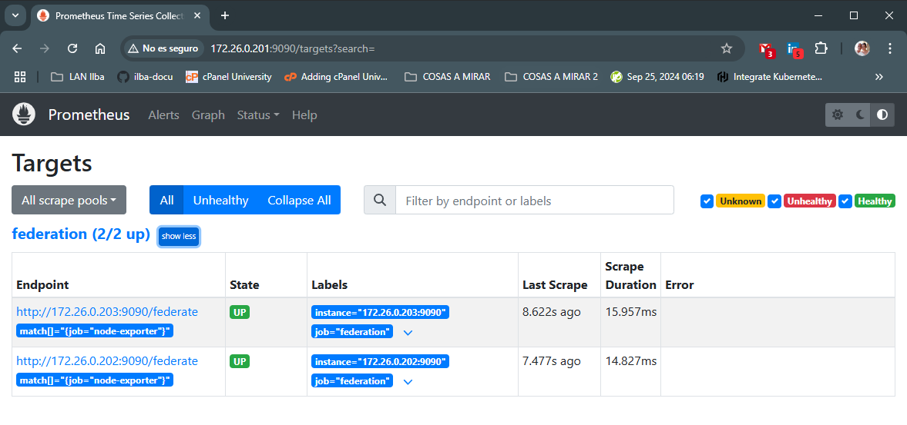
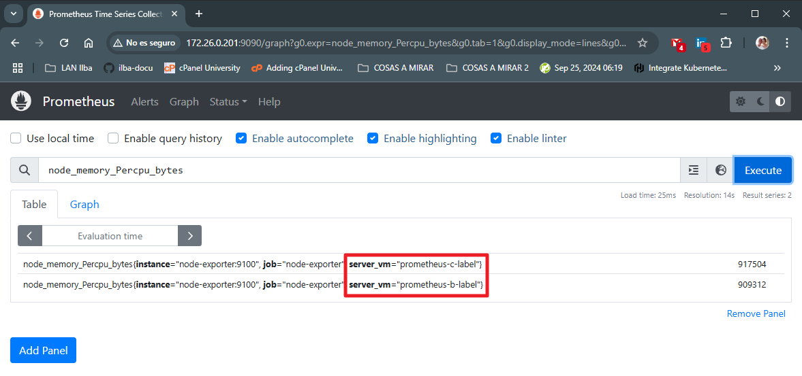

# Pruebas de Prometheus Federation

* [Getting Started](#id1)
* [Desplegar Prometheus Standalone (prometheus-c)](#id10)
* [Desplegar Prometheus Standalone (prometheus-b)](#id20)
* [Desplegar Prometheus Federation (prometheus-a)](#id30)


## Getting Started <div id='id1' />

Instalación base:

* docker-compose

Notas:

* El equipo: prometheus-a, será el "Prometheus Federation"
* Los otros dos equipos serán clientes que envian la misma información al equipo prometheus-a
* La forma de recolección de datos es "pull-based": prometheus-a se conecta a los otros prometheus para recolectar las métricas. Esto implica que en caso de corte de conexión, se perderian datos en el prometheus-a

Esquema:

```
                               +---+
                               |   |
                               |   |
                               |   |
                               +---+
                                
                          Name: prometheus-a
                           IP: 172.26.0.201


      +---+                                             +---+
      |   |                                             |   |
      |   |                                             |   |
      |   |                                             |   |
      +---+                                             +---+ 

Name: prometheus-b                                 Name: prometheus-c
 IP: 172.26.0.202                                   IP: 172.26.0.203
```

Realmente la configuración de prometheus es esta:




## Desplegar Prometheus Standalone (prometheus-c) <div id='id10' />

```
$ scp files/docker-compose-prometheus-c.yaml 172.26.0.203:/etc/docker-compose/docker-compose.yaml
$ scp files/prometheus-prometheus-c.yaml 172.26.0.203:/etc/docker-compose/prometheus.yml
```

```
root@prometheus-c:~# docker compose -f /etc/docker-compose/docker-compose.yaml up -d
```

Verificaremos el correcto funcionamiento:
* URL: http://172.26.0.203:9090/targets?search=


## Desplegar Prometheus Standalone (prometheus-b) <div id='id20' />

```
$ scp files/docker-compose-prometheus-b.yaml 172.26.0.202:/etc/docker-compose/docker-compose.yaml
$ scp files/prometheus-prometheus-b.yaml 172.26.0.202:/etc/docker-compose/prometheus.yml
```

```
root@prometheus-b:~# docker compose -f /etc/docker-compose/docker-compose.yaml up -d
```

Verificaremos el correcto funcionamiento:
* URL: http://172.26.0.202:9090/targets?search=



## Desplegar Prometheus Federation (prometheus-a) <div id='id20' />

```
$ scp files/docker-compose-prometheus-a.yaml 172.26.0.201:/etc/docker-compose/docker-compose.yaml
$ scp files/prometheus-prometheus-a.yaml 172.26.0.201:/etc/docker-compose/prometheus.yml
```

```
root@prometheus-a:~# docker compose -f /etc/docker-compose/docker-compose.yaml up -d
```

Verificaremos el correcto funcionamiento:
* URL: http://172.26.0.201:9090/targets?search=




