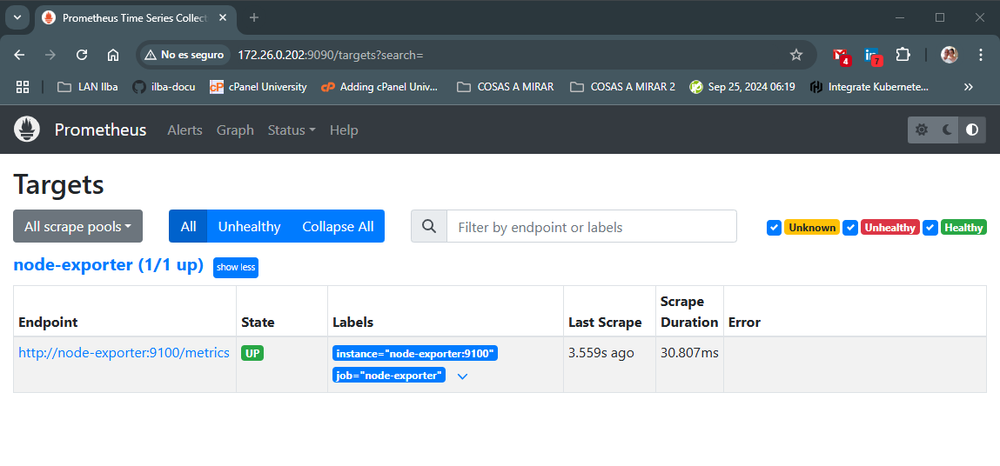
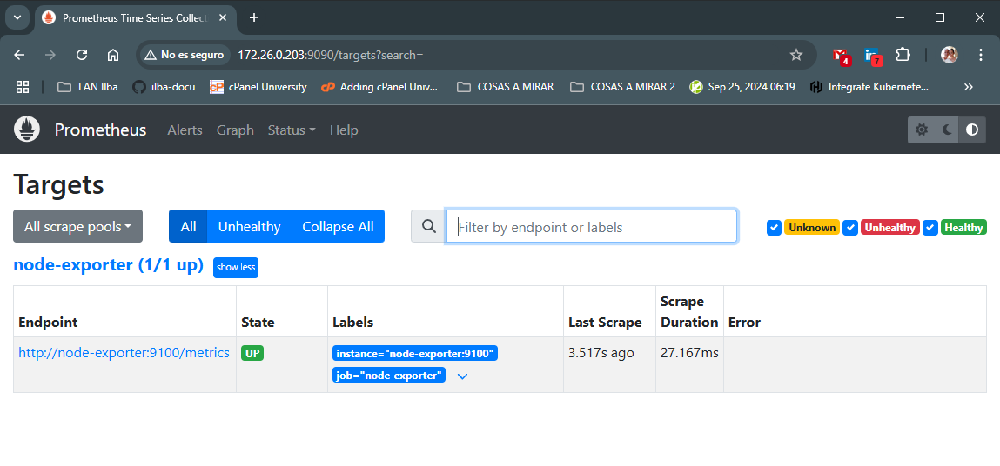
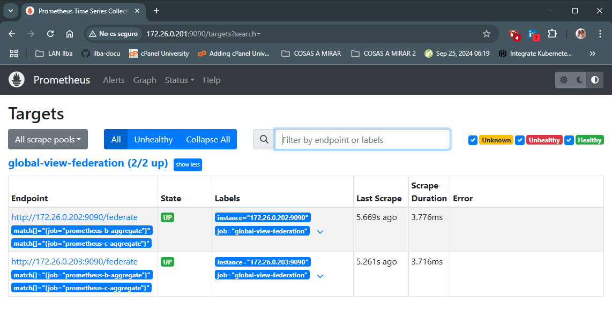

# Pruebas de Prometheus Federation

* [Getting Started](#id1)
* [Desplegar Prometheus Standalone (prometheus-b)](#id10)
* [Desplegar Prometheus Standalone (prometheus-c)](#id20)
* [Desplegar Prometheus Federation (prometheus-a)](#id30)


## Getting Started <div id='id1' />

Instalación base:

* docker-compose

Notas:

* El equipo: prometheus-a, será el "Prometheus Federation"

Esquema:

```
                               +---+
                               |   |
                               |   |
                               |   |
                               +---+
                                
                          Name: prometheus-a
                           IP: 172.26.0.201


      +---+                                             +---+
      |   |                                             |   |
      |   |                                             |   |
      |   |                                             |   |
      +---+                                             +---+ 

Name: prometheus-b                                 Name: prometheus-c
 IP: 172.26.0.202                                   IP: 172.26.0.203
```

## Desplegar Prometheus Standalone (prometheus-b) <div id='id10' />

Desplegaremos prometheus en los equipos:
* prometheus-b
* prometheus-c

Realizaremos el procedimiento en un equipo (prometheus-b) y posteriormente o copiaremos y sustituiremos las variables en el equipo: prometheus-c

```
root@prometheus-b:~# vim /etc/docker-compose/docker-compose.yaml
version: '3.8'

services:
  node-exporter:
    image: prom/node-exporter:v1.8.2
    container_name: node-exporter
    hostname: node-exporter
    restart: unless-stopped
    volumes:
      - /proc:/host/proc:ro
      - /sys:/host/sys:ro
      - /:/rootfs:ro
    command:
      - '--path.procfs=/host/proc'
      - '--path.rootfs=/rootfs'
      - '--path.sysfs=/host/sys'
      - '--collector.filesystem.mount-points-exclude=^/(sys|proc|dev|host|etc)($$|/)'
    ports:
      - 9100:9100
    networks:
      - monitoring

  prometheus:
    image: prom/prometheus:v2.55.1
    container_name: prometheus-b
    hostname: prometheus-b
    restart: unless-stopped
    volumes:
      - ./prometheus.yml:/etc/prometheus/prometheus.yml
      - prometheus_data:/prometheus
    command:
      - '--config.file=/etc/prometheus/prometheus.yml'
      - '--storage.tsdb.path=/prometheus'
      - '--web.console.libraries=/etc/prometheus/console_libraries'
      - '--web.console.templates=/etc/prometheus/consoles'
      - '--web.enable-lifecycle'
    ports:
      - 9090:9090
    networks:
      - monitoring

volumes:
  prometheus_data: {}

networks:
  monitoring:
    driver: bridge
```

```
root@prometheus-b:~# vim /etc/docker-compose/prometheus.yml
global:
  scrape_interval: 15s

scrape_configs:
 - job_name: 'node-exporter'
   static_configs:
     - targets:
         - node-exporter:9100
```

```
root@prometheus-b:~# docker compose -f /etc/docker-compose/docker-compose.yaml up -d
```

Verificaremos el correcto funcionamiento:
* URL: http://172.26.0.202:9090/targets?search=



## Desplegar Prometheus Standalone (prometheus-c) <div id='id20' />

```
root@prometheus-b:~# scp /etc/docker-compose/prometheus.yml 172.26.0.203:/etc/docker-compose/
root@prometheus-b:~# scp /etc/docker-compose/docker-compose.yaml  172.26.0.203:/etc/docker-compose/

root@prometheus-c:~# sed -i 's/prometheus-b/prometheus-c/g' /etc/docker-compose/docker-compose.yaml
root@prometheus-c:~# docker compose -f /etc/docker-compose/docker-compose.yaml up -d
```

Verificaremos el correcto funcionamiento:
* URL: http://172.26.0.203:9090/targets?search=



## Desplegar Prometheus Federation (prometheus-a) <div id='id30' />

```
root@prometheus-a:~# vim /etc/docker-compose/docker-compose.yaml
version: '3.8'

services:

  prometheus:
    image: prom/prometheus:v2.55.1
    container_name: prometheus-a
    hostname: prometheus-a
    restart: unless-stopped
    volumes:
      - ./prometheus.yml:/etc/prometheus/prometheus.yml
      - prometheus_data:/prometheus
    command:
      - '--config.file=/etc/prometheus/prometheus.yml'
      - '--storage.tsdb.path=/prometheus'
      - '--web.console.libraries=/etc/prometheus/console_libraries'
      - '--web.console.templates=/etc/prometheus/consoles'
      - '--web.enable-lifecycle'
    ports:
      - 9090:9090
    networks:
      - monitoring

  grafana:
    image: grafana/grafana:11.3.1
    container_name: grafana
    hostname: grafana
    restart: unless-stopped
    volumes:
      - grafana_data:/var/lib/grafana
      - ./grafana/provisioning:/etc/grafana/provisioning
    environment:
      - GF_SECURITY_ADMIN_USER=admin
      - GF_SECURITY_ADMIN_PASSWORD=sorisat
    ports:
      - "3000:3000"
    networks:
      - monitoring

volumes:
  prometheus_data: {}
  grafana_data: {}

networks:
  monitoring:
    driver: bridge
```

```
root@prometheus-a:~# vim /etc/docker-compose/prometheus.yml
global:
  scrape_interval: 15s

scrape_configs:
  - job_name: 'global-view-federation'
    honor_labels: true
    metrics_path: '/federate'
    params:
      'match[]':
        - '{job="prometheus-b-aggregate"}'
        - '{job="prometheus-c-aggregate"}'
    static_configs:
      - targets:
        - '172.26.0.202:9090'
        - '172.26.0.203:9090'
```
```
root@prometheus-a:~# docker compose -f /etc/docker-compose/docker-compose.yaml up -d
```

Verificaremos el correcto funcionamiento:
* URL: http://172.26.0.201:9090/targets?search=




Accedemos a Grafana
* URL: http://172.26.0.201:3000/
* Username: admin
* Password: sorisat

Pasos que hemos de hacer dentro de Grafana:

* Añadimos el "Data Source": http://prometheus-a:9090
* Importamos el dashboard [1860](https://grafana.com/grafana/dashboards/1860-node-exporter-full/)


