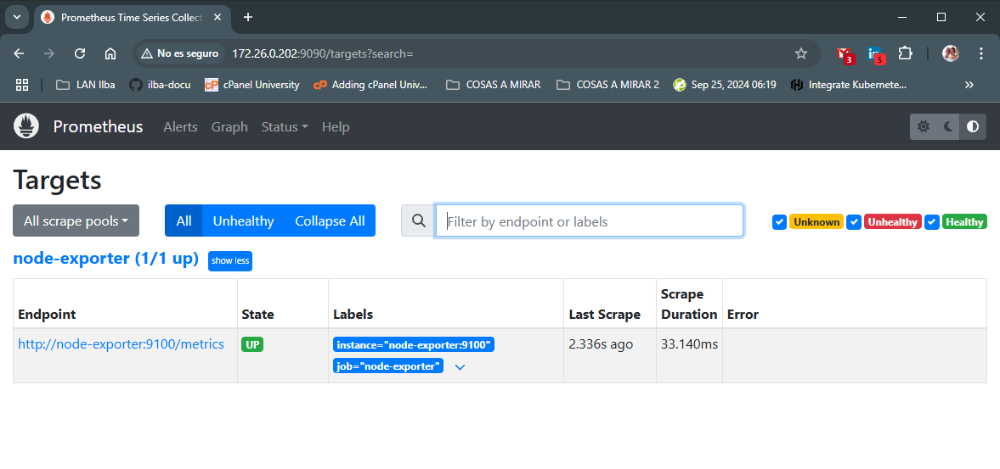
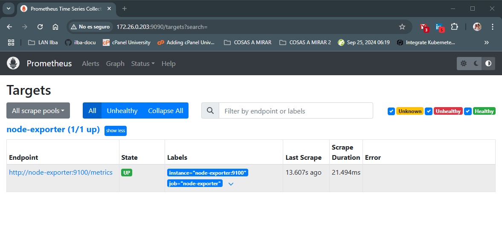
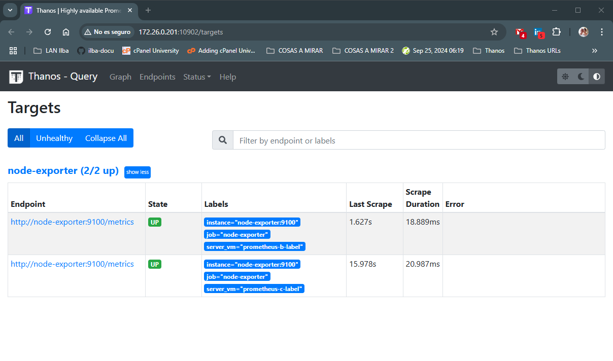
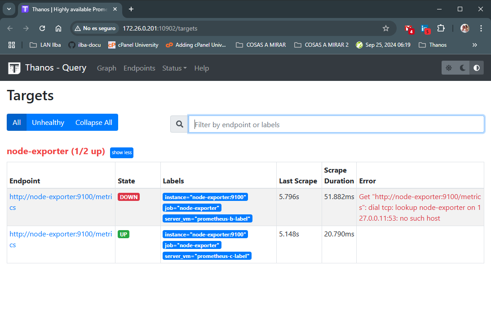

# Thanos

* [Getting Started](#id1)
* [Copiar configuraciones](#id10)
* [Proceso arrancado de contenedores](#id20)
* [Alertas](#id30)

## Getting Started <div id='id1' />

Notas random:
* Thanos es un sólo binario, que en función de los parámetros que le pasemos puede realizar unas funciones o otras
* Prometheus por defecto sólo guarda un histórico de [15 días.](https://prometheus.io/docs/prometheus/latest/storage/#operational-aspects)

Instalación base:

* 3 equipos con docker-compose

Equipos necesarios:


Esquema:

```
                               +---+
                               |   |
                               |   |
                               |   |
                               +---+
                                
                          Name: prometheus-a
                           IP: 172.26.0.201


      +---+                                             +---+
      |   |                                             |   |
      |   |                                             |   |
      |   |                                             |   |
      +---+                                             +---+ 

Name: prometheus-b                                 Name: prometheus-c
 IP: 172.26.0.202                                   IP: 172.26.0.203
```

Antes de empezar, revisar este esquema:


## Copiar configuraciones <div id='id10' />

```
$ scp files/docker-compose-prometheus-c.yaml 172.26.0.203:/etc/docker-compose/docker-compose.yaml
$ scp files/prometheus-prometheus-c.yml 172.26.0.203:/etc/docker-compose/prometheus.yml
$ scp files/bucket_config.yaml 172.26.0.203:/etc/docker-compose/bucket_config.yaml
```

```
$ scp files/docker-compose-prometheus-b.yaml 172.26.0.202:/etc/docker-compose/docker-compose.yaml
$ scp files/prometheus-prometheus-b.yml 172.26.0.202:/etc/docker-compose/prometheus.yml
$ scp files/bucket_config.yaml 172.26.0.202:/etc/docker-compose/bucket_config.yaml
```

```
$ scp files/docker-compose-prometheus-a.yaml 172.26.0.201:/etc/docker-compose/docker-compose.yaml
$ scp files/prometheus-prometheus-a.yml 172.26.0.201:/etc/docker-compose/prometheus.yml
$ scp files/bucket_config.yaml 172.26.0.201:/etc/docker-compose/bucket_config.yaml
```

## Proceso arrancado de contenedores <div id='id20' />

### Arrancamos MinIO

```
root@prometheus-a:~# docker compose -f /etc/docker-compose/docker-compose.yaml up -d minio
```

Accederemos al MinIO y crearemos el bucket: **thanos**
* URL: http://172.26.0.201:9001/
* Username: admin
* Password: superpassword


### Arrancamos promtheus-b + sidecar

```
root@prometheus-b:~# docker compose -f /etc/docker-compose/docker-compose.yaml up -d
```

```
root@prometheus-b:~# docker exec -it prometheus-b ash
/prometheus $ chmod 777 -R /prometheus
/prometheus $ exit
root@prometheus-b:~# docker restart prometheus-b thanos-sidecar
root@prometheus-b:~# docker ps -a
```

Verificaremos el correcto funcionamiento:
* URL: http://172.26.0.202:9090/targets?search=



### Arrancamos promtheus-c + sidecar

```
root@prometheus-c:~# docker compose -f /etc/docker-compose/docker-compose.yaml up -d
```

```
root@prometheus-c:~# docker exec -it prometheus-c ash
/prometheus $ chmod 777 -R /prometheus
/prometheus $ exit
root@prometheus-c:~# docker restart prometheus-c thanos-sidecar
root@prometheus-c:~# docker ps -a
```

Verificaremos el correcto funcionamiento:
* URL: http://172.26.0.203:9090/targets?search=



A partir de aquí (pasado un rato), podremos ver como se va llenando el bucket que hemos creado en el MinIO:

* URL: http://172.26.0.201:9001/
* Username: admin
* Password: superpassword


### Arrancamos stack de Thanos

```
root@prometheus-a:~# docker compose -f /etc/docker-compose/docker-compose.yaml up -d
```

Podremos verificar el correcto funcionamiento:

* URL: http://172.26.0.201:10902/stores


## Alertas <div id='id30' />

```
$ scp files/alertmanager.yml 172.26.0.201:/etc/docker-compose/alertmanager.yml
$ scp files/docker-compose-prometheus-a-alerts.yaml 172.26.0.201:/etc/docker-compose/docker-compose.yaml
$ scp files/thanos-ruler.rules.yaml 172.26.0.201:/etc/docker-compose/thanos-ruler.rules.yaml
```

```
root@prometheus-a:~# docker compose -f /etc/docker-compose/docker-compose.yaml down
root@prometheus-a:~# docker compose -f /etc/docker-compose/docker-compose.yaml up -d
```

Verificamos el correcto funcionamiento: 

http://172.26.0.201:10902/targets



http://172.26.0.201:10903/alerts


http://172.26.0.201:9093/#/alerts


Para realizar las pruebas de testing, pararemos el contenedor del *node-exporter* del *prometheus-b*

```
root@prometheus-b:~# docker stop node-exporter
```

http://172.26.0.201:10902/targets



http://172.26.0.201:10903/alerts


http://172.26.0.201:9093/#/alerts

