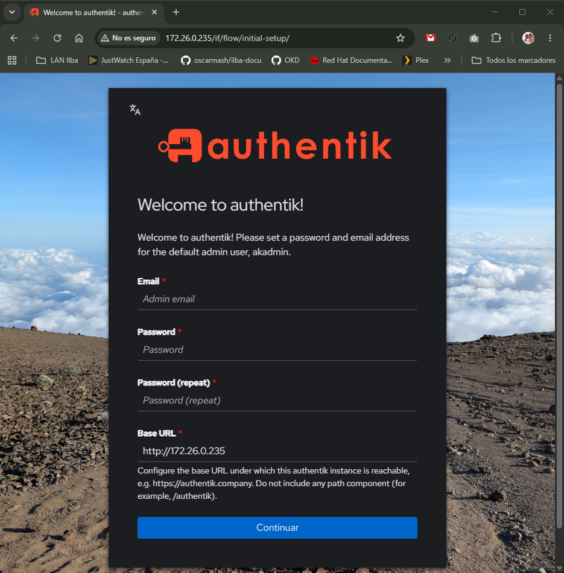
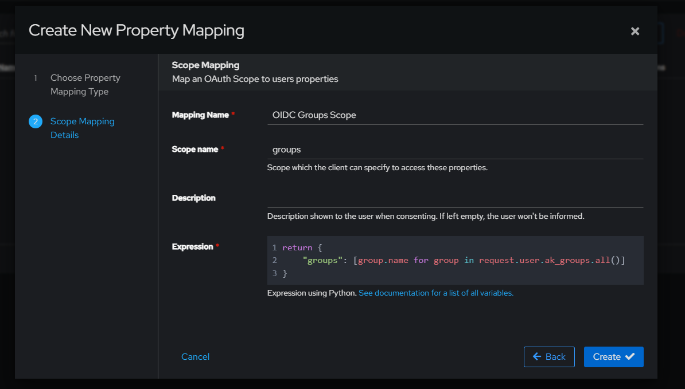
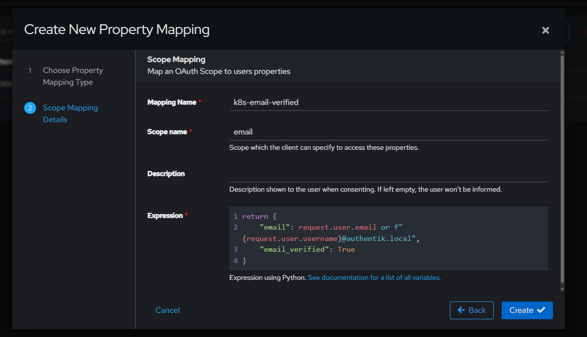
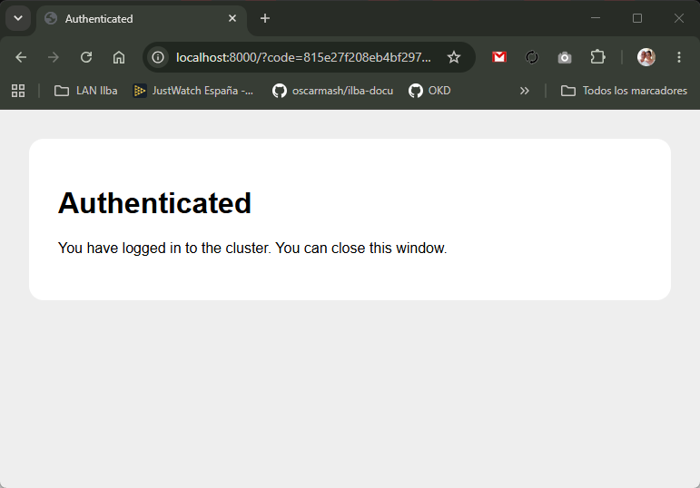

## Índice

- [Instalación de Authentik](#instalación-de-authentik)
- [Creación de la CA](#creación-de-la-ca)
- [Importación del certificado en Authentik](#importación-del-certificado-en-authentik)
- [Scope de Grupos en Authentik](#scope-de-grupos-en-authentik)
- [Crear el Provider OIDC para Kubernetes + la Application en Authentik](#crear-el-provider-oidc-para-kubernetes--la-application-en-authentik)
- [Crear el grupo de administradores y tu usuario](#crear-el-grupo-de-administradores-y-tu-usuario)
- [Asignar el certificado a la interfaz web de Authentik](#asignar-el-certificado-a-la-interfaz-web-de-authentik)
- [Copiar la CA a tu clúster de Kubernetes](#copiar-la-ca-a-tu-clúster-de-kubernetes)
- [Crear el RBAC en Kubernetes para el grupo k8s-admins](#crear-el-rbac-en-kubernetes-para-el-grupo-k8s-admins)
- [Pruebas desde authentik](#pruebas-desde-authentik)

Gestionar el acceso a Kubernetes mediante certificados TLS de cliente (x509) presenta dos problemas graves a medio plazo: 
* No admiten revocación nativa (si un certificado se filtra o un empleado se va, la única forma de anularlo antes de su caducidad es cambiar la CA del clúster o retirar permisos en RBAC)
* Carecen de un flujo de auditoría/MFA centralizado. 
Integrar Authentik mediante OpenID Connect (OIDC) resuelve esto de raíz delegando la identidad, caducidad de tokens y grupos al proveedor de identidad.

Arquitectura:

```
[ kubectl / Lens ]
         │  1. Login OAuth/OIDC (vía plugin kubelogin)
         ▼
   ┌───────────┐
   │ Authentik │ ──> Devuelve ID Token (JWT firmado con grupos/roles)
   └───────────┘
         │
         │  2. Envía 'Authorization: Bearer <id_token>'
         ▼
┌─────────────────┐
│ kube-apiserver  │ ──> Valida firma y claims contra Authentik
└─────────────────┘
         │
         ▼
     [ RBAC ] (RoleBinding emparejado con claim 'groups')
```

# Instalación de Authentik

```
root@authentik:~# cd /etc/docker-compose/
```

```
root@authentik:/etc/docker-compose# vim docker-compose.yaml
services:
  postgresql:
    image: docker.io/library/postgres:16-alpine
    restart: unless-stopped
    healthcheck:
      test: ["CMD-SHELL", "pg_isready -d $${POSTGRES_DB} -U $${POSTGRES_USER}"]
      start_period: 20s
      interval: 30s
      retries: 5
      timeout: 5s
    volumes:
      - database:/var/lib/postgresql/data
    environment:
      POSTGRES_PASSWORD: ${PG_PASS}
      POSTGRES_USER: ${AUTHENTIK_POSTGRESQL__USER}
      POSTGRES_DB: ${AUTHENTIK_POSTGRESQL__NAME}
    networks:
      - authentik_net

  redis:
    image: docker.io/library/redis:alpine
    command: --save 60 1 --loglevel warning
    restart: unless-stopped
    healthcheck:
      test: ["CMD-SHELL", "redis-cli ping | grep PONG"]
      start_period: 20s
      interval: 30s
      retries: 5
      timeout: 3s
    volumes:
      - redis:/data
    networks:
      - authentik_net

  server:
    image: ghcr.io/goauthentik/server:${AUTHENTIK_TAG:-latest}
    restart: unless-stopped
    command: server
    environment:
      AUTHENTIK_REDIS__HOST: redis
      AUTHENTIK_POSTGRESQL__HOST: postgresql
      AUTHENTIK_POSTGRESQL__USER: ${AUTHENTIK_POSTGRESQL__USER}
      AUTHENTIK_POSTGRESQL__NAME: ${AUTHENTIK_POSTGRESQL__NAME}
      AUTHENTIK_POSTGRESQL__PASSWORD: ${PG_PASS}
      AUTHENTIK_SECRET_KEY: ${AUTHENTIK_SECRET_KEY}
      AUTHENTIK_ERROR_REPORTING__ENABLED: ${AUTHENTIK_ERROR_REPORTING__ENABLED}
    volumes:
      - ./media:/media
      - ./custom-templates:/templates
      - ./certs:/certs
    ports:
      - "80:9000"
      - "443:9443"
    depends_on:
      postgresql:
        condition: service_healthy
      redis:
        condition: service_healthy
    networks:
      - authentik_net

  worker:
    image: ghcr.io/goauthentik/server:${AUTHENTIK_TAG:-latest}
    restart: unless-stopped
    command: worker
    environment:
      AUTHENTIK_REDIS__HOST: redis
      AUTHENTIK_POSTGRESQL__HOST: postgresql
      AUTHENTIK_POSTGRESQL__USER: ${AUTHENTIK_POSTGRESQL__USER}
      AUTHENTIK_POSTGRESQL__NAME: ${AUTHENTIK_POSTGRESQL__NAME}
      AUTHENTIK_POSTGRESQL__PASSWORD: ${PG_PASS}
      AUTHENTIK_SECRET_KEY: ${AUTHENTIK_SECRET_KEY}
      AUTHENTIK_ERROR_REPORTING__ENABLED: ${AUTHENTIK_ERROR_REPORTING__ENABLED}
    # Montar el socket de docker si se van a usar Outposts locales gestionados por Authentik
    volumes:
      - /var/run/docker.sock:/var/run/docker.sock
      - ./media:/media
      - ./certs:/certs
      - ./custom-templates:/templates
    depends_on:
      postgresql:
        condition: service_healthy
      redis:
        condition: service_healthy
    networks:
      - authentik_net

volumes:
  database:
    driver: local
  redis:
    driver: local

networks:
  authentik_net:
    driver: bridge
```

```
root@authentik:/etc/docker-compose# vim .env
AUTHENTIK_SECRET_KEY=S0jk7y9V47Kt7aaOZaxIzsd4KoHqz5zqp5zZEUcu4AGMB628
AUTHENTIK_ERROR_REPORTING__ENABLED=false
PG_PASS=uLzEDFaBt3CN6vGaKBNeDVM4tiIXamwF
AUTHENTIK_POSTGRESQL__HOST=postgresql
AUTHENTIK_POSTGRESQL__USER=authentik
AUTHENTIK_POSTGRESQL__NAME=authentik
AUTHENTIK_POSTGRESQL__PASSWORD=uLzEDFaBt3CN6vGaKBNeDVM4tiIXamwF
AUTHENTIK_TAG=2026.8.3
```

```
root@authentik:/etc/docker-compose# docker compose pull
root@authentik:/etc/docker-compose# docker compose up -d
root@authentik:/etc/docker-compose# docker compose logs -f server
```

http://172.26.0.235/if/flow/initial-setup/




# Creación de la CA

NOTA: Para todo el lab usaremos certificados autogenerados

Crearemos nuestra propia CA:

```
root@authentik:/etc/docker-compose# cd certs/
root@authentik:/etc/docker-compose/certs# openssl genrsa -out ca.key 4096
root@authentik:/etc/docker-compose/certs# openssl req -x509 -new -nodes -key ca.key -sha256 -days 3650 -out ca.crt -subj "/CN=K8s-Authentik-CA"
```

```
root@authentik:/etc/docker-compose/certs# ls -la
total 16
drwxr-xr-x 2 root root 4096 Oct  2 08:42 .
drwxr-xr-x 5 root root 4096 Oct  2 08:32 ..
-rw-r--r-- 1 root root 1826 Oct  2 08:42 ca.crt
-rw------- 1 root root 3272 Oct  2 08:42 ca.key
```

Crearemos la clave privada y la solicitud (CSR) para authentik

```
root@authentik:/etc/docker-compose/certs# openssl genrsa -out authentik.key 2048
root@authentik:/etc/docker-compose/certs# openssl req -new -key authentik.key -out authentik.csr -subj "/CN=authentik.local"
```

```
root@authentik:/etc/docker-compose/certs# vim cert.ext
authorityKeyIdentifier=keyid,issuer
basicConstraints=CA:FALSE
keyUsage = digitalSignature, nonRepudiation, keyEncipherment, dataEncipherment
subjectAltName = @alt_names

[alt_names]
DNS.1 = authentik.local
IP.1 = 172.26.0.235
```

```
root@authentik:/etc/docker-compose/certs# openssl x509 -req -in authentik.csr -CA ca.crt -CAkey ca.key -CAcreateserial \
  -out authentik.crt -days 825 -sha256 -extfile cert.ext
```

```
root@authentik:/etc/docker-compose/certs# ls -lha
total 36K
drwxr-xr-x 2 root root 4.0K Oct  2 08:47 .
drwxr-xr-x 5 root root 4.0K Oct  2 08:32 ..
-rw-r--r-- 1 root root 1.5K Oct  2 08:47 authentik.crt      <- el certificado firmado del servidor
-rw-r--r-- 1 root root  899 Oct  2 08:46 authentik.csr
-rw------- 1 root root 1.7K Oct  2 08:43 authentik.key      <- la clave privada del servidor
-rw-r--r-- 1 root root 1.8K Oct  2 08:42 ca.crt             <- el certificado público de tu CA, que llevarremos a Kubernetes
-rw------- 1 root root 3.2K Oct  2 08:42 ca.key             <- la clave privada de la CA
-rw-r--r-- 1 root root   41 Oct  2 08:47 ca.srl
-rw-r--r-- 1 root root  226 Oct  2 08:47 cert.ext
```

# Importación del certificado en Authentik

* En el menú lateral izquierdo System -> Certificates
* Clic en "Import Existing Certificate-Key Pair"
  * Nombre: Authentik Web Certificate
  * En Certificate, pega el contenido de /etc/docker-compose/certs/authentik.crt
  * En Private Key, pega el contenido de /etc/docker-compose/certs/authentik.key
  * Haz clic en Create

# Scope de Grupos en Authentik

* En la consola de Authentik, Customization -> Property Mappings
  * Clic en "Create New Property Mapping"
    * Scope Mapping
      * Name: OIDC Groups Scope
      * Scope name: groups
      * Expression:

```
return {
    "groups": [group.name for group in request.user.ak_groups.all()]
}
```



* En la consola de Authentik, Customization -> Property Mappings
  * Clic en "Create New Property Mapping"
    * Scope Mapping
      * Name: k8s-email-verified
      * Scope name: email
      * Expression:

```
return {
    "email": request.user.email or f"{request.user.username}@authentik.local",
    "email_verified": True
}
```



# Crear el Provider OIDC para Kubernetes + la Application en Authentik

* En el menú lateral, ve a Applications -> Applications.
* Haz clic en "New application"
  * Application
    * Application Name: Kubernetes
    * Slug: k8s (este slug define la ruta del emisor OIDC en Authentik: /application/o/k8s/)
    * Next
  * Choose a Provider
    * OAuth2/OpenID Provider
    * Next
  * Configure Provider
    * Name: k8s-oidc-provider
    * Authentication flow:default-provider-authorization-implicit-consent (Authorize Application)
    * Client type: Public
    * Client ID: copia el valor generado (Mj6ELfeHmj9dzrjgaGIZnKFOIlPZaScrqJplSVms)
    * Redirect URIs: añade la URI que utiliza por defecto el plugin CLI de Kubernetes:
      * http://localhost:8000
      * http://localhost:18000
    * Signing Key: selecciona el certificado que importaste (Authentik Web Certificate).
    * En la sección Advanced protocol settings, en la columna derecha deben quedar:
     * authentik default OAuth Mapping: OpenID 'openid'
     * authentik default OAuth Mapping: OpenID 'profile'
     * k8s-email-verified
    * Next
  * Configura bindings
    * Next

# Crear el grupo de administradores y tu usuario

* Ve a Directory -> Groups y pulsa "New Group":
  * Name: k8s-admins
* Ve a Directory -> Users -> New User:
  * Choose User Type
    * Internal User
  * Internal User Details
    * Username: oscar.mas
    * Email Address: oscar.mas@authentik.local
* Asígnale una contraseña en la pestaña de credenciales del usuario.
* Agrégalo al grupo k8s-admins

# Asignar el certificado a la interfaz web de Authentik

* En el menú lateral izquierdo, ve a System -> Brands (Marcas).
* Verás una entrada llamada authentik-default. Pulsa en el botón de editar
* En el campo Web certificate (o Certificate) de "Other global settings"
  * Selecciona el certificado que importaste anteriormente: Authentik Web Certificate
  * Asegúrate de dejar el campo Client Certificates totalmente vacío
* Haz clic en Save.

```
root@authentik:/etc/docker-compose/certs# docker compose restart server
root@authentik:/etc/docker-compose/certs# echo "172.26.0.235 authentik.local" >> /etc/hosts
```

# Copiar la CA a tu clúster de Kubernetes

```
root@k8s-test-cp:~# k get nodes
NAME            STATUS   ROLES           AGE    VERSION
k8s-test-cp     Ready    control-plane   144m   v1.36.4
k8s-test-wk01   Ready    <none>          144m   v1.36.4
k8s-test-wk02   Ready    <none>          144m   v1.36.4
k8s-test-wk03   Ready    <none>          144m   v1.36.4
```

```
root@k8s-test-cp:~# mkdir -p /etc/kubernetes/ssl/oidc
root@k8s-test-cp:~# scp 172.26.0.235:/etc/docker-compose/certs/ca.crt /etc/kubernetes/ssl/oidc/authentik-ca.pem
root@k8s-test-cp:~# chmod 644 /etc/kubernetes/ssl/oidc/authentik-ca.pem
root@k8s-test-cp:~# echo "172.26.0.235 authentik.local" >> /etc/hosts
```

```
root@k8s-test-cp:~# vim /etc/kubernetes/manifests/kube-apiserver.yaml
    - --oidc-issuer-url=https://authentik.local/application/o/k8s/
    - --oidc-client-id=<CLIENT_ID>
    - --oidc-ca-file=/etc/kubernetes/ssl/oidc/authentik-ca.pem
    - --oidc-username-claim=email
    - --oidc-groups-claim=groups
```

```
root@k8s-test-cp:~# kubectl get nodes
NAME            STATUS   ROLES           AGE    VERSION
k8s-test-cp     Ready    control-plane   146m   v1.36.4
k8s-test-wk01   Ready    <none>          145m   v1.36.4
k8s-test-wk02   Ready    <none>          145m   v1.36.4
k8s-test-wk03   Ready    <none>          145m   v1.36.4
```

# Crear el RBAC en Kubernetes para el grupo k8s-admins

```
root@k8s-test-cp:~# vim authentik-rbac.yaml
apiVersion: rbac.authorization.k8s.io/v1
kind: ClusterRoleBinding
metadata:
  name: authentik-cluster-admins
subjects:
- kind: Group
  name: "k8s-admins"               # Grupo exacto que creaste en Authentik
  apiGroup: rbac.authorization.k8s.io
roleRef:
  kind: ClusterRole
  name: cluster-admin              # Permisos totales en el clúster
  apiGroup: rbac.authorization.k8s.io
```

```
root@k8s-test-cp:~# kubectl apply -f authentik-rbac.yaml
```

# Pruebas desde authentik

```
root@authentik:~# apt-get update && apt-get -y install unzip kubectl
root@authentik:~# curl -LO https://github.com/int128/kubelogin/releases/latest/download/kubelogin_linux_amd64.zip
root@authentik:~# unzip kubelogin_linux_amd64.zip
root@authentik:~# mv kubelogin /usr/local/bin/kubectl-oidc_login
```

```
root@authentik:~# kubectl oidc-login --version
kubelogin version v1.36.4
```

```
root@authentik:~# mkdir -p ~/.kube
root@authentik:~# cp /etc/docker-compose/certs/ca.crt ~/.kube/authentik-ca.crt
```

```
root@authentik:~# vim ~/.kube/config
apiVersion: v1
clusters:
- cluster:
    insecure-skip-tls-verify: true
    server: https://172.26.0.230:6443
  name: kubernetes
contexts:
- context:
    cluster: kubernetes
    user: oidc-user
  name: k8s-oidc
current-context: k8s-oidc
kind: Config
preferences: {}
users:
- name: oidc-user
  user:
    exec:
      apiVersion: client.authentication.k8s.io/v1beta1
      command: kubectl
      args:
      - oidc-login
      - get-token
      - --oidc-issuer-url=https://authentik.local/application/o/k8s/
      - --oidc-client-id=<CLIENT_ID>
      - --certificate-authority=/root/.kube/authentik-ca.crt
      - --oidc-extra-scope=groups
      - --oidc-extra-scope=profile
      - --oidc-extra-scope=email
      - --skip-open-browser
```

```
$ ssh 172.26.0.235 -L 8000:127.0.0.1:8000
```



```
root@authentik:~# rm -rf ~/.kube/cache/oidc-login
root@authentik:~# kubectl get nodes
Please visit the following URL in your browser: http://localhost:8000/
NAME            STATUS   ROLES           AGE    VERSION
k8s-test-cp     Ready    control-plane   5h8m   v1.36.4
k8s-test-wk01   Ready    <none>          5h8m   v1.36.4
k8s-test-wk02   Ready    <none>          5h8m   v1.36.4
k8s-test-wk03   Ready    <none>          5h8m   v1.36.4
```
